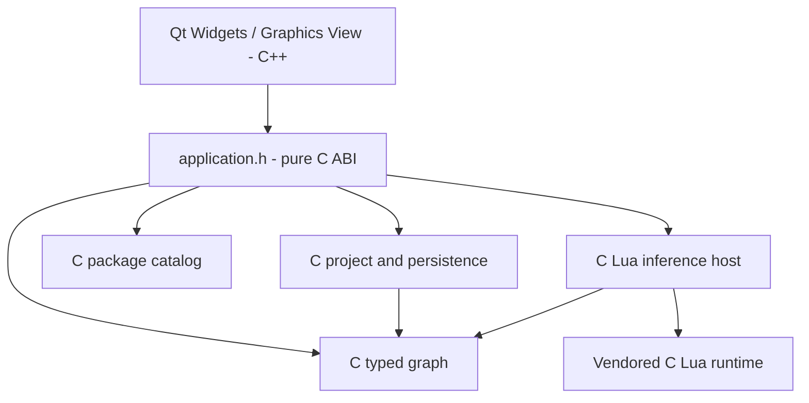

# Native client architecture

Accepted 2026-09-29: Qt 6 Widgets replaces the SDL3 graphical frontend.

`src/model.c`, `project.c`, `catalog.c`, `inference.c`, and `application.c`
form `nnmodelling_core`, compiled as C11 independently of Qt or a C++ compiler.
Model, graph, type analysis, serialization, validation, commands and application
ownership remain C. No compiler/IR implementation exists in this checkout;
future compiler/IR code must also be C. Public headers have C linkage guards
and expose only C types. Qt never becomes a dependency of this library.

`gui/qt/` contains all C++ and Qt code. MainWindow composes native widgets;
GraphView owns viewport transforms; GraphScene synchronizes QGraphicsItems
from borrowed C snapshots. Items retain stable string IDs and presentation
state, never an authoritative graph. Qt owns selection, hover, drafts, camera
and temporary drag positions. C owns persisted scope-local coordinates.

An opaque NNApplication owns one NNProject and its catalog/model/resources.
Open stages a project before swapping; failure preserves the active project.
Save uses existing schema-v2 atomic persistence. Close saves unless explicitly
discarded. Frontends request mutations through application.h; it resolves
packages, validates parameters and handles, delegates graph invariants to the
model and marks successful changes dirty. Snapshots are borrowed until mutation.
Analysis remains read-only and may be refreshed after a semantic mutation.

SDL platform, custom rasterization, generic input translation, manually drawn
widgets and their smoke test are retired after the Qt replacement passes.
Preserved stereotype packages, historical UML and unrelated vendored assets
are unchanged. Backend, training and command service remain deferred.
`justfile` owns developer recipes; CMake separates C and optional Qt targets.
Tests live under tests; core tests never instantiate QApplication.
