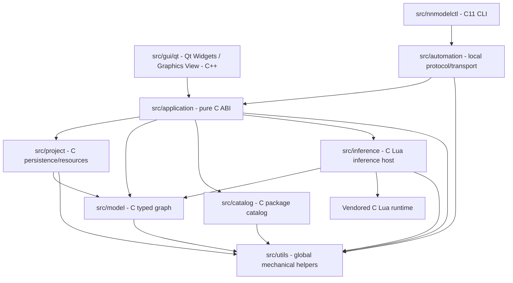

# Native client architecture

Accepted 2026-09-29: Qt 6 Widgets replaces the SDL3 graphical frontend.

Accepted 2026-10-02: `src/model/`, `catalog/`, `project/`, `inference/`,
`application/` and `automation/` form `nnmodelling_core`, compiled as C11
independently of Qt or a C++ compiler. Physical translation-unit boundaries and
private helpers follow [source-layout](../contracts/source-layout.md). Each
concept unit compiles separately; private owner/helper headers stay within their
module, while cross-module public includes use explicit module/header paths.
Model, graph, type analysis, serialization, validation, commands and application
ownership remain C. No compiler/IR implementation exists in this checkout;
future compiler/IR code must also be C. Public headers have C linkage guards
and expose only C types. Qt never becomes a dependency of this library.

`src/gui/qt/` contains all C++ and Qt code. MainWindow composes native widgets;
GraphView owns viewport transforms; GraphScene synchronizes QGraphicsItems
from borrowed C snapshots. Items retain stable string IDs and presentation
state, never an authoritative graph. Qt owns selection, hover, drafts, camera
and temporary drag positions. C owns persisted scope-local coordinates.

An opaque NNApplication owns one NNProject and its catalog/model/resources.
Open stages a project before swapping; failure preserves the active project.
Save uses existing schema-v2 atomic persistence. Close saves unless explicitly
discarded. Frontends request mutations through application.h; it resolves
packages, validates parameters and handles, delegates graph invariants to the
model and marks successful changes dirty. Snapshots are borrowed until mutation.
Analysis remains read-only and may be refreshed after a semantic mutation.
Accepted 2026-09-30: application owns the lazy analysis cache and UI/CLI consume
the same structured problems per contracts/diagnostics.md, uml/editor.md and
uml/sequences.md. src/utils/utils.c/h centralizes allocation-free error
formatting and owned text copying;
path joining uses checked malloc; JSON text construction uses existing yyjson.
SDS was reconsidered and is not a dependency (diagnostics.md).

Completed 2026-09-30: the SDL platform, custom rasterization, generic input
translation, manually drawn widgets and their smoke test are removed after
the Qt replacement passed the recorded core/GUI and visible QA gates.
Removed sources: `src/platform.h`, `src/platform_sdl3.c`, `src/editor.h`,
`src/editor.c`, `src/main.c` and `tests/platform_smoke.c`. The sole graphical
entry point is `src/gui/qt/main.cpp`; no SDL fallback or C drawing API remains.
Preserved stereotype packages, historical UML and unrelated vendored assets
are unchanged. Backend and training remain deferred. C11 local automation serves
the same application owner; Qt schedules nonblocking IPC dispatch on its thread.
Resource authoring follows resource-authoring.md. Accepted 2026-10-01 typed
output/loss topology, terminal spawning and handle-sensitive recursive analysis
follow contracts/typed-outputs.md and uml/metamodel.md. Catalog normalizes
definitions; C persists terminal mappings; Qt only presents the typed boundary.
`src/automation/` supplies the optional Linux local command service and C
dispatcher; `src/nnmodelctl/` is the C11 companion CLI. The GUI starts IPC only
when requested with --socket. Native visual forms generate boundary JSON but
C remains resource validator, catalog owner and filesystem writer.
`justfile` owns developer recipes; CMake separates C and optional Qt targets.
Tests live under tests; core tests never instantiate QApplication.

## Expanded 3D explorer (accepted 2026-10-04)

C `src/visualization/` derives an owned disposable scene from project/catalog.
It owns generic subflow Lua composition, expanded occurrence identity, layout,
camera, projection and picking. Qt paints its projected primitives in a 3D tab.
See [3D contract](../contracts/visualization-3d.md). No model or file-format change
for 3D presentation; object stereotype parameters now follow that contract.
