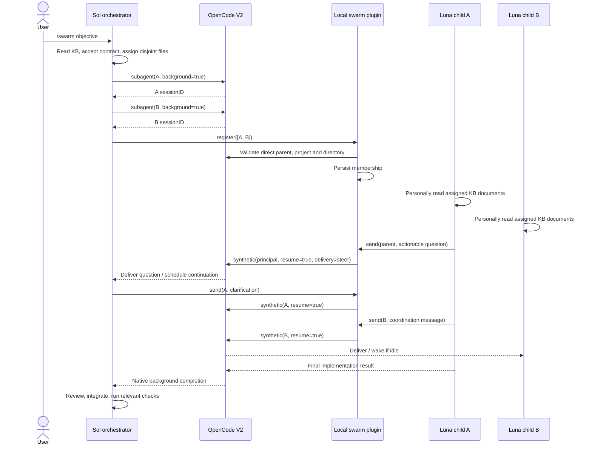

# Development swarm sequence

See the [accepted tooling contract](../contracts/agent-swarm.md).

```mermaid
sequenceDiagram
    actor User
    participant Principal as Sol orchestrator
    participant Runtime as OpenCode V2
    participant Mailbox as Local swarm plugin
    participant A as Luna child A
    participant B as Luna child B
    User->>Principal: /swarm objective
    Principal->>Principal: Read KB, accept contract, assign disjoint files
    Principal->>Runtime: subagent(A, background=true)
    Runtime-->>Principal: A sessionID
    Principal->>Runtime: subagent(B, background=true)
    Runtime-->>Principal: B sessionID
    Principal->>Mailbox: register([A, B])
    Mailbox->>Runtime: Validate direct parent, project and directory
    Mailbox->>Mailbox: Persist membership
    A->>A: Personally read assigned KB documents
    B->>B: Personally read assigned KB documents
    A->>Mailbox: send(parent, actionable question)
    Mailbox->>Runtime: synthetic(principal, resume=true, delivery=steer)
    Runtime-->>Principal: Deliver question / schedule continuation
    Principal->>Mailbox: send(A, clarification)
    Mailbox->>Runtime: synthetic(A, resume=true)
    A->>Mailbox: send(B, coordination message)
    Mailbox->>Runtime: synthetic(B, resume=true)
    Runtime-->>B: Deliver / wake if idle
    A-->>Runtime: Final implementation result
    Runtime-->>Principal: Native background completion
    Principal->>Principal: Review, integrate, run relevant checks
```
