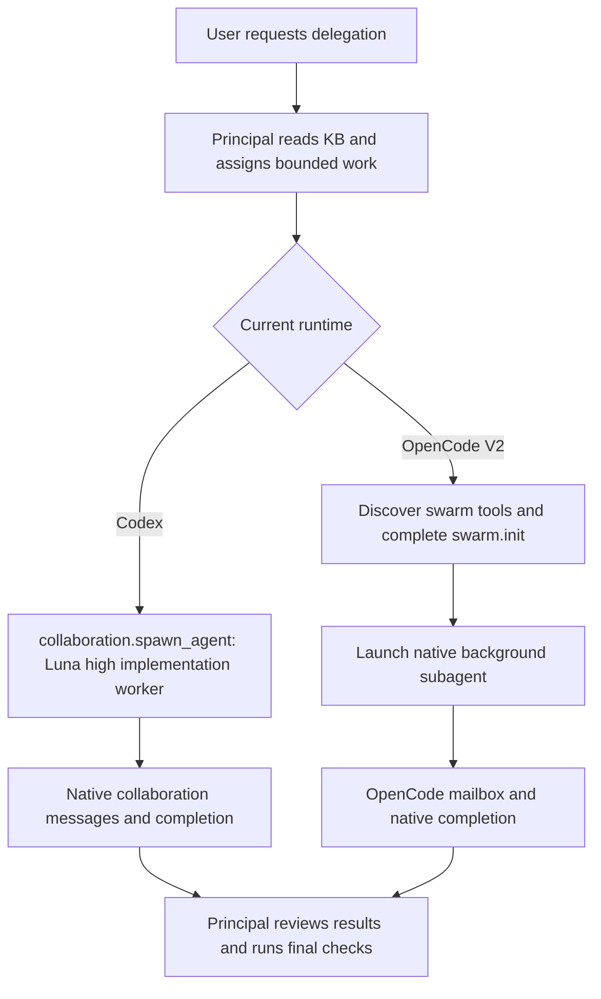

# Development swarm ownership

See the [accepted tooling contract](../contracts/agent-swarm.md). Detailed
interaction sequences are maintained in [development-agents](sequences/development-agents.md).

## Runtime routing

Shared-checkout workers own disjoint files and serialize Git index/commit
mutations. Runtime limits govern concurrency. Codex uses native collaboration
tools and has no OpenCode initialization or enrollment step. OpenCode V2
protocol sequences live in [development-agents.md](sequences/development-agents.md).
