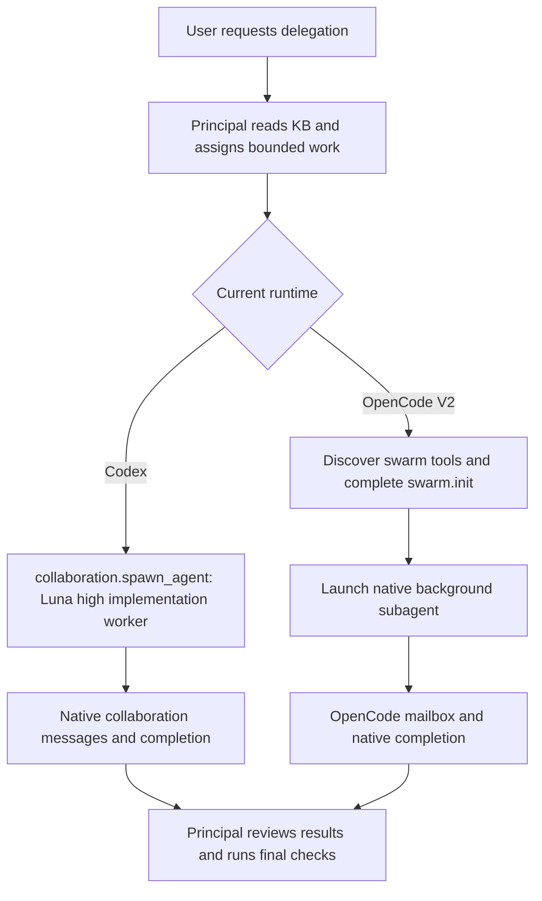
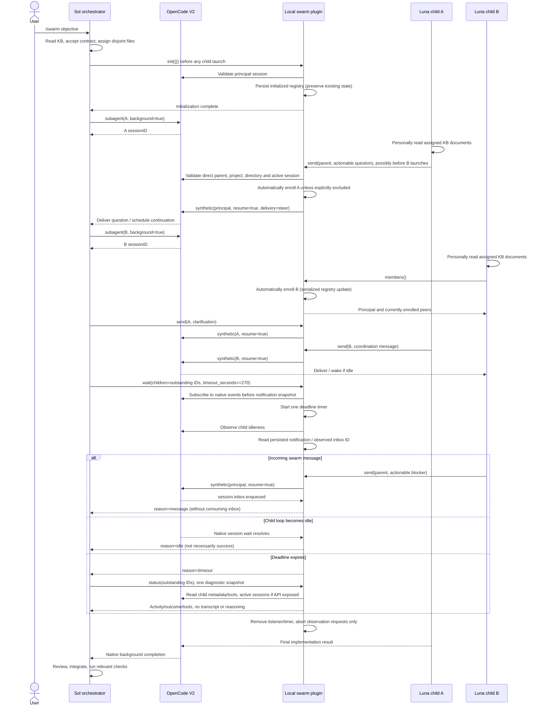
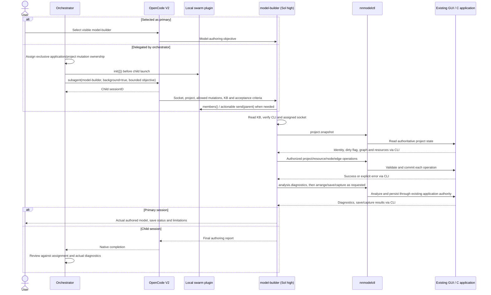

# Development swarm sequence

See the [accepted tooling contract](../contracts/agent-swarm.md).

## Runtime routing

Shared-checkout workers own disjoint files and serialize Git index/commit
mutations. Runtime limits govern concurrency. Codex requires no OpenCode
initialization or enrollment. The sequences below describe OpenCode V2 only.

The number of independent children is not capped by project instructions.
Each launch follows successful initialization; no later `register` call is needed.
Registry updates serialize within the plugin storage context. Optional explicit
replacement with `register` excludes omitted enrolled children until the principal
explicitly restores them. Repeating `init` preserves membership and exclusions.

## CLI model-authoring agent

`model-builder` is a Sol high agent with `mode: all`; native primary selection
and child invocation both use the same KB-first CLI authoring instructions.
It does not replace the orchestrator's architecture/review ownership.

One mutating author owns a socket's application and writable project at a time;
disjoint node IDs do not provide independent state. Builder owns no separate
graph and cannot edit project files or spawn workers. CLI failure does not undo
earlier successful commands. Numerical execution/training remain deferred.
