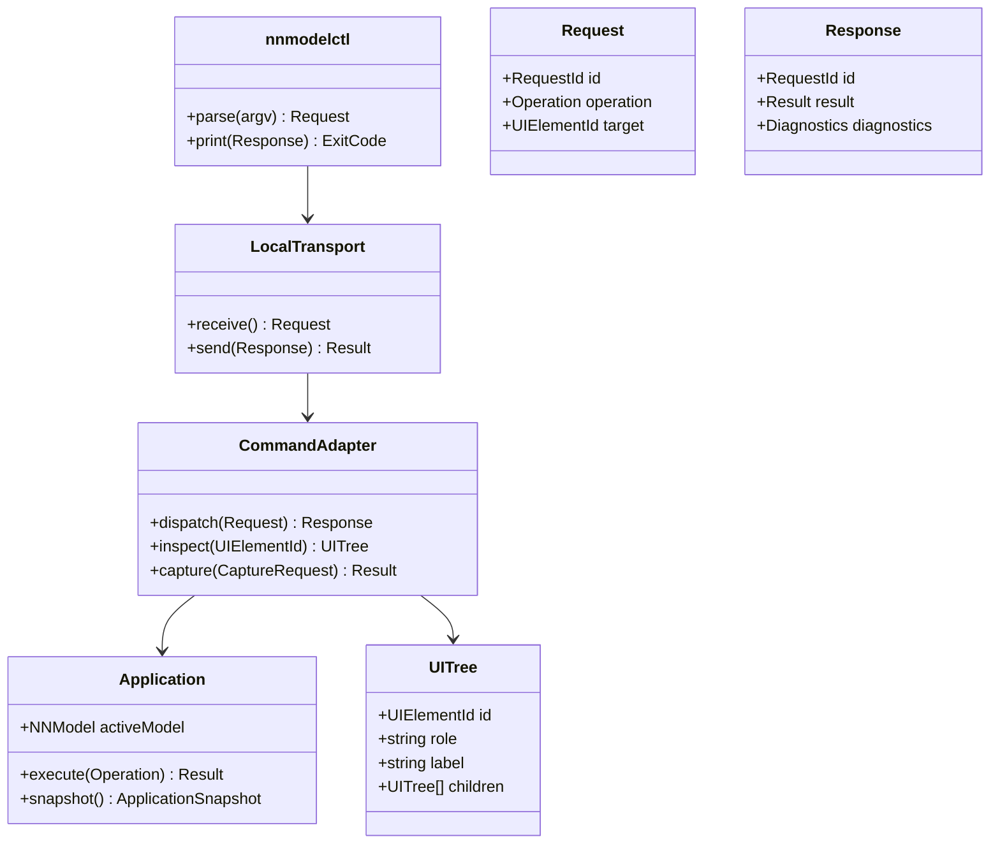

# Deferred automation model

## Purpose

Show future local command interface without making it part of current client
bootstrap. Same application authority serves UI, tests and a future CLI.

## Diagram

## Operations

`dispatch` validates request shape and semantic target, invokes one
application operation, and returns success/error/diagnostics. `inspect` reads
semantic UI tree without a graph copy. `capture` synchronizes layout and frame
before saving screenshot. IPC, request schema, permissions and exact command
set are OPEN; no code should implement guessed wire protocol during bootstrap.
Backend training operations are outside this client milestone.

## Constraints

Formal: `authority(nnmodelctl)=authority(UI)=Application` and
`CommandAdapter.modelStorage=∅`. Natural: CLI never owns graph.

Formal: `captureAfterLayout(req) ⇒ captureFrame≥layoutCommitFrame`.
Natural: screenshot includes finished layout.

Formal: `invalidRequest ⇒ model'=model`. Natural: bad command cannot partially
mutate graph.

## C mapping

Future request/response use tagged operations and typed IDs. Unix socket
transport (when chosen) is isolated from command adapter and application.
Neither C structs nor JSON wire format are fixed by this conceptual model.
