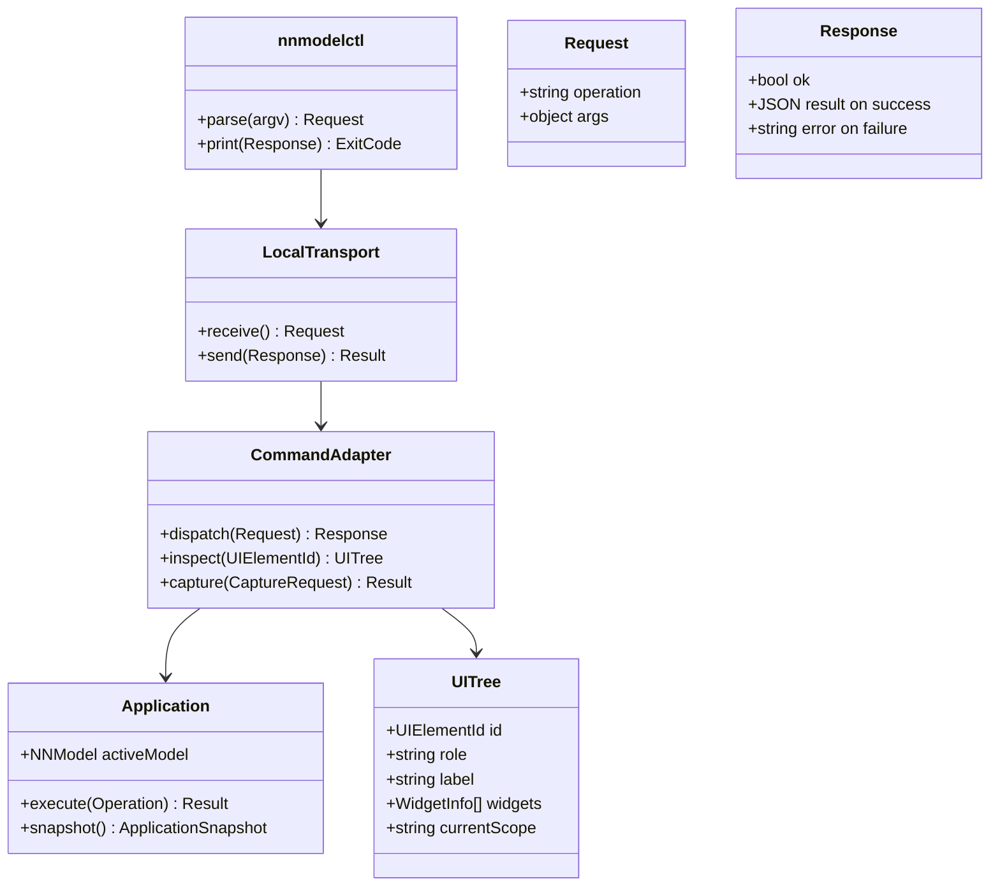

# Local automation model

## Purpose

Accepted 2026-09-30: implement local Unix command interface according to
[automation contract](../contracts/automation.md). Same C application authority
serves UI, tests and nnmodelctl. Backend training remains deferred.
Accepted 2026-10-01: typed-outputs.md extends definition payloads, snapshots,
handle-keyed diagnostic tensors and node.boundary mapping edits. C remains the
only command validator; UI/CLI subflow creation spawns identical terminals.

## Diagram



## Operations

Resource use cases: Agent starts GUI with --socket, project.create(blank),
stereotype.create(visual-form-equivalent definition, Lua, dependencies),
dataset.create(named input/target tensors, select=true), node.add and
node.parameter, edge.connect, ui.scope, ui.arrange, project.save, ui.screenshot.
Alternatively project.create(template=mnist-vae) creates a complete editable
encoder/decoder design. Failure reports an error, never a partially active
resource. UI dialogs and command payloads invoke the identical C transaction.

### LLM resource-authoring example

The UI must already be running with `--socket /tmp/opencode/nnmodelling.sock`.
These operations require neither raw UI clicking nor a backend:

```sh
export NNMODELLING_SOCKET=/tmp/opencode/nnmodelling.sock
nnmodelctl project.create '{"parent":"/tmp/opencode","id":"shape-design","name":"Shape design"}'
nnmodelctl stereotype.create '{"id":"local.identity","version":"1.0.0","definition":{"name":"Identity shape","description":"Pass-through shape rule, no execution","kind":"layer","view":{"color":"#4779c4","width":220,"height":100},"parameters":{"note":{"type":"string","default":"shape only","position":"bottom"}}},"inference":"return function(context, parameters, services) return {status=\"success\",output=context.inputs[1]} end","dependencies":{}}'
nnmodelctl dataset.create '{"id":"local.features","version":"1.0.0","select":true,"definition":{"name":"Features","batch":{"inputs":{"features":{"dtype":"float32","shape":["B",32]}},"targets":{}}}}'
nnmodelctl node.add '{"id":"input","package":"core.input","version":"0.1.0"}'
nnmodelctl node.parameter '{"id":"input","key":"binding","value":"features"}'
nnmodelctl node.add '{"id":"identity","package":"local.identity","version":"1.0.0","y":200}'
nnmodelctl edge.connect '{"id":"features-identity","source":"input","sourceHandle":"out","target":"identity","targetHandle":"in"}'
nnmodelctl ui.inspect
nnmodelctl ui.arrange
nnmodelctl project.save
nnmodelctl ui.screenshot '{"path":"/tmp/opencode/shape-design.png"}'
```

Resource creation saves current graph edits transactionally; subsequent graph
changes remain dirty until project.save. A resource error leaves the previous
project and model.json unchanged. Larger Lua/definition payloads can be passed
from stdin with `nnmodelctl stereotype.create -`. For the complete VAE, use
project.create with `template:"mnist-vae"`, then ui.scope with `id:"encoder"`
or `id:"decoder"`; project.snapshot exposes the nodes for parameter edits.

`dispatch` validates request shape and semantic target, invokes one
application operation, and returns success/error/diagnostics. `inspect` reads
semantic UI tree without a graph copy. `capture` synchronizes layout and frame
before saving screenshot. Nonblocking Linux AF_UNIX, bounded newline-delimited
JSON, private same-user permissions and exact commands follow automation.md.
Backend training operations are outside this client milestone.

## Constraints

Formal: `authority(nnmodelctl)=authority(UI)=Application` and
`CommandAdapter.modelStorage=∅`. Natural: CLI never owns graph.

Formal: `captureAfterLayout(req) ⇒ captureFrame≥layoutCommitFrame`.
Natural: screenshot includes finished layout.

Formal: `invalidRequest ⇒ model'=model`. Natural: bad command cannot partially
mutate graph.

## C mapping

src/automation.c owns Unix socket lifecycle and dispatch; src/nnmodelctl.c owns
CLI parsing, request generation and response output. src/automation.h exposes
opaque service lifecycle, nonblocking poll and malloc-result UI callback. Qt
schedules poll on its thread and owns introspection/layout/capture only.
analysis.diagnostics queries the application's report; ui.reveal shares problem
navigation with Qt. Both are specified in contracts/diagnostics.md.
