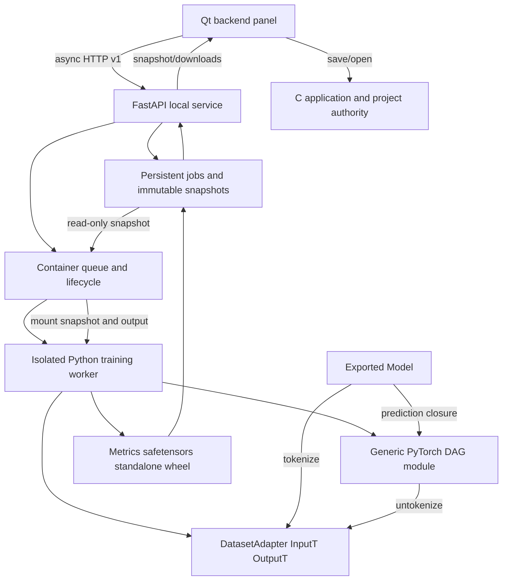

# Backend execution and snapshot ownership

Accepted 2026-10-05. Normative protocol: [backend](../contracts/backend.md).
The diagrams below show component ownership; request and runtime sequences are
kept in the [backend sequence](sequences/backend-training.md).

`GraphModule` owns registered runtime modules and derives its topological
execution order from frozen graph metadata. The worker owns optimizer, random seeds and metrics. `JobStore` owns
persisted job state, immutable request bytes and published output files. The
Qt panel owns transient controls and asynchronous replies; C still owns the
active native project. Exported `Model` owns a private dataset adapter, graph
runtime and weights, without training payloads.

Wheel export separates readable distribution identity (`nnm_<normalized-project-id>`)
from the existing job-specific Python import package (`nnmodel_<normalized-job-id>`).
The API serves the stored artifact filename; old wheels remain unchanged.
