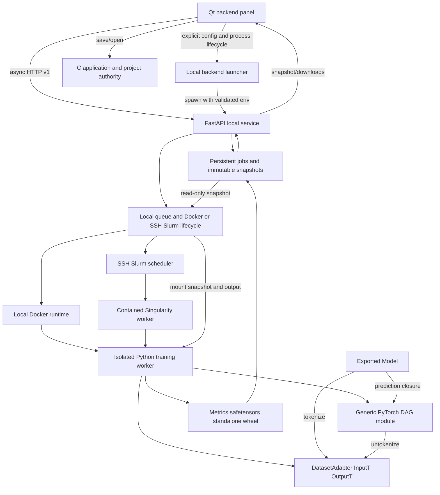

# Backend execution and snapshot ownership

Accepted 2026-10-05. Normative protocol: [backend](../contracts/backend.md).
The diagrams below show component ownership; request and runtime sequences are
kept in the [backend sequence](sequences/backend-training.md).

`GraphModule` owns registered runtime modules and derives its topological
execution order from frozen graph metadata. The worker owns optimizer, random seeds and metrics. `JobStore` owns
persisted job state, immutable request bytes and published output files. The
Qt panel owns transient controls and asynchronous replies; the main window owns
the optional local backend child process, and per-user Qt settings own its
non-secret launch profile. C still owns the active native project. Exported
`Model` owns a private dataset adapter, graph runtime and weights, without
training payloads.

Wheel export separates readable distribution identity (`nnm_<normalized-project-id>`)
from the existing job-specific Python import package (`nnmodel_<normalized-job-id>`).
The API serves the stored artifact filename; old wheels remain unchanged.

Slurm execution keeps Store/API local. UUID job directories receive frozen snapshots
and worker source; per-allocation scheduler IDs are persisted for cancellation.
Warning signals checkpoint model, Adam, RNG, cursor and metric-window state as
safetensors plus JSON in remote output. Runner retrieves and validates handoff,
then submits another allocation against same logical job and remote directory.
Only final weights and wheel are served as artifacts after test evaluation.
Metrics and outputs return through bounded SSH transfers and existing local result
validation.
