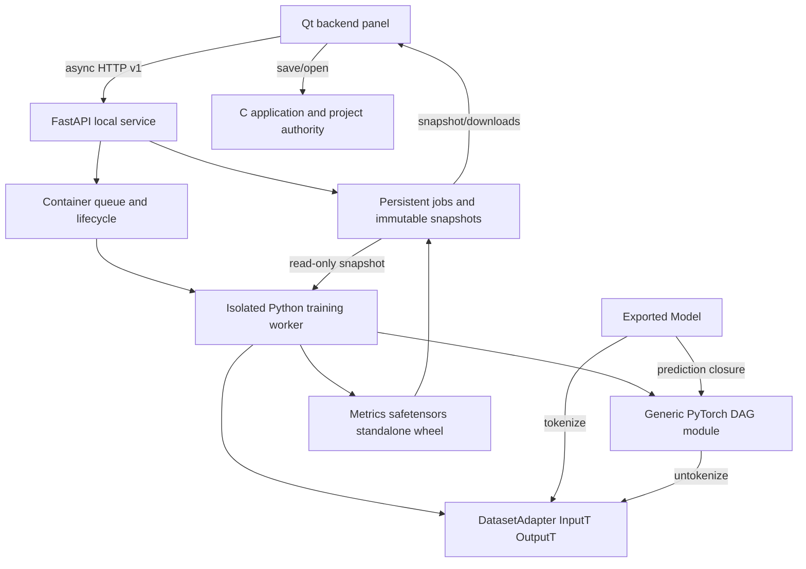
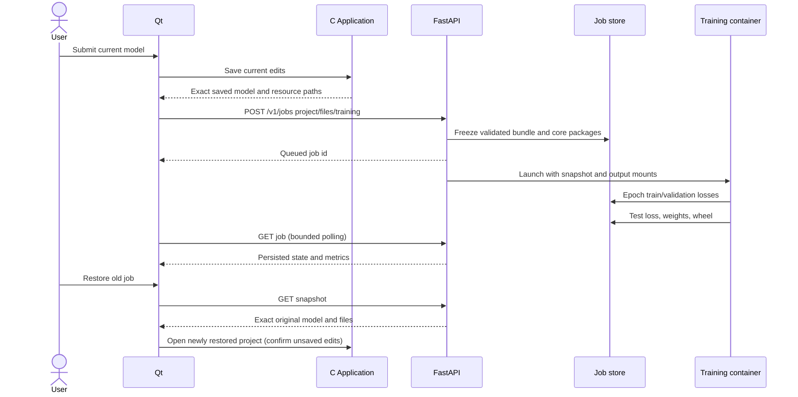

# Backend execution and snapshot ownership

Accepted 2026-10-05. Normative protocol: [backend](../contracts/backend.md).

DatasetAdapter is abstract generic over distinct input/output types. GraphModule
owns registered stereotype module instances and immutable graph schedule; service
owns no active UI graph. Exported Model owns adapter, graph and safetensors state.
