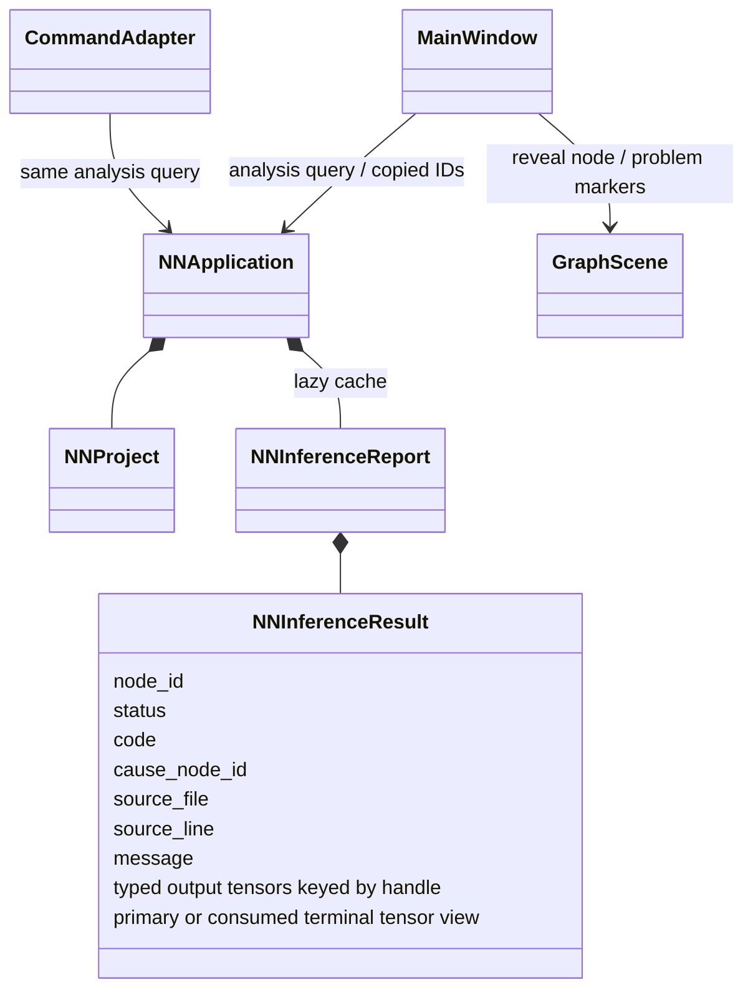

# Analysis ownership and problem navigation

Accepted 2026-09-30 per contracts/diagnostics.md.



```mermaid
sequenceDiagram
    actor User
    participant Entry as Qt or CLI
    participant App as C NNApplication
    participant Analysis as C Lua analysis
    participant Scene as Qt GraphScene
    Entry->>App: semantic mutation
    App->>App: invalidate report on success
    Entry->>App: analysis query
    alt cache missing
        App->>Analysis: infer immutable project
        Analysis-->>App: owned report or failure
    end
    App-->>Entry: borrowed outcomes or explicit failure
    Note over Entry: Problems grouped by root cause; tensors separate
    User->>Entry: click problem or ui.reveal(node)
    Entry->>Scene: validate ID, switch scope, queued refresh
    Scene->>Scene: select and center node
```

Failed mutation does not invalidate committed model/analysis. Positions and
labels do not rerun rules. Report IDs are owned; GUI stores copies, never report
pointers across invalidation. Lua syntax, semantic, incomplete and runtime
failures stay distinct. Hidden subflow children retain diagnostic root causes.
Current-scope filtering retains needed outside-scope roots as context, so the
actual originating severity is not replaced by a blocked/incomplete summary.
Blocked subflow owners propagate their root IDs to uninvoked children. Problem
rows wrap category/name, scope and reason within the existing panel width.
No SDS dependency is retained. utils owns bounded errors and path joining;
yyjson owns JSON escaping/serialization. No third-party types are added to APIs.
Typed output and boundary completion errors follow typed-outputs.md; handle/type
are retained in CLI tensors and all successful outputs remain inspectable.
