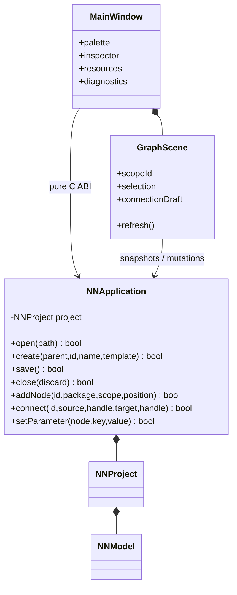

# Editor and C application boundary

C application owns active project and validates commands. Qt owns widget state,
selection, scope navigation and gestures. Snapshots are borrowed only until the
next C mutation; Qt copies stable IDs when retaining references. Parameter
widgets follow schema, but C remains final validator. ID-based refresh restores
selection where entities survive. Failed operations preserve committed state.
