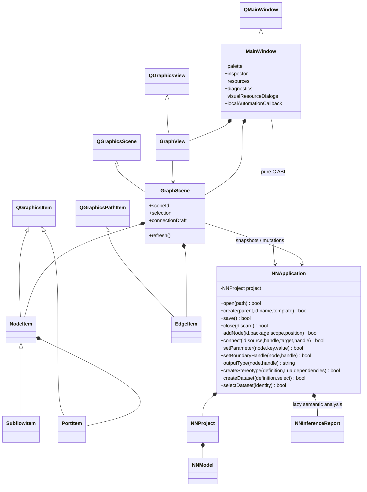

# Editor and C application boundary

Consolidated 2026-10-02: this is the single current editor/graphics/analysis
ownership diagram. The former graphics.md and diagnostics.md duplicated these
owners; their current details are retained here and in sequences.md. Source
organization follows contracts/source-layout.md and architecture/overview.md.

C application owns active project and validates commands. Qt owns widget state,
selection, scope navigation and gestures. Snapshots are borrowed only until the
next C mutation; Qt copies stable IDs when retaining references. Parameter
widgets follow schema, but C remains final validator. ID-based refresh restores
selection where entities survive. Failed operations preserve committed state.
Problem navigation, cause grouping and C report ownership follow
contracts/diagnostics.md and the analysis sequence in sequences.md.
Typed output forms, spawned subflow terminals, mapped boundaries and circles
follow contracts/typed-outputs.md and metamodel.md (2026-10-01).

## Graphics and report lifetimes

Qt owns items, clipping, fonts, transforms and event delivery. GraphScene copies
diagnostic category markers; NodeItem stores no borrowed report pointers. Card
geometry includes definition-positioned top/bottom parameter rows and central
title; Qt copies text and adapts port positions to height. Boundary kinds render
filled black/brown/red circles with outside labels, not cards. Ports copy
C-resolved output/loss classification; fanout/drafts follow source black/red,
with selection halos separate from that classification.
Accepted 2026-10-03: boundary PortItems paint visible contrasting rim handles
at rest and on hover. Their hit regions remain generous; circle rendering does
not suppress the only discoverable source/target affordance. Graph/model and
port ID/type ownership are unchanged.

C owns graph, coordinates and application mutations. Edge endpoints follow
PortItem scene positions only for rendering. Release commits positions to C;
failure restores committed positions. Painting is read-only. SubflowItem owns
no child model; scope navigation filters C nodes, collapse is transient.
The graphical entry point is `src/gui/qt/main.cpp`. The former NNPlatform,
nn_editor_run, SDL adapter and lifecycle smoke test were removed 2026-09-30.
No SDL draw list, custom camera math or C++ graph remains.

NNApplication owns the lazy report. Failed mutation does not invalidate it;
positions/labels do not rerun rules. Report IDs are owned; GUI retains copies,
never report pointers across invalidation. Lua syntax, semantic, incomplete and
runtime failures stay distinct. Hidden subflow children retain root causes;
uninvoked children of blocked owners inherit that root. Current-scope filtering
keeps outside-scope roots as context instead of replacing the originating
severity. Problem rows wrap category/name, scope and reason within the panel.
Typed tensors remain separately inspectable. Root completion is report metadata,
shown as a non-navigable Root problem with null node identity; it never erases
successful local tensors. CommandAdapter queries the same application report.
No SDS or third-party API types: global utils owns bounded errors/path joining;
yyjson owns escaping/serialization.
