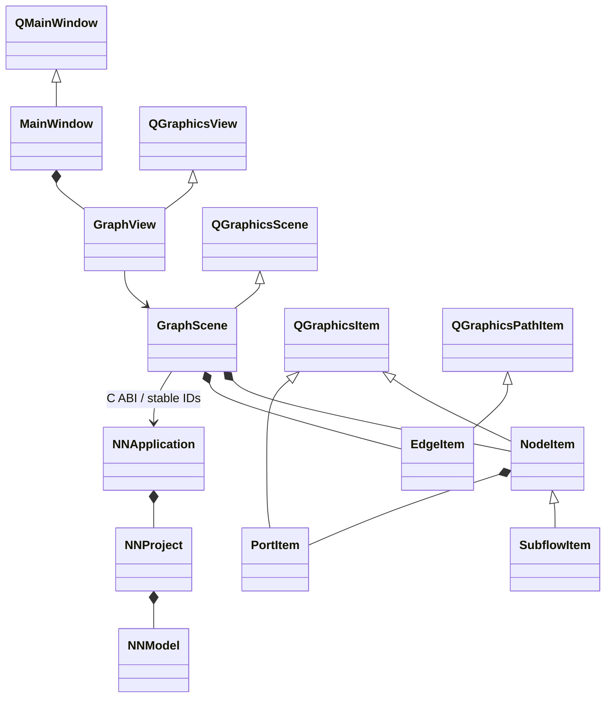

# Qt graphics ownership

Qt owns items, clipping, fonts, transforms and event delivery. C owns graph,
coordinates and application mutations. Edge endpoints follow PortItem scene
positions only for rendering. On release, positions commit to C and failed
commits restore C positions. Painting is read-only. SubflowItem owns no child
model: navigation filters C nodes by scope ID, and collapse is transient.
No SDL adapter, draw list, custom camera math or C++ graph exists.
