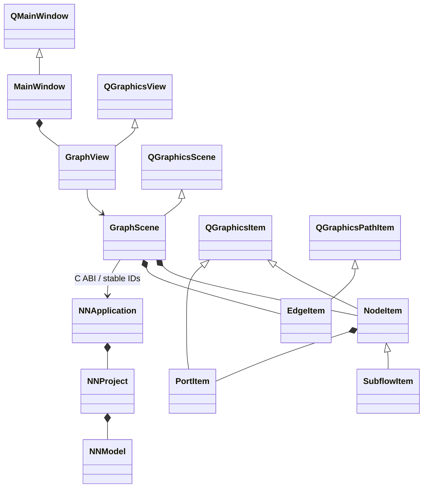

# Qt graphics ownership

Qt owns items, clipping, fonts, transforms and event delivery.
GraphScene copies diagnostic category markers from the application's borrowed
report; NodeItem renders them without storing report pointers (diagnostics.md).
Card geometry includes definition-positioned top/bottom parameter rows and
central title; Qt copies text for painting and adapts port positions to height.
Accepted 2026-10-01: boundary kinds render filled black/brown/red circles with
outside labels, not cards. Ports copy C-resolved output/loss classification;
fanout and drafts follow black/red source color. typed-outputs.md specifies
selection halos, typed output inspector and boundary mapping editor.
C owns graph, coordinates and application mutations. Edge endpoints follow PortItem scene
positions only for rendering. On release, positions commit to C and failed
commits restore C positions. Painting is read-only. SubflowItem owns no child
model: navigation filters C nodes by scope ID, and collapse is transient.
The graphical entry point is `gui/qt/main.cpp`; the C application/core has no
graphical entry point. The former `NNPlatform` adapter and `nn_editor_run` loop
were removed on 2026-09-30, together with their SDL lifecycle smoke test.
No SDL adapter, draw list, custom camera math or C++ graph exists.
