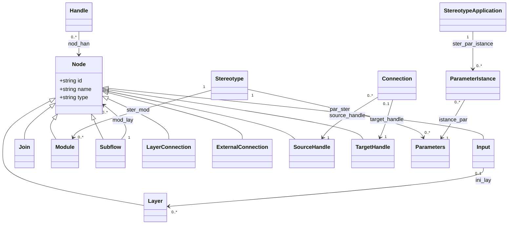
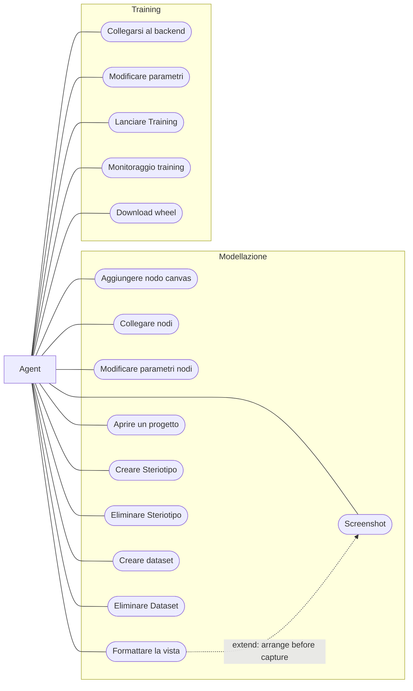

# Visual Paradigm reference transcription

## Purpose

Record what original `analysis/uml/nn.vpp` and generated
`analysis/uml/nn_metamodel.puml` actually contain. This is historical reference,
not the native class design. The `.vpp` is SQLite; its 25 Class records include
unnamed placeholders and duplicates. Generated PlantUML keeps 15 named
concepts, nine named associations, and nine Node generalizations. It has no
operation records. Spelling `ParameterIstance` and the unusual handle-as-Node
generalizations are retained here as provenance, then reconciled in
[current metamodel](metamodel.md). The VPP also contains one `Agent` actor,
15 named use cases, one extend relation, and `Training`/`Modellazione` groups.
Its 17 Constraint records and 12 NOTE records have no usable names; the
legacy [MCP use-case parity document](https://github.com/LucaSforza/NNModelling/blob/master/docs/knowledge/uml/mcp-use-case-parity.md)
provides their accepted interpretation.

## Diagram

## Legacy use cases

This second VPP model is transcribed in original terms. Associations and the
layout-before-screenshot rule follow the accepted legacy parity document;
grouping alone does not imply the native client implements training.

## Reconciliation and constraints

The generated file additionally generalizes `Node` to both handle types and
both connection-like types, although it also models `Connection` and `Handle`
separately. Those inconsistent references are not treated as a current
inheritance contract. The unlabelled multiplicity at `Handle→Node` is
unspecified. No operations or semantic constraints can be recovered faithfully
from this VPP model; current operations and constraints come from accepted
legacy graph/package contracts and are marked as such in normative UML.

Formal reference constraint: `∀a∈transcribedAssociations:
a.name,a.ends,a.multiplicity = generatedPuml(a)` where present. Natural: this
diagram preserves named source relationships without inventing missing ones.

No C mapping applies to historical inheritance. Current tagged/composed C
mapping appears in [metamodel](metamodel.md).
