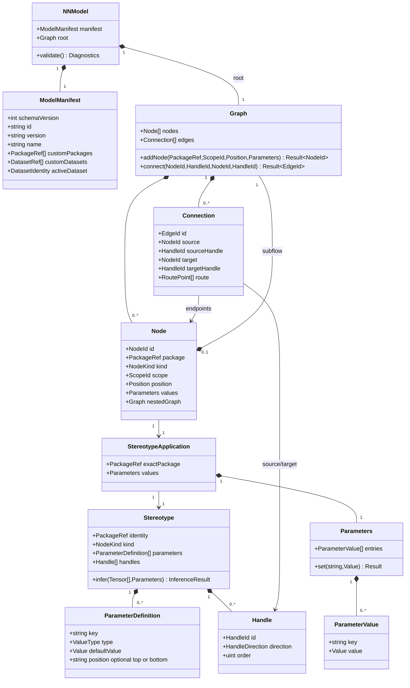

# Native neural-network metamodel

## Purpose

Define typed graph ownership and package application for native client. This
reconciles [legacy reference](legacy.md) with current package-only semantics.
`Input`, `Layer`, `Join` and `Subflow` are definition `kind` values, not C
subclasses. `Module` is represented by a nested graph where needed; legacy
`LayerConnection`/`ExternalConnection` are not separate edge classes. Handles
belong to nodes, not graph nodes. `ParameterIstance` is corrected to
`ParameterValue`.

## Diagram

## Operations

Accepted 2026-09-30: a subflow's single Input inherits owner tensor and its
single Output supplies owner output through Lua services.infer_subflow.
Nested inference follows resource-authoring.md and includes hidden children.

`Graph.connect(s,sh,t,th) -> Result<EdgeId>` requires both nodes in graph,
source/output and target/input handles on those nodes, equal immediate scope,
free target handle and no resulting cycle. Success adds one edge and invalidates
dependent inference. Failure adds none. `Graph.addNode(ref,scope,pos,values)`
requires exact active package and validated values; success owns one new node.
`Parameters.set(key,value)` validates definition type/range before replacing
one value, then invalidates dependent analysis. `Stereotype.infer` is read-only,
calls isolated Lua and returns success, Lua compilation error, semantic error,
unresolved, or fault. Application owns cached result values per diagnostics.md;
graph owns committed nodes/edges.
Project/resource ownership, dataset slots and package dependency resolution
are normative in [project UML](project.md).

## Constraints

Formal: `∀e∈g.edges: e.source,e.target∈g.nodes ∧ scope(e.source)=scope(e.target)`.
Natural: edge endpoints belong to same immediate graph.

Formal: `∀n∈g.nodes: n.package∈activePackages(model)` and
`n.kind=definition(n.package).kind`. Natural: exact package definition drives
node kind and behavior.

Formal: `∀e1≠e2: (e1.target,e1.targetHandle)≠(e2.target,e2.targetHandle)`;
`acyclic(g)`. Natural: input handles have one producer and graph has no cycles.

Formal: `joinInputs(n)=sort(incoming(n),targetHandle.order)`.
Natural: join order is explicit, not traversal-dependent.
For package definitions without declared handles, `kind=join` derives ordered
`in-<positive integer>` inputs; other input-bearing kinds derive `in`, and
output-bearing kinds derive `out`.

Formal: `node.nestedGraph≠null ⇔ node.kind=Subflow` for current concept;
`hidden(node) ⇏ remove(node.nestedGraph)`. Natural: subflows own child graphs
regardless of visibility. Containment uses the existing node scope_id string, with empty root and
subflow node ID for children; Qt scope navigation never changes containment.

## C mapping

Use explicit structs and IDs; `NodeKind` discriminates only topology, while
package ID selects definition data, never a switch over concrete packages.
Optional nested graph and tagged primitive parameter values replace UML
inheritance. `Connection` stores IDs, not raw node pointers. `Handle` is
definition data. The application owns model storage and catalog lifetime.
