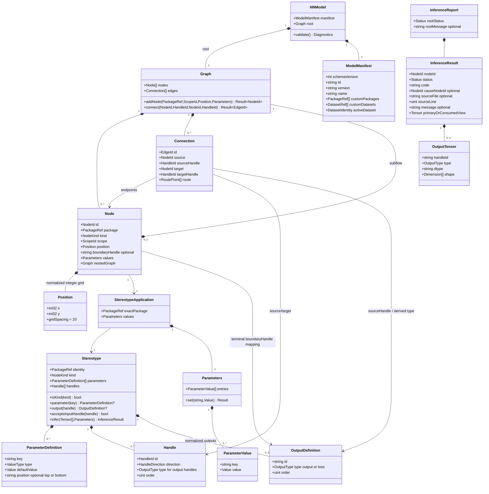
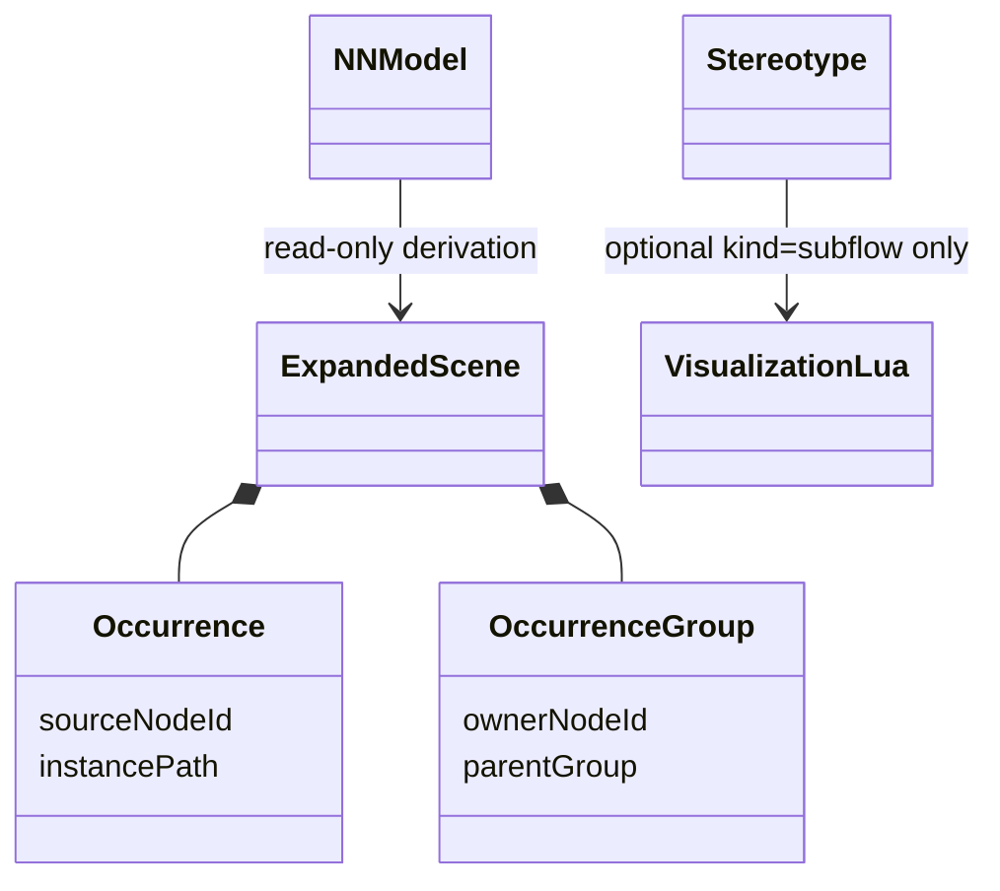

# Native neural-network metamodel

## Purpose

Define typed graph ownership and package application for native client. This
reconciles [legacy reference](legacy.md) with current package-only semantics.
`Input`, `Layer`, `Join` and `Subflow` are definition `kind` values, not C
subclasses. `Module` is represented by a nested graph where needed; legacy
`LayerConnection`/`ExternalConnection` are not separate edge classes. Handles
belong to nodes, not graph nodes. `ParameterIstance` is corrected to
`ParameterValue`.

Consolidated 2026-10-02: typed outputs and analysis result types, formerly
duplicated in typed-outputs.md/diagnostics.md, are part of this metamodel.
Their operation sequences live in sequences/; no older single-output design
is retained as a current alternative.

## Diagram

## Operations

Accepted 2026-10-01: a subflow's single Input inherits owner tensor; mapped
typed terminals supply keyed owner outputs through services.infer_subflow.
Nested inference follows typed-outputs.md and includes hidden children.
Creating a subflow seeds one immediate Input and each mapped terminal atomically,
with scope-local integer grid positions; no edges or existing-scope repair.

`Graph.connect(s,sh,t,th) -> Result<EdgeId>` requires both nodes in graph,
source/output and target/input handles on those nodes, equal immediate scope,
free target handle and no resulting cycle. Success adds one edge and invalidates
dependent inference. Failure adds none. `Graph.addNode(ref,scope,pos,values)`
requires exact active package and validated values; success owns one new node.
`Parameters.set(key,value)` validates definition type/range before replacing
one value, then invalidates dependent analysis. `Stereotype.infer` is read-only,
calls isolated Lua and returns success, Lua compilation error, semantic error,
unresolved, or fault. Application owns cached result values per diagnostics.md;
graph owns committed nodes/edges.
Project/resource ownership, dataset slots and package dependency resolution
are normative in [project UML](project.md).

## Constraints

Formal: `∀e∈g.edges: e.source,e.target∈g.nodes ∧ scope(e.source)=scope(e.target)`.
Natural: edge endpoints belong to same immediate graph.

Formal: `∀n∈g.nodes: n.package∈activePackages(model)` and
`n.kind=definition(n.package).kind`. Natural: exact package definition drives
node kind and behavior.

Formal: `∀e1≠e2: (e1.target,e1.targetHandle)≠(e2.target,e2.targetHandle)`;
`acyclic(g)`. Natural: input handles have one producer and graph has no cycles.

Formal: `joinInputs(n)=sort(incoming(n),targetHandle.order)`.
Natural: join order is explicit, not traversal-dependent.
For package definitions without declared handles, `kind=join` derives ordered
`in-<positive integer>` inputs; other input-bearing kinds derive `in`, and
output-bearing kinds derive out/output except loss derives loss/loss.
Explicit declarations replace defaults, at most one handle per type; output
and loss-output terminal kinds expose no output handles. See typed-outputs.md
and the boundary constraints below for terminal restrictions and mappings.

Formal: `node.nestedGraph≠null ⇔ node.kind=Subflow` for current concept;
`hidden(node) ⇏ remove(node.nestedGraph)`. Natural: subflows own child graphs
regardless of visibility. Containment uses the existing node scope_id string, with empty root and
subflow node ID for children; Qt scope navigation never changes containment.

## C mapping

Use explicit structs and IDs; `NodeKind` discriminates only topology, while
package ID selects definition data, never a switch over concrete packages.
Catalog owns read-only package queries for kind comparison, parameter/output
definition lookup, and kind-derived input-handle validity. Returned definition
entries are borrowed for catalog lifetime. Graph occupancy, output-type
compatibility, subflow mapping, and inference status stay in their owning
consumers; package queries do not absorb graph validation.
In Qt, kind=join selects the junction bar and generic +/- empty-input-slot
controls; graph edges retain occupied in-N handles, while extra empty slots are
editor state. No package-ID special case or fork-output semantic change.
Optional nested graph and tagged primitive parameter values replace UML
inheritance. `Connection` stores IDs, not raw node pointers. `Handle` is
definition data. The application owns model storage and catalog lifetime.
Accepted 2026-10-03: model add/move normalize finite double input coordinates
to signed 32-bit multiples of 20, nearest with ties away from zero, rejecting
range errors before mutation. Project load uses the same path; save and command
snapshots emit integer positions. Camera transforms remain Qt floating geometry.

## Typed boundary constraints (accepted 2026-10-01)

Every declared output matches exactly one immediate terminal with equal ID and
type. Tensor mapping is not a cross-scope edge: an inherited Input feeds the
internal graph, whose Output/Loss Output terminals map to parent output/loss
handles. Default subflow has out/output only. Root has exactly one Output and
one Loss Output, without mappings; multiple root Inputs remain allowed. All
terminal inputs have at most one producer; accumulation requires explicit join.
Intermediate nodes accept either edge type; their own outputs classify fanout.
Analysis reads keyed sourceHandle tensors without mutation. Computational Lua
success chooses the complete keyed map OR single-handle shorthand; terminal
success uses consumed-tensor shorthand only. Missing completion is Incomplete;
invalid declarations/mappings are semantic errors; invalid edge commands reject
without mutation. Root completion is report metadata even for zero nodes:
Incomplete with a non-navigable null-node Root problem, never synthetic IDs or
discarded successful tensors. The CLI complete flag conjuncts root/per-node
success. Report-construction allocation failure is an explicit whole-report
failure, not partial successful state.

## Presentation occurrences (2026-10-04)

Occurrences are not NNModel nodes. Generic Lua plans describe body instances,
synthetic operators, edges and owner output mapping per visualization-3d.md.
