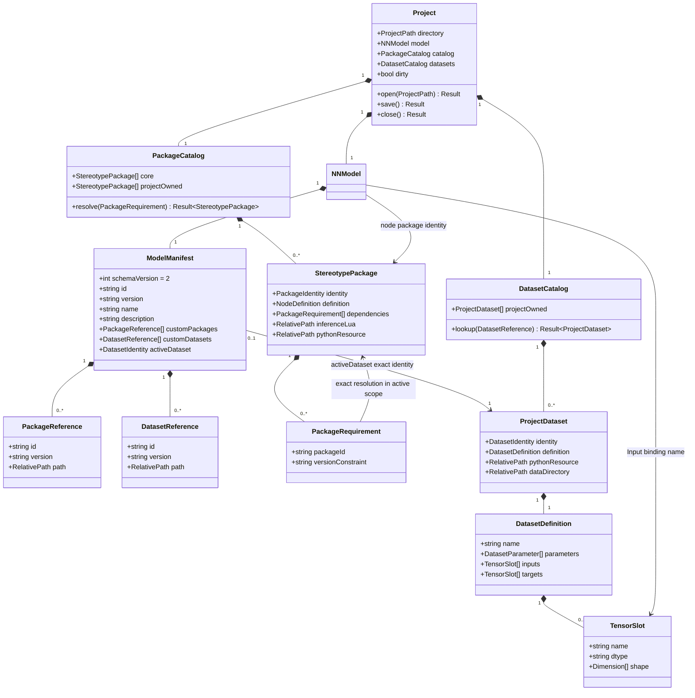

# Project, dataset and stereotype dependency model

## Purpose

Define one writable project as ownership boundary for model, datasets and
custom stereotypes. This diagram is normative. It reconciles legacy project
manifest v2, project-owned resource paths and exact package activation.

## Diagram

## Operations and ownership

`Project.open(path) -> Result` reads `model.json`, parses typed graph and
manifest, validates all declared package/dataset paths and their exact
identities, resolves each dependency within `core ∪ projectOwned`, then swaps
active project atomically. Failure keeps previous project, model and catalogs.
Filesystem path is session state, never serialized. `save() -> Result` writes
schema-v2 model JSON to a temporary sibling, flushes and atomically renames;
failure retains dirty state and old file. `close() -> Result` releases catalogs,
Lua rules and directory ownership after successful save or explicit discard.
`PackageCatalog.resolve` returns exactly one active package matching ID and
version constraint; missing or ambiguous resolution is an error. Dataset
lookup matches exact ID/version and validated project-relative path. No
project dataset Python or stereotype PyTorch resource runs in this client.
`activeDataset` is an optional exact `{id,version}` manifest value and must
resolve to one declared dataset. Selecting another dataset edits this manifest
value and invalidates client type analysis.
Dataset resource schema 1 stores `manifest.json` with exact ID/version and
`entrypoints.definition` pointing at `dataset.json`. Definition exposes
`batch.inputs` and `batch.targets` maps of named `{dtype,shape}` tensor slots;
dimensions are positive integers or symbolic batch string `B`. The bundled
MNIST example under `examples/mnist-mlp/` demonstrates this boundary.

## Constraints

Formal: `activePackages(P) = corePackages ∪ refs(P.manifest.customPackages)`;
`activeDatasets(P) = refs(P.manifest.customDatasets)`.
Natural: project manifest exhaustively declares non-core resources; ambient
directories are not activated.

Formal: `activeDataset(P)=null ∨ activeDataset(P)∈activeDatasets(P)`.
Natural: selected dataset is persisted by exact identity, never by display name.

Formal: `∀r∈customPackages∪customDatasets: canonical(P.dir/r.path) ⊂ P.dir ∧
!symlinkTraversal(r.path) ∧ identity(resource(r.path))=(r.id,r.version)`.
Natural: each resource stays inside project and identifies exact manifest
entry. Absolute paths, traversal and symlink escapes are rejected.

Formal: `∀q∈dependencies(pkg): |resolve(q,activePackages(P))|=1` and
`acyclic(dependencyGraph(P))`.
Natural: every package dependency has one active provider; dependency cycles
cannot activate. Required package cannot be removed while another package or
graph node uses it.

Formal: `∀Input n: ∃slot∈selectedDataset.inputs: slot.name=n.params.binding`
when dataset selected. Natural: named Input bindings resolve from selected
dataset metadata; no package-ID-specific inference branch.

Formal: `openFailure ⇒ (project',model',catalogs')=(project,model,catalogs)`;
`saveFailure ⇒ dirty'=true ∧ diskModel'=diskModel`.
Natural: failed open/save never drops current model or claims saved state.

## C mapping

Use owned structs for project, typed graph, package records and dataset
metadata. References carry copied ID/version/relative path strings, not raw
filesystem handles. Dependency edges use package indices or exact identity
after validation; no global package map becomes project authority. JSON DOM is
temporary parse/write state. Only project module owns filesystem mutations.
