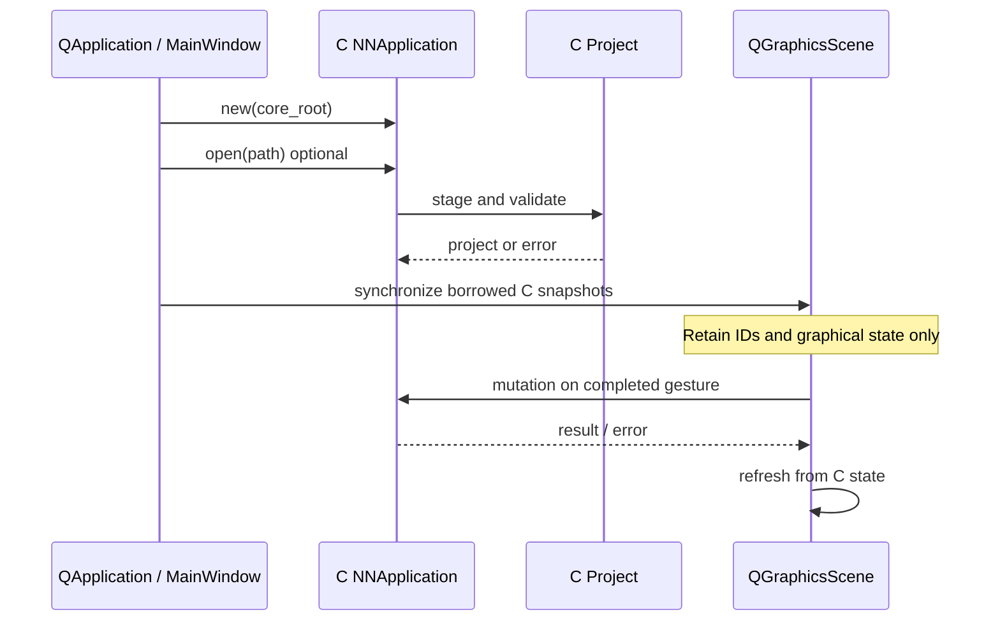
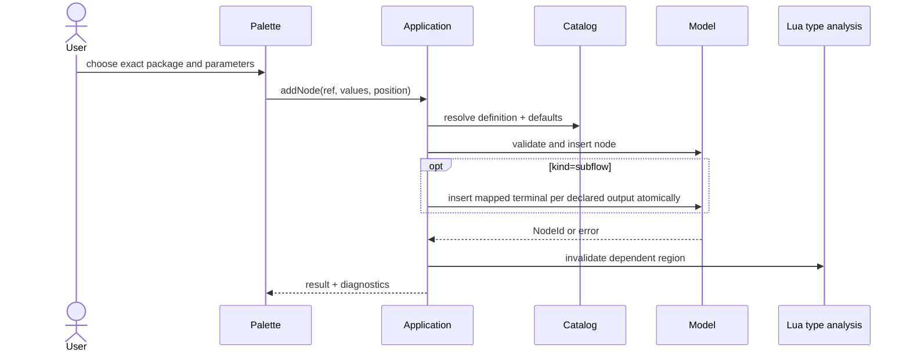
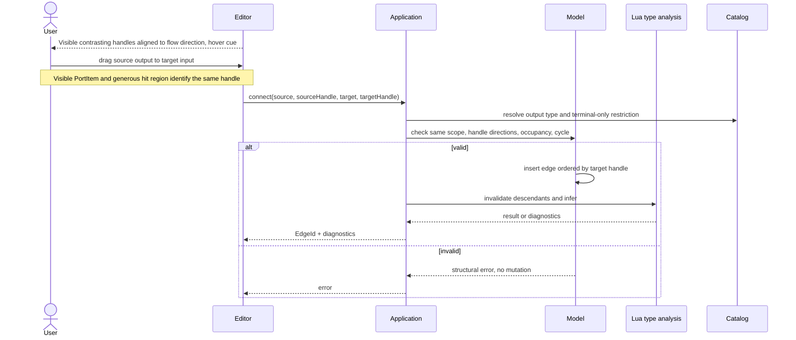
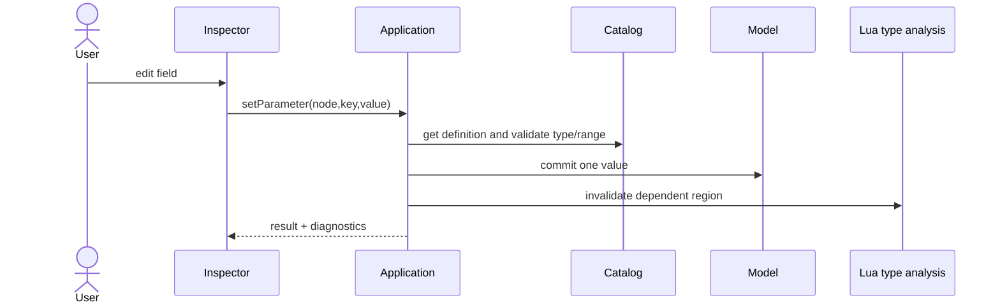
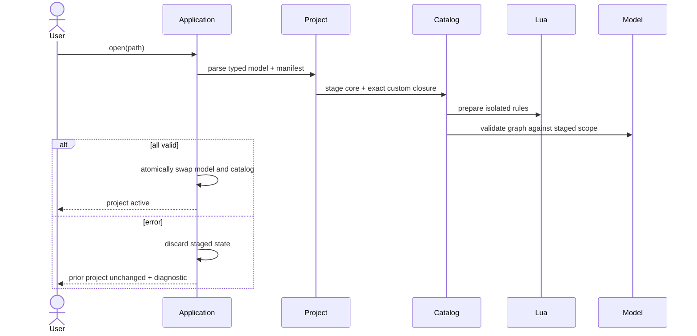
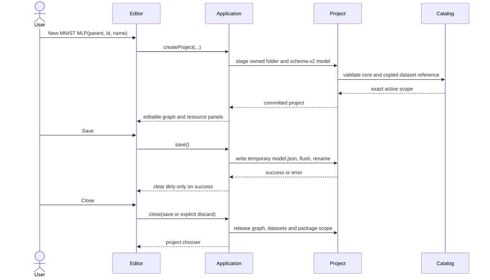
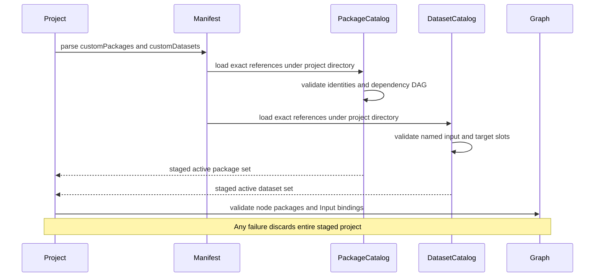
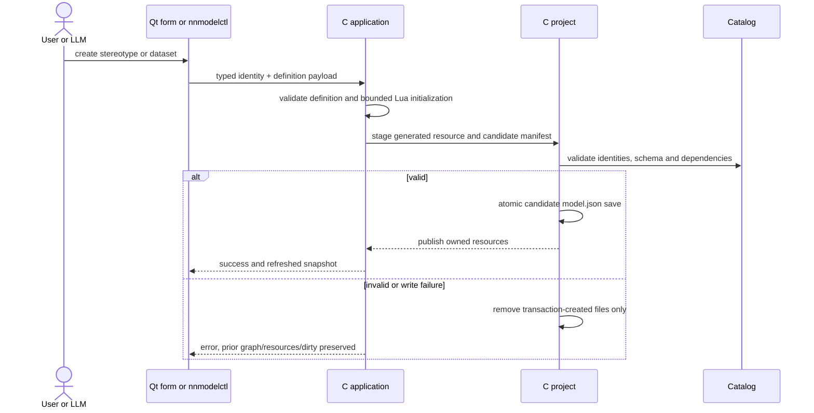
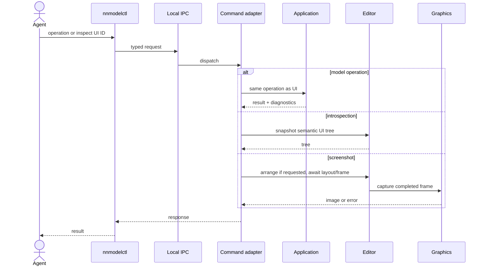

# Interaction sequences

## Purpose

Test ownership and ordering for important client flows. Dashed future actors
remain deferred. Each sequence references operation contracts in
[model](../contracts/model.md), [editor](../contracts/editor.md) and
[future interfaces](../contracts/future-interfaces.md).

## Startup and graphical synchronization



## Create node



## Connect nodes



## Fit and arrange scope

```mermaid
sequenceDiagram
    actor User
    participant Window as MainWindow
    participant Scene as GraphScene
    participant App as C NNApplication
    participant View as GraphView
    User->>Window: Fit or Arrange(Vertical/Horizontal)
    Note over Window: Fit always chooses Vertical
    Window->>Scene: set presentation direction
    Window->>App: read current-scope nodes and edges
    Window->>Window: deterministic DAG ranks and spaced lanes
    Window->>App: move nodes using copied stable IDs
    App-->>Window: committed positions or visible error
    Window->>Scene: refresh matching handles and edge tangents
    Window->>View: frame content with margin and final centering
    Note over App,Scene: Positions persist; direction is session presentation state
```

## Edit parameter



## Project loading



## Create, save and close project



## Resolve project resource dependencies



## Local command, introspection and screenshot

Accepted 2026-09-30 per automation.md; transport is nonblocking AF_UNIX and
dispatch occurs on Qt application thread. Resource creation sequence:





## Constraints and C mapping

Formal: `operationFailure ⇒ graph'=graph`; `projectOpenFailure ⇒
(graph',catalog')=(graph,catalog)`; `renderFrame ⇒ graph'=graph`.
Natural: failed commands/load and frame rendering do not corrupt active model.

Formal: `∀join: inputOrder=targetHandleOrder`; `screenshotFrame≥layoutFrame`.
Natural: semantic join order and visible screenshot order are deterministic.

In C, sequences call explicit application functions; event handlers and local
transport adapters hold pointers/IDs to the same application owner. Project
staging uses temporary owned structs, swapped only after validation. No second
graph is allocated for command service beyond immutable response snapshots.
Analysis queries/invalidation and problem navigation follow diagnostics.md.

## Analysis cache and problem navigation

Accepted 2026-09-30, consolidated 2026-10-02 from diagnostics UML; owner diagram
is editor.md and result types are metamodel.md. contracts/diagnostics.md remains
normative. Typed spawning is already included in Create node above.

```mermaid
sequenceDiagram
    actor User
    participant Entry as Qt or CLI
    participant App as C NNApplication
    participant Analysis as C Lua analysis
    participant Scene as Qt GraphScene
    Entry->>App: semantic mutation
    App->>App: invalidate report on success
    Entry->>App: analysis query
    alt cache missing
        App->>Analysis: infer immutable project
        Analysis-->>App: owned report or failure
    end
    App-->>Entry: borrowed outcomes or explicit failure
    Note over Entry: Problems grouped by root cause; tensors separate
    User->>Entry: click problem or ui.reveal(node)
    Entry->>Scene: validate ID, switch scope, queued refresh
    Scene->>Scene: select and center node
```
