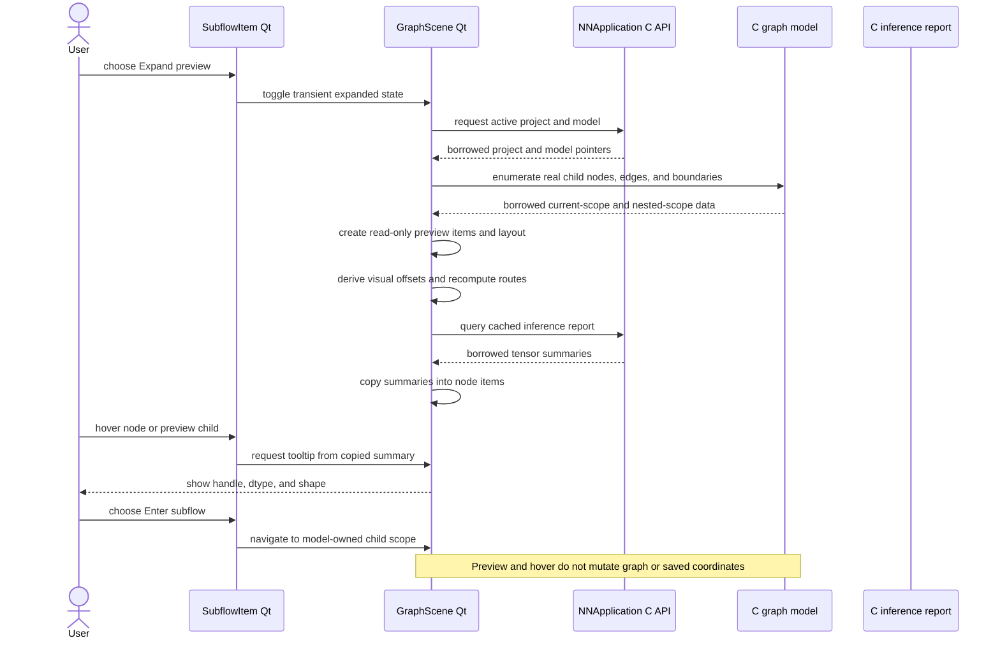

# Analysis and navigation sequences

## Analysis and problem navigation

**Purpose.** Show how successful model edits invalidate the shared C report,
how Qt copies report data, and how a problem row reveals its source node.

```mermaid
sequenceDiagram
    actor User
    participant Main as MainWindow Qt Widgets
    participant Scene as GraphScene Qt
    participant App as NNApplication C API
    participant Analysis as C inference report
    participant Model as C graph model
    Main->>App: successful semantic mutation
    App->>App: invalidate cached report
    Main->>Scene: refresh graph and panels after success
    Scene->>App: nn_app_analysis()
    alt report cache is empty
        App->>Analysis: infer active project
        Analysis->>Model: read graph and package rules
        Analysis-->>App: owned report
        App->>App: retain report in application
    else report already cached
        App->>App: keep current report
    end
    App-->>Scene: borrowed results or explicit failure
    Scene->>Scene: copy successful tensor summaries and problem markers
    Main->>Main: build diagnostics panel from same application report
    User->>Main: select problem row
    Main->>App: resolve problem node ID and containing scope
    App->>Model: read active project and node ownership
    Model-->>App: copied node and scope identifiers
    App-->>Main: resolved node and scope
    Main->>Scene: switch scope, refresh, select, and center node
    Note over Scene,Analysis: Analysis reads graph; report pointers are not retained across mutation
```

## Preview and hover

**Purpose.** Distinguish a read-only expanded preview from entering a subflow,
and show that hover text is copied from the cached analysis report.


