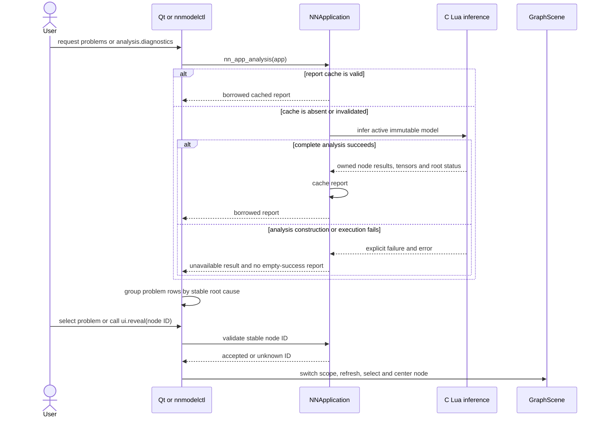
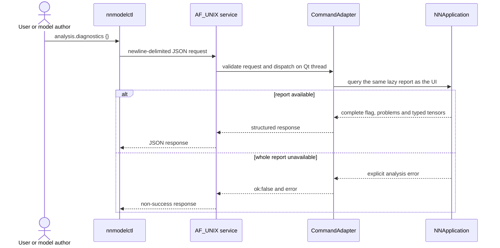
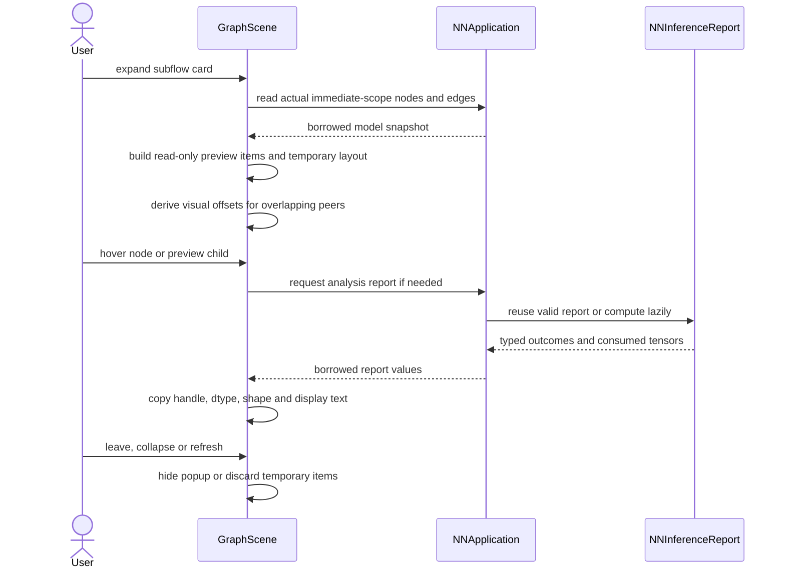

# Analysis and problem navigation

The C `NNApplication` owns one lazy `NNInferenceReport`. Analysis is computed
only when queried; a successful semantic mutation invalidates the cache but does
not infer immediately. Position, label and save operations keep the report.
Sources: `src/application/application.c`, `src/application/graph_commands.c`,
`src/inference/inference.c`, `src/gui/qt/MainWindowDiagnostics.cpp` and
`src/gui/qt/GraphScene.cpp`.

## Lazy analysis and problem navigation

Problems distinguish Lua compilation, model semantic, incomplete and internal
failures. Successful typed tensors stay available in the inspector and port
hover; they do not become success rows. Borrowed report references expire on
invalidation or application release. Qt copies stable IDs and category markers;
it never keeps report pointers across mutation. A failed mutation preserves
the old report because active model state did not change.

## Diagnostics query through local automation

The command is read-only and uses the active UI application's single report.
Transport and command details are in
[resource-automation.md](resource-automation.md) and
`contracts/diagnostics.md`.

## Preview and tensor hover

Preview borrows identity from the existing graph; it does not create a second
graph or mutate child positions. Hover text is copied into Qt-owned storage.
Expansion, camera and popup state remain transient presentation state.
