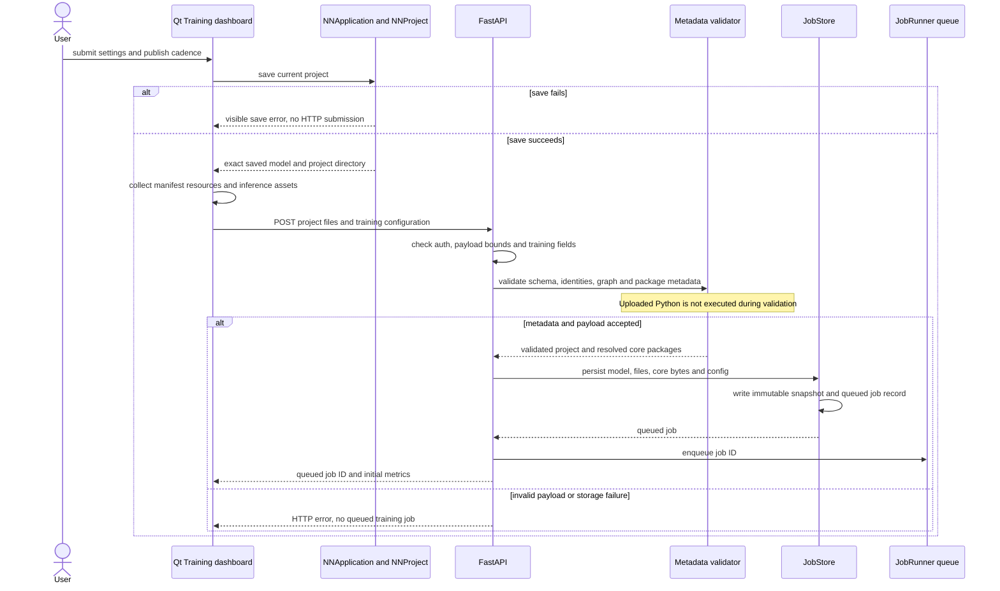
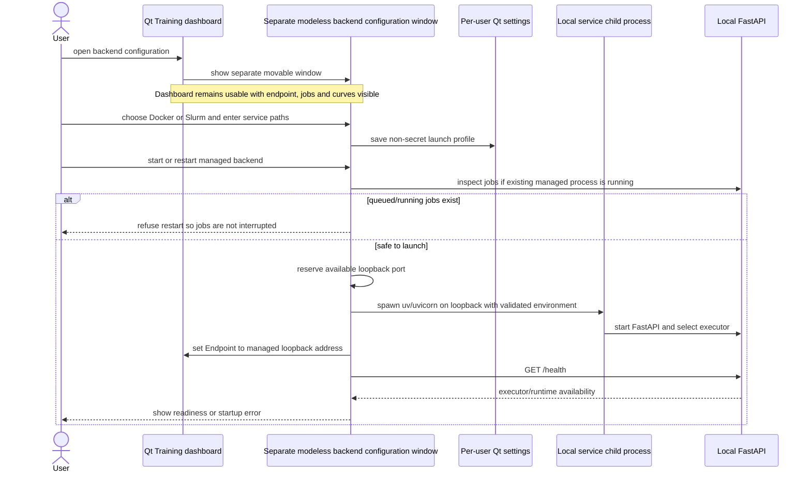
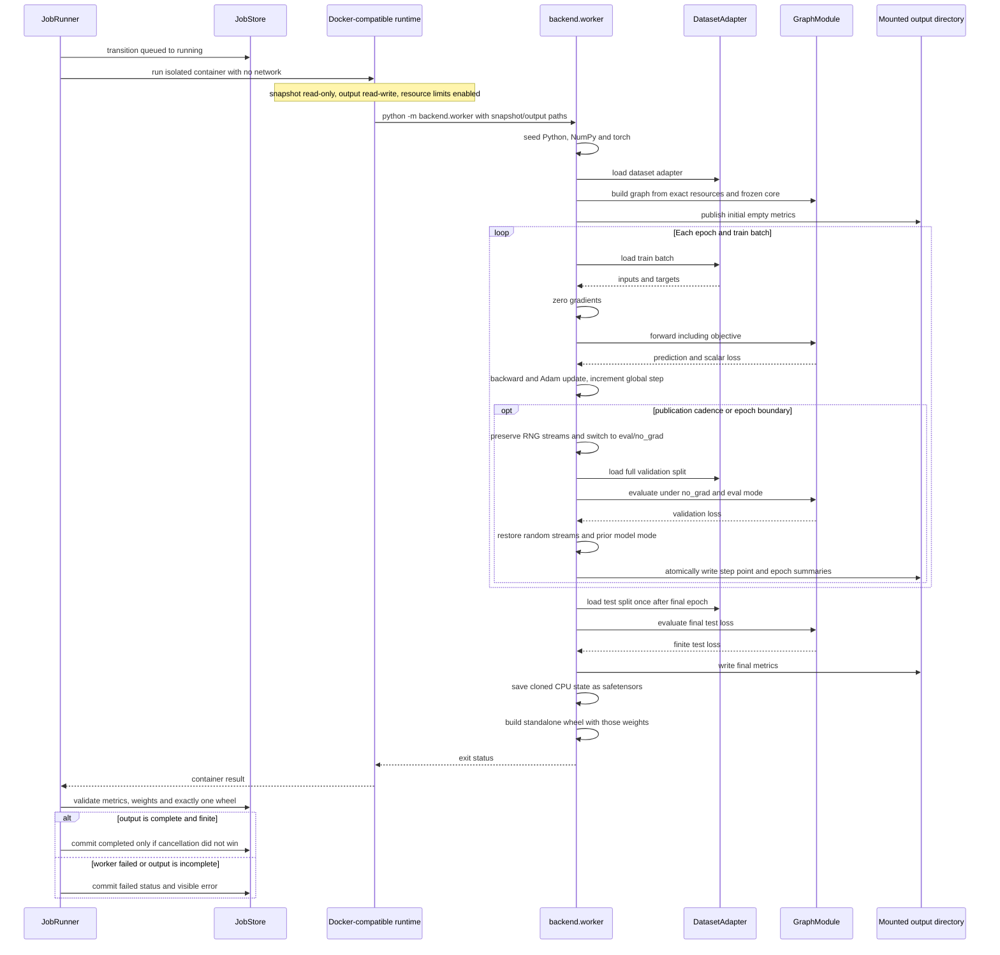
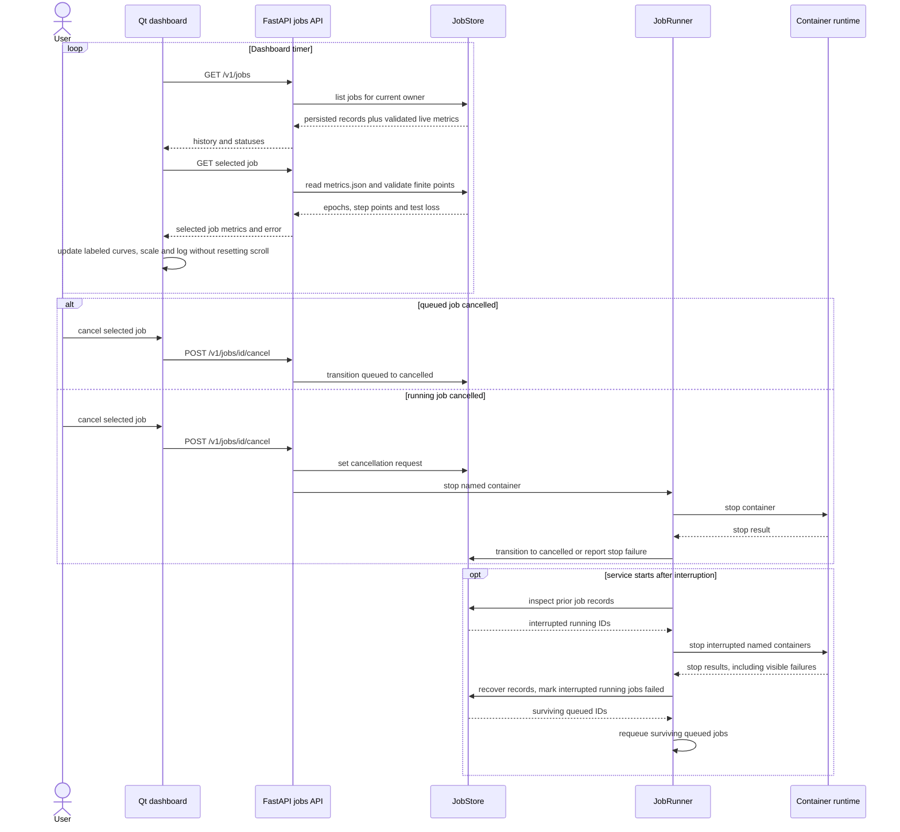
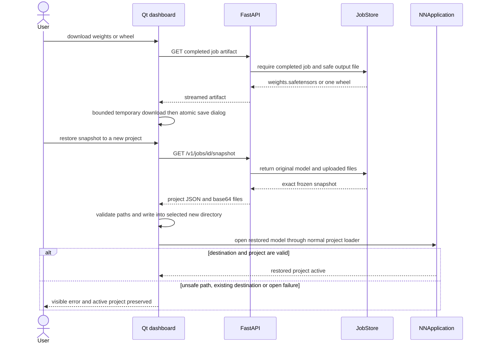
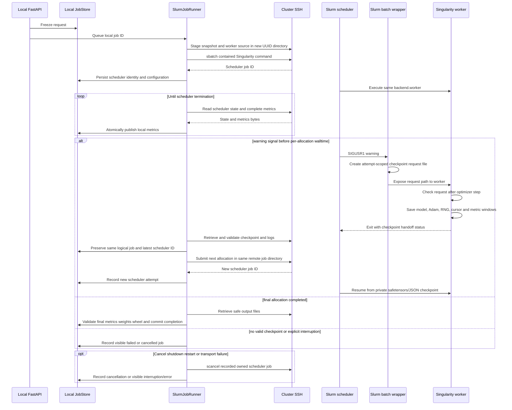

# Backend jobs and training dashboard

The service freezes an API request into a job directory before execution. The
container reads the snapshot and writes only the mounted output; the service
reads and validates those files before marking a job complete. Sources include
`src/gui/qt/BackendDialog.cpp`, `backend/app.py`, `backend/validation.py`,
`backend/store.py`, `backend/runner.py`, `backend/worker.py` and
`python/nnmodelling-runtime/`.

## Save and submit an immutable snapshot

The snapshot includes selected dataset resources and submitted data. It is
read-only to the worker. Later UI edits cannot change a queued or running job.
The resolved core directory is frozen under `snapshot/core/<package-folder>`.

## Configure and launch the local service

The child is a separate local Python process, not embedded in Qt. Closing the
Training dialog leaves it running. Application shutdown warns that active jobs
will be interrupted; user must explicitly confirm stopping it. An external
backend endpoint is never managed by this launcher.

## Queue, container and worker lifecycle

Each step point pairs the sample-weighted training mean since the prior point
with full-split validation loss. The global optimizer step increases only after
a successful update. Epoch end publishes any remaining window once; if that
step already has a point, it reuses that validation value. Epoch summaries keep
the epoch-wide sample-weighted mean. Test loss runs once after the final epoch.

## Poll curves, cancel and recover

Polling is asynchronous in Qt. Job records are per local owner; metrics readers
accept legacy epoch-only records and new step records. Metrics over the contract
limit or invalid/nonfinite points fail visibly. Container launch or worker
errors are recorded instead of represented as successful completion.

## Download artifacts or restore a snapshot

Restore does not overwrite the original project or an existing destination.
Downloaded weights and wheels require completed jobs. Safetensors is the
interchange checkpoint; pickle checkpoints are not emitted.

## Local API with remote Slurm containers (accepted 2026-10-08)

Each local job keeps one ID across allocation attempts. Its Slurm ID changes and
the active ID alone is targeted by cancellation. Checkpoints are written in the
remote job output and transferred to local private output after each handoff;
they use safetensors plus JSON, never pickle, and remain unavailable from the
artifact API. The training adapter must replay an epoch deterministically from
the captured Python, NumPy and torch RNG states so the worker can skip batches
already covered by a checkpoint. A signal is honored at the next optimizer-step
boundary; a hard walltime kill before that boundary fails visibly without
automatic continuation. Final weights and wheel are created only after test
evaluation on the last allocation.
