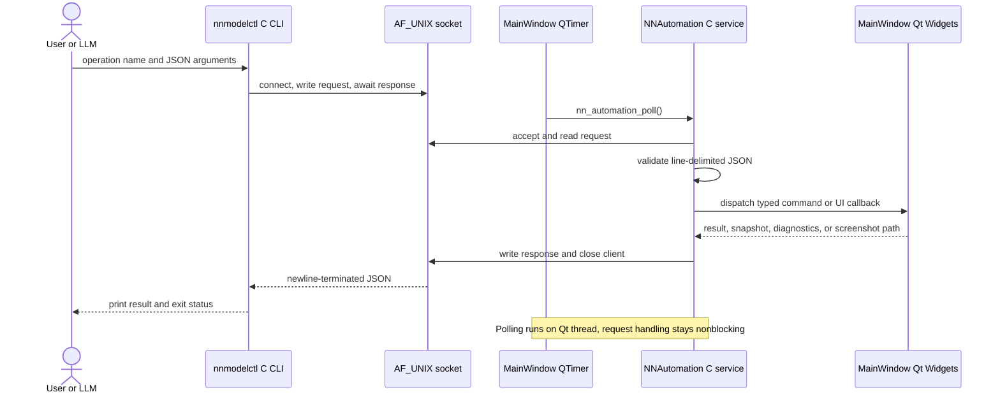
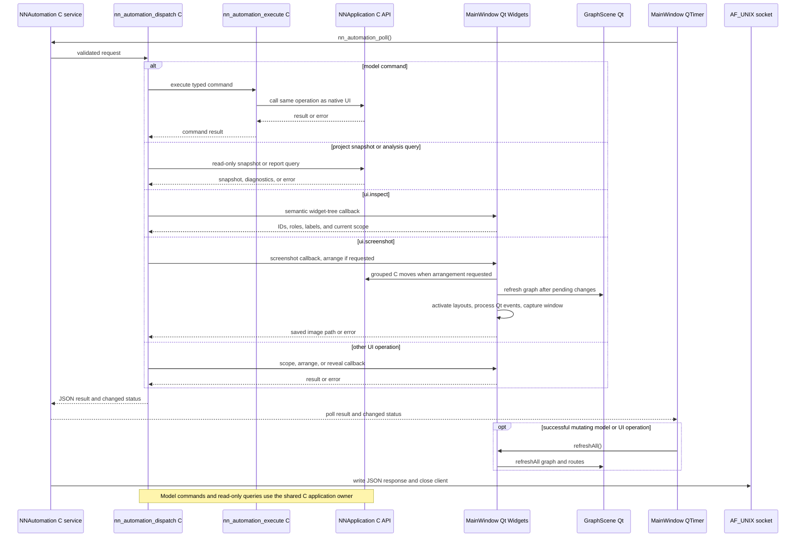

# Local command service sequences

## Request transport

**Purpose.** Trace line-delimited requests from nnmodelctl to the nonblocking
C service polled on the Qt application thread.

## Route a request

**Purpose.** Identify the distinct model, query, and UI paths selected by the
C dispatcher after a request reaches the service.

