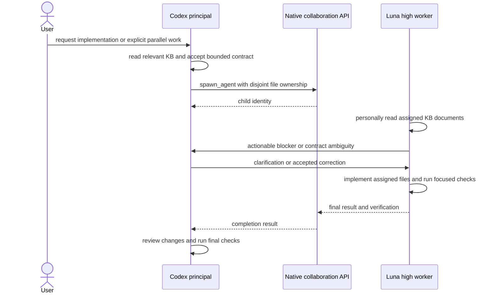
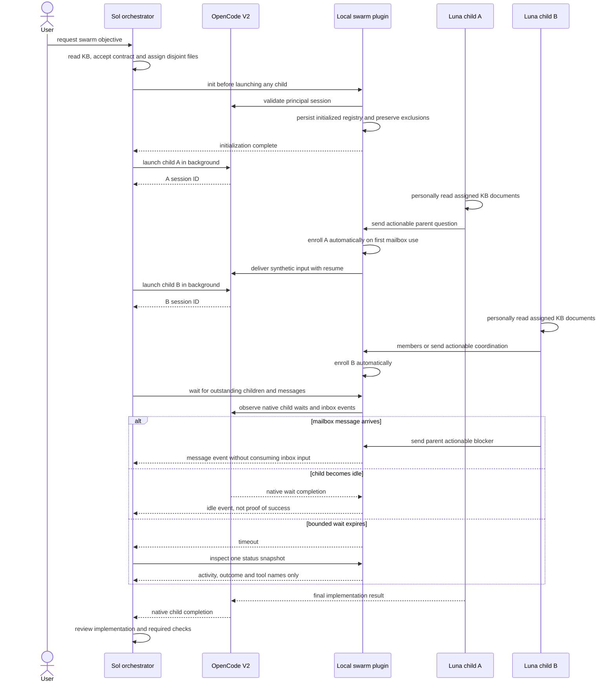
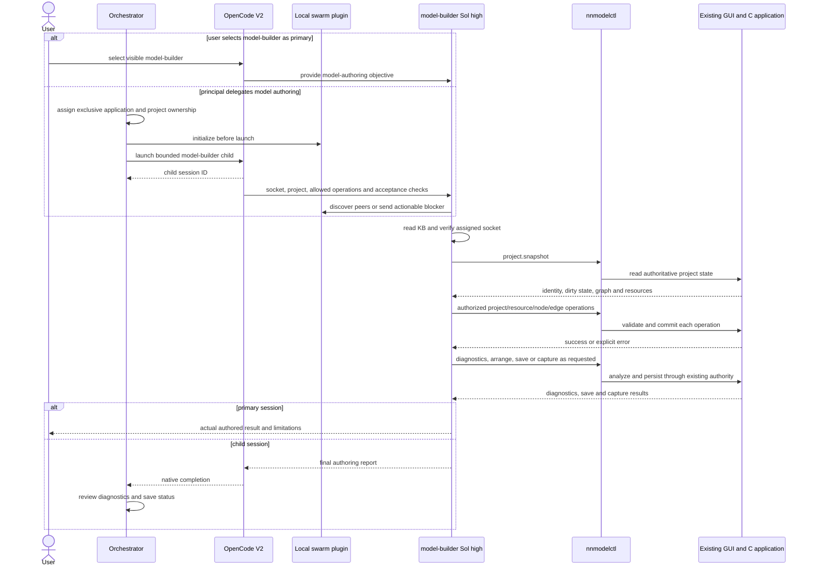

# Development agent sequences

The KB-first rules apply in Codex and OpenCode V2, but their delegation APIs are
separate. The principal owns architecture, accepted contracts, knowledge-base
changes and result review. Workers implement only bounded assignments and do
not delegate further.

## Codex bounded implementation

Codex workers use native `collaboration` tools. OpenCode `swarm.init`, mailbox
enrollment and session IDs do not apply to this path. Shared-checkout workers
own disjoint files; Git staging and commits are serialized by the principal.

## OpenCode V2 initialization, launch and mailbox

Initialization must succeed before any OpenCode child launch. Direct children
enroll on mailbox use or when addressed; no subsequent register barrier is
needed. Wait observes events and does not consume messages, cancel children or
prove completion. Registry membership/exclusions and all role limits follow
`contracts/agent-swarm.md`.

## CLI model-authoring agent

Only one mutating author may own an application socket and writable project at
a time. Builder has no second graph and cannot edit project files or spawn
workers. Each successful CLI command commits independently; later command
failure does not undo earlier operations.
