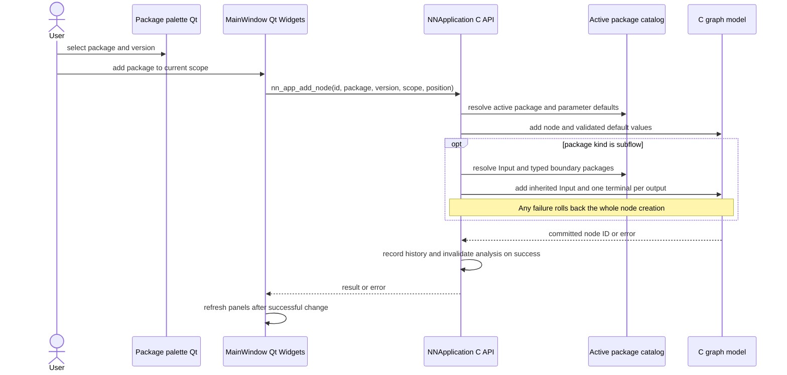
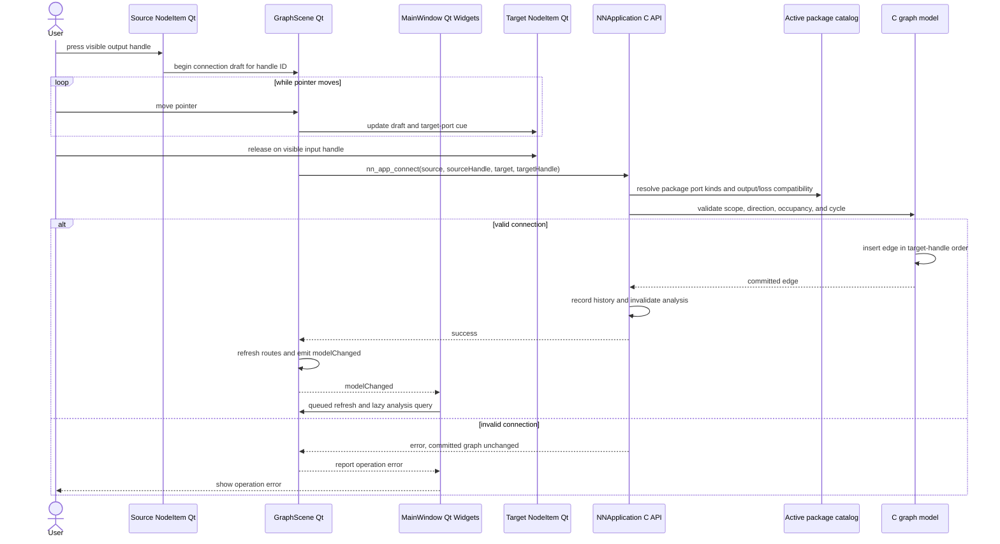
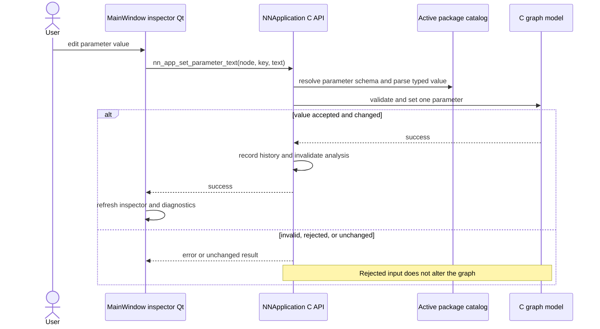
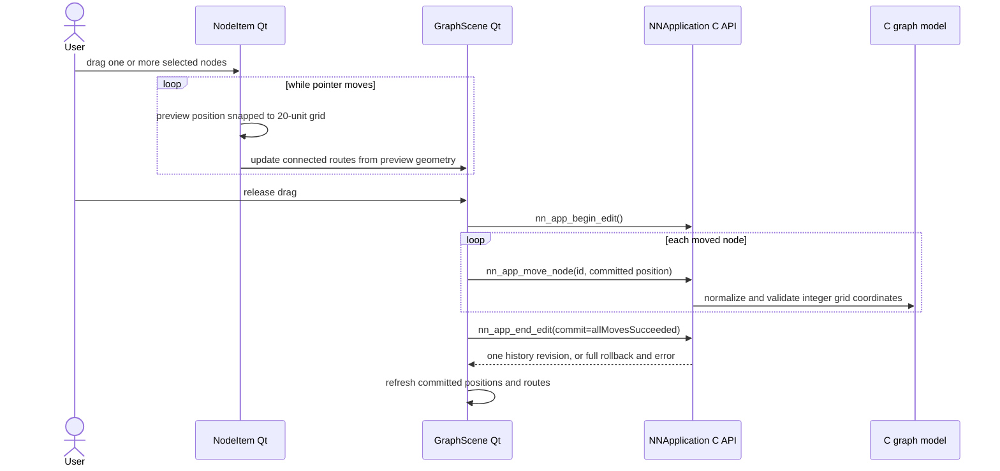
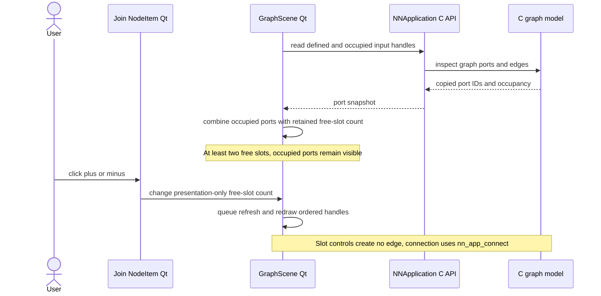
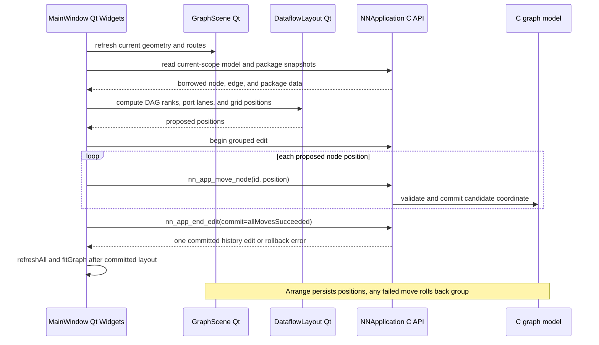
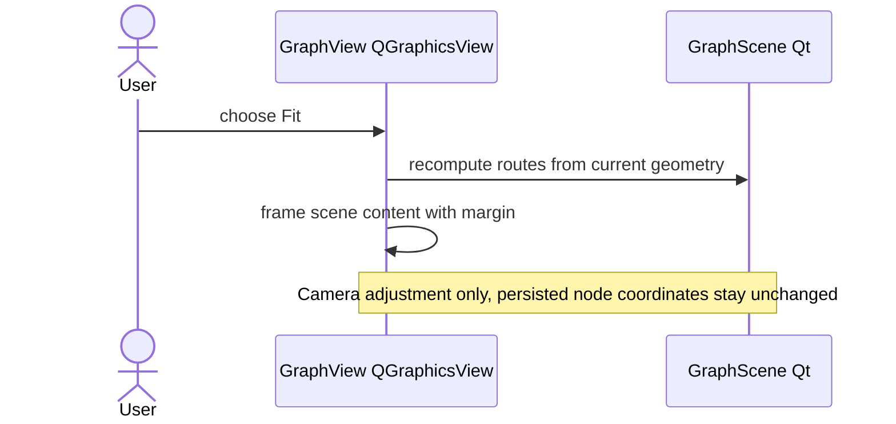
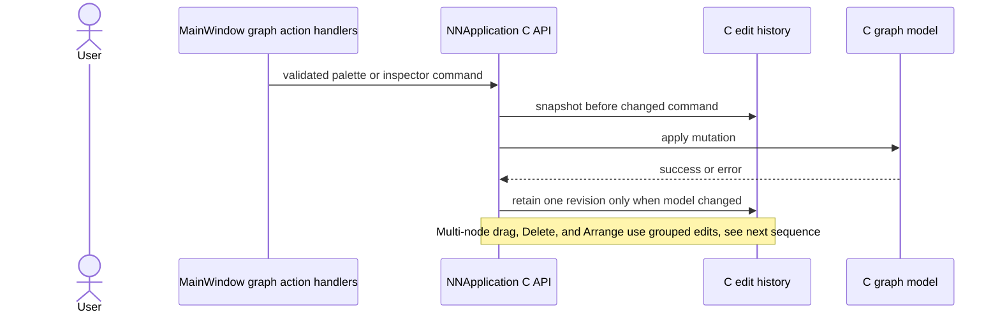
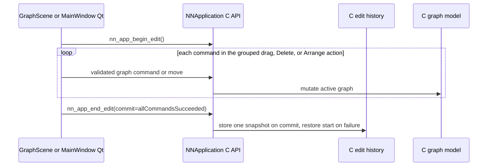
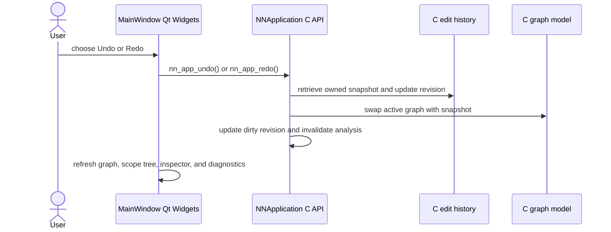

# Graph editing sequences

## Add a node

**Purpose.** Show how a palette choice becomes a C-owned graph node with
catalog defaults and, for subflows, transactional boundary nodes.

## Connect nodes

**Purpose.** Trace a visible port gesture through C validation, and show that
inference refresh happens after a successful mutation.

## Edit a parameter

**Purpose.** Show that the inspector sends text to the shared C validator and
that only a successful value update invalidates graph analysis.

## Move nodes

**Purpose.** Distinguish Qt drag preview from the grouped C mutation committed
on release.

## Adjust visible join slots

**Purpose.** Separate Qt’s temporary empty-slot controls from model-backed
occupied handles and actual graph connections.

## Arrange current scope

**Purpose.** Show that Arrange computes positions in Qt but commits them as one
C-owned edit, with rollback if a move fails.

## Fit current scope

**Purpose.** Show that Fit changes only the 2D view camera and does not move
nodes or write model state.

## Single-command history

**Purpose.** Show how a single graph command records history before mutation,
and how C restores snapshots while Qt refreshes its views.

## Grouped edit history

**Purpose.** Show how multi-command canvas actions commit one history revision
and roll back together if any command fails.

## Undo and redo

**Purpose.** Show how restoring a C-owned snapshot updates model revision and
analysis state before Qt refreshes its views.

