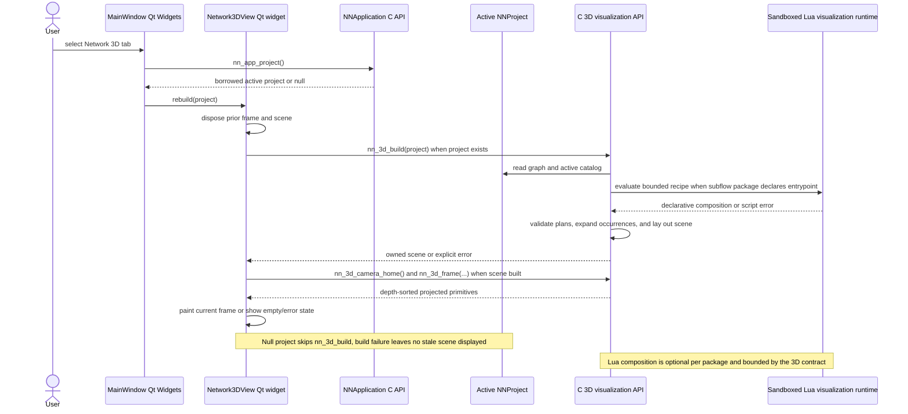
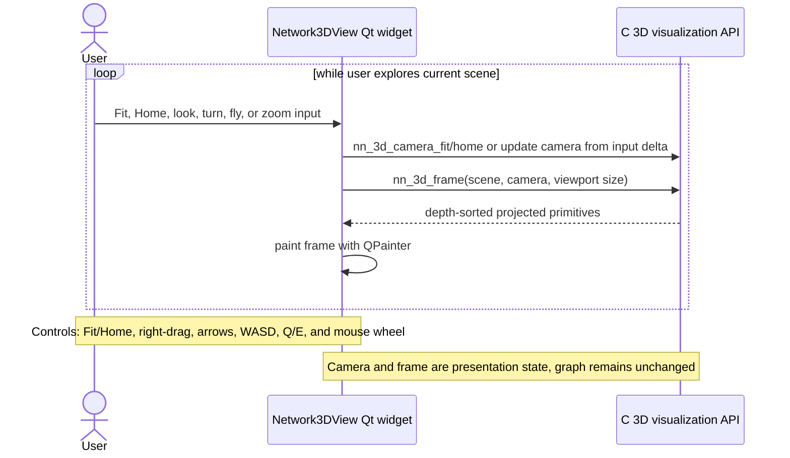
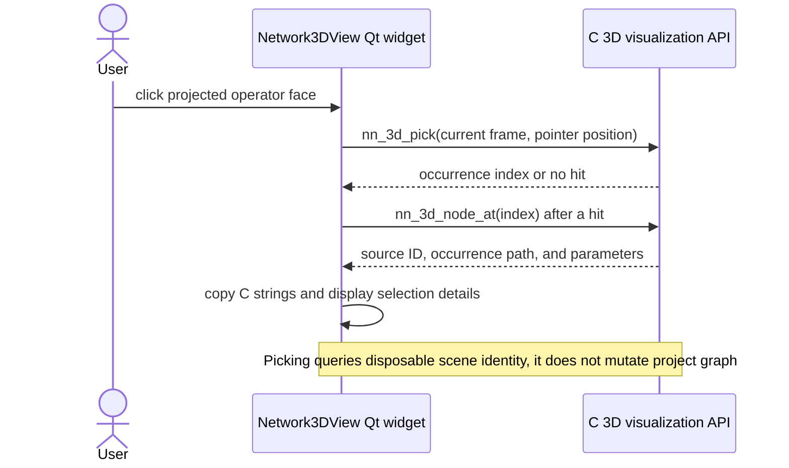

# Network 3D sequences

## Build the 3D view

**Purpose.** Show how the concrete Network3DView widget rebuilds its C-owned
scene from the active project and presents a fresh camera frame.

## Navigate the 3D camera

**Purpose.** Trace repeated camera input through the widget’s C camera API and
frame repaint without changing the graph model.

## Select a 3D occurrence

**Purpose.** Show how a pointer hit maps from the current projected frame to a
specific expanded occurrence and its copied source details.

