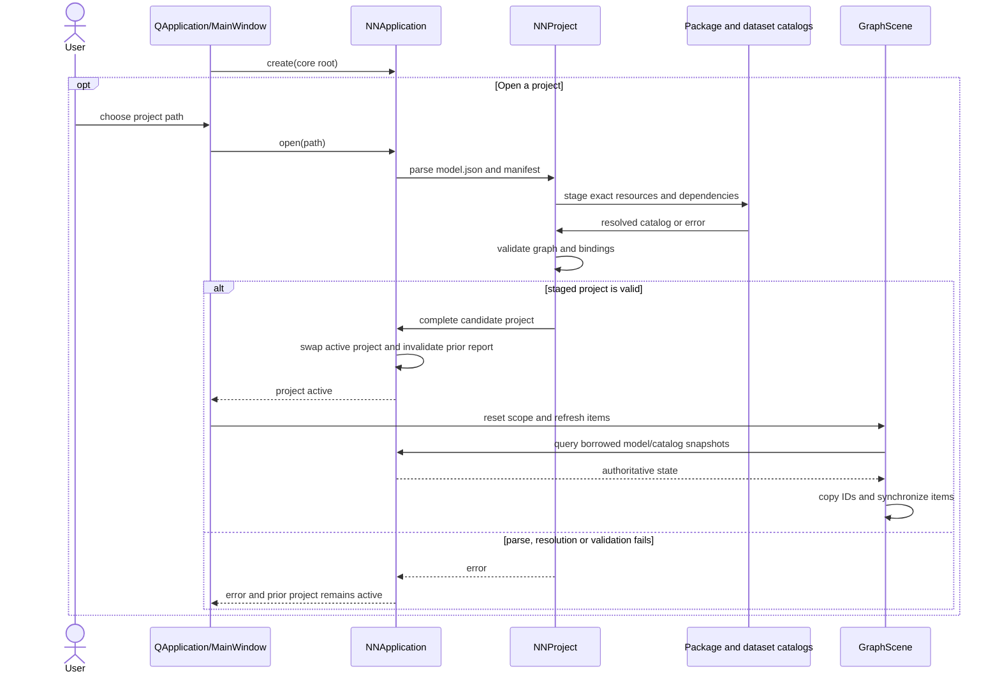
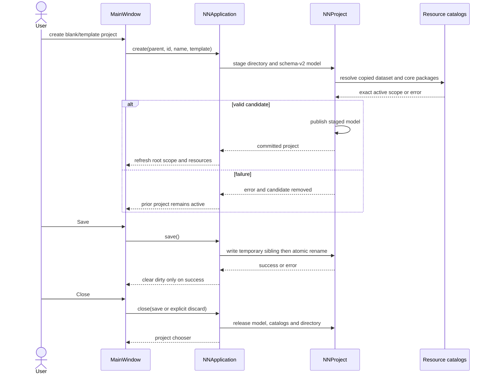
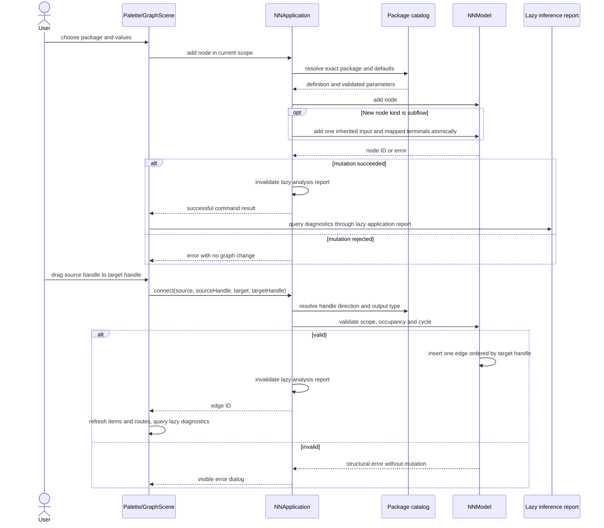
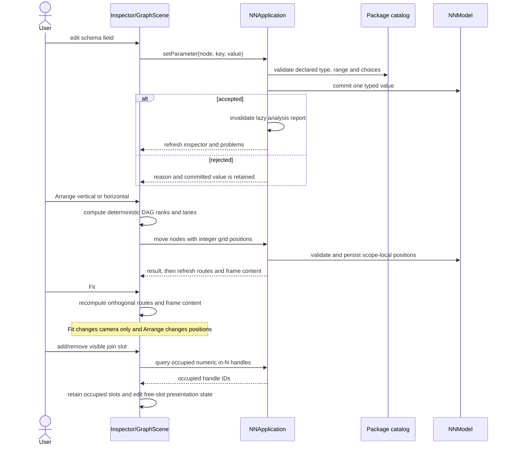
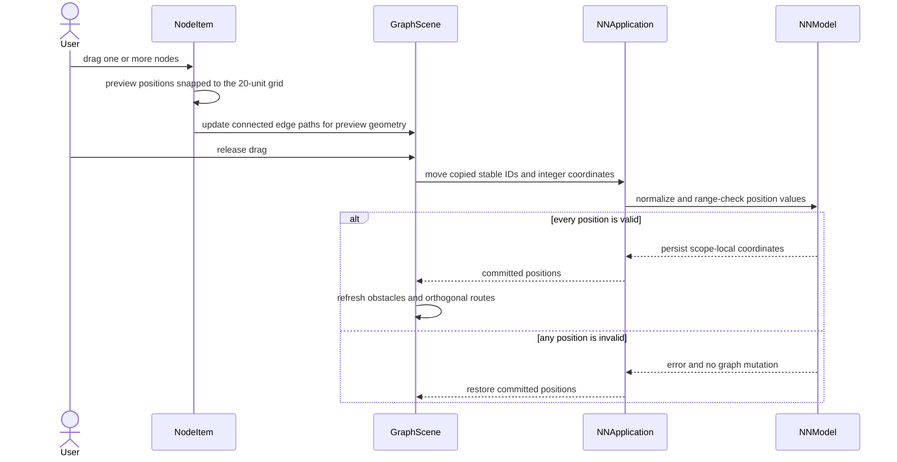
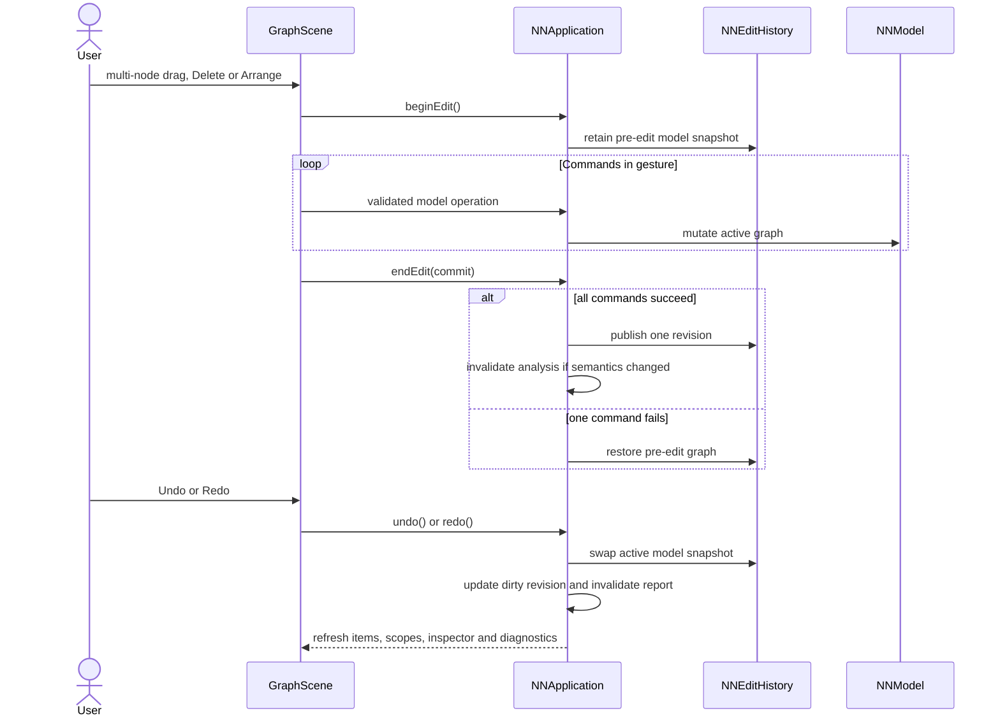

# Project and editor sequences

These flows follow `src/application/application.c`, `src/application/graph_commands.c`,
`src/application/history.c`, `src/project/project.c`, `src/model/model.c` and the
Qt entrypoints in `src/gui/qt/MainWindow*.cpp`, `GraphScene.cpp` and
`DataflowLayout.cpp`. C owns the active model and persisted integer positions;
Qt owns selection, scope, camera, drafts and presentation-only expansion state.

## Startup and project replacement

An open failure discards staged state and preserves the active project. Graph
snapshots borrowed from C expire on the next mutation; Qt retains copied stable
IDs. Relevant owners are `nn_app_open` and project staging in
`src/application/application.c` and `src/project/project.c`.

## Create, save and close

Save failure retains both the old file and dirty state. Successful project
replacement or close releases the previous catalog and resets scope to root.

## Add and connect nodes

Qt submits graph commands but does not decide tensor compatibility. Add/connect
and spawned terminal operations are owned by `src/application/graph_commands.c`
and model operations in `src/model/`; report refresh remains lazy.

## Parameter edit, layout and join slots

Position/label changes do not invalidate semantic analysis. Coordinates persist
as signed 32-bit multiples of 20; direction and visible free join slots remain
Qt session state. Join kind, not package identity, selects the junction UI.

## Drag and persist node positions

Drag preview is Qt-only. Release is the model mutation boundary; failure restores
the model-backed item positions and does not dirty the graph.

## Undo and grouped edits

`NNApplication` owns the bounded history. Qt holds no parallel graph history;
camera, selection, expansion and direction are not restored by undo.
