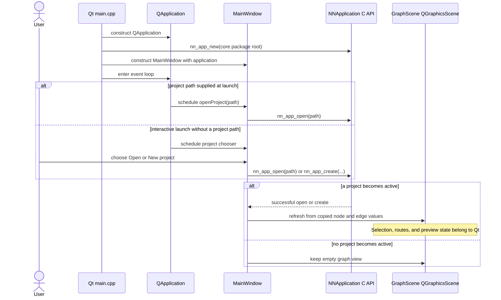
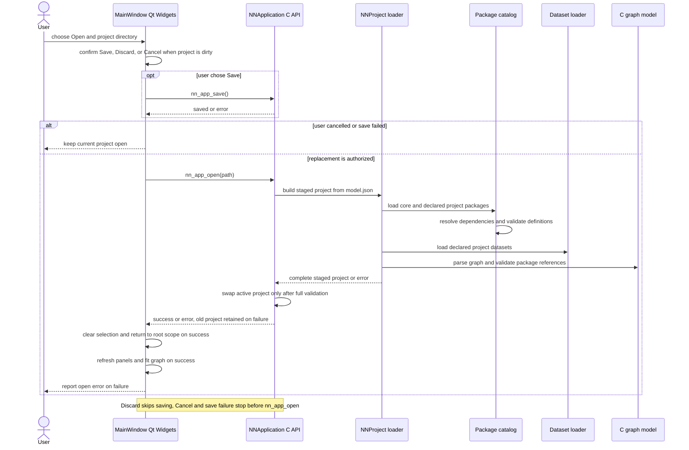
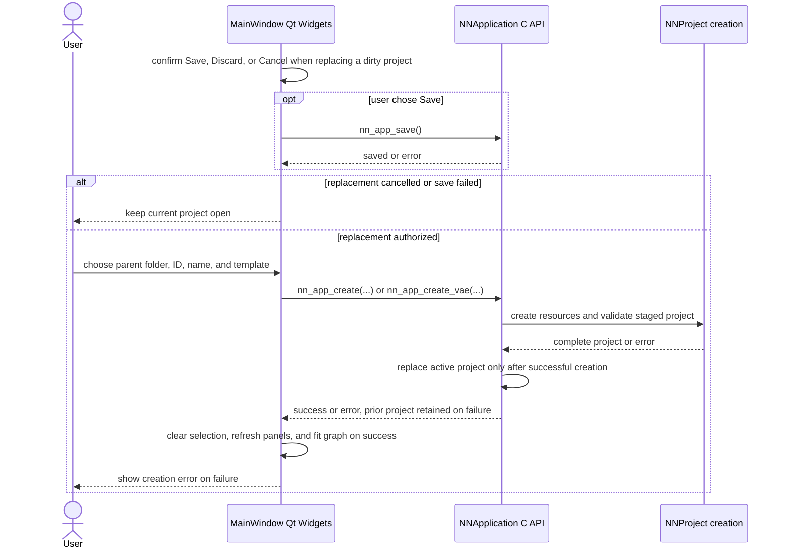
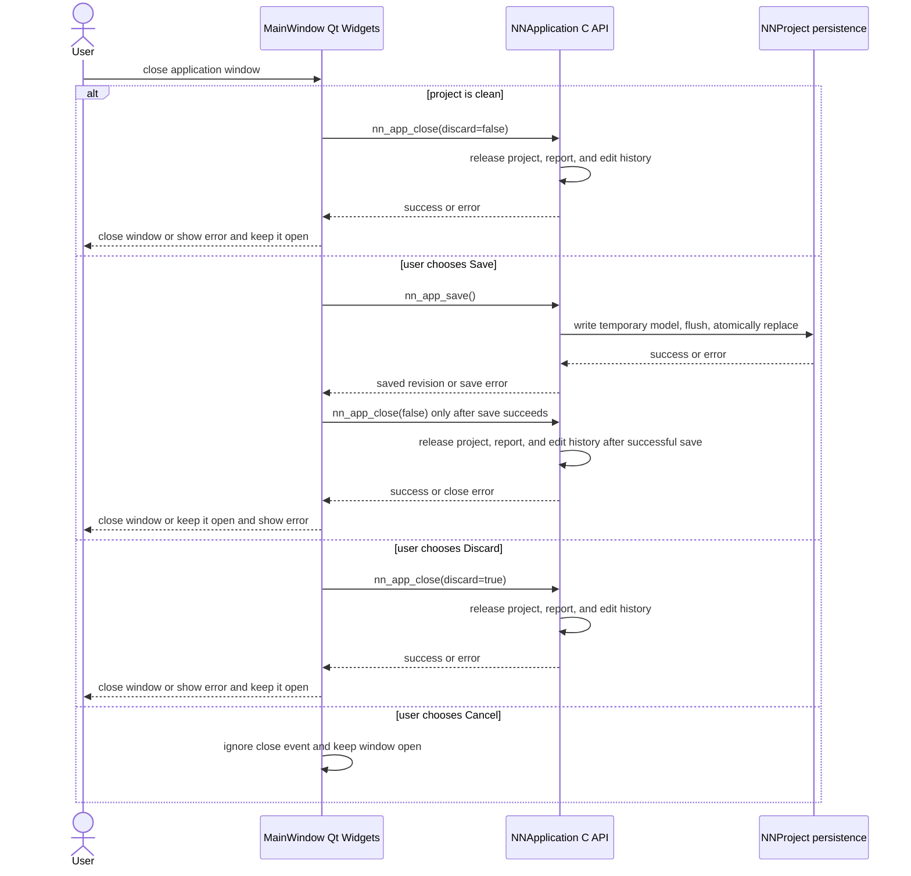

# Project lifecycle sequences

## Startup and editor synchronization

**Purpose.** Show how the Qt entry point creates one C application owner and how
the main window refreshes its graph presentation after a project becomes active.

## Open and replace a project

**Purpose.** Trace project replacement through dirty-state handling and staged
loading of model, package, and dataset resources.

## Create a project

**Purpose.** Show the UI gathering project identity before C creates and
activates a complete project, including built-in templates.

## Save and close

**Purpose.** Capture the window’s Save, Discard, and Cancel behavior and the
application’s final project release.

