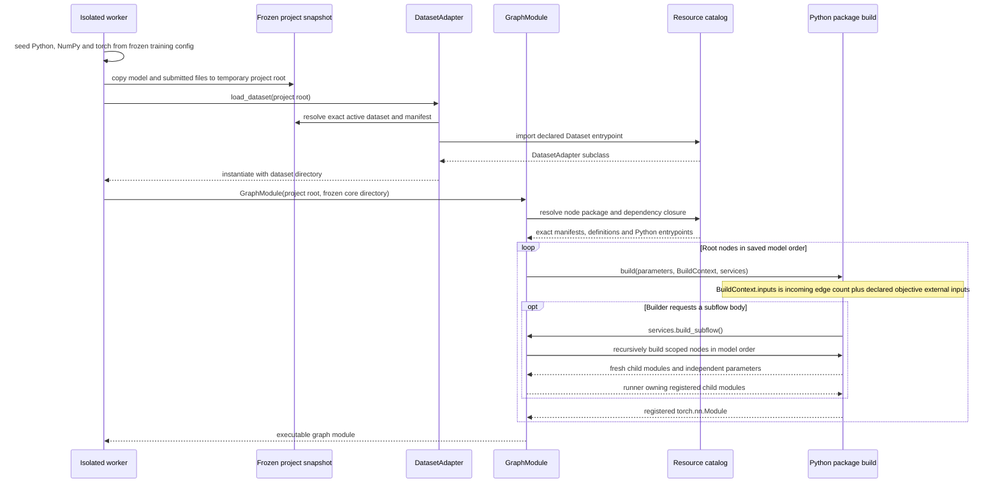
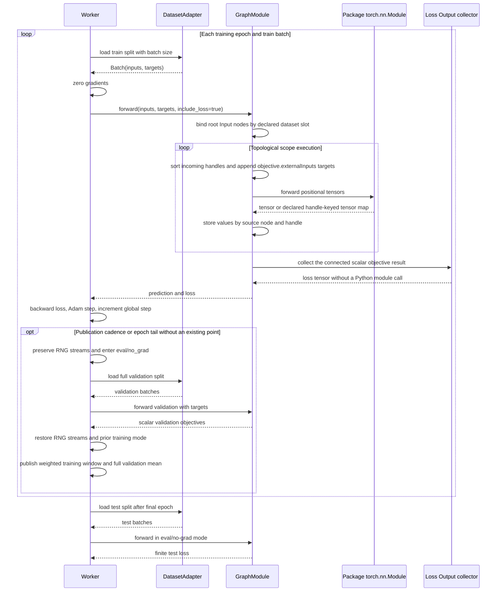
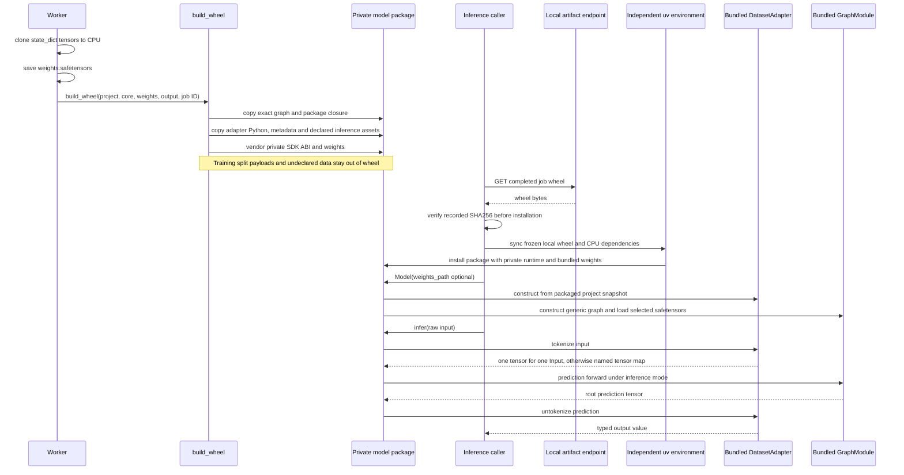

# Python dataset and numerical graph runtime

The C client persists and validates schema-v2 model structure but does not run
Python. Runtime behavior is isolated to the container worker and exported
wheel. Sources: `python/nnmodelling-runtime/src/nnmodelling_runtime/`,
`python/nnmodelling-runtime/src/stereotype_runtime/pytorch.py`,
`backend/worker.py` and `backend/Dockerfile`.

## Adapter and graph construction

Package defaults are merged with node overrides and schema-validated before
each build. `BuildContext.inputs` reports actual graph arity: incoming edges
plus that package instance's declared objective external inputs. It preserves
definition input/output metadata. A stereotype reference built without a graph
instance has no known graph arity, so the runtime does not invent one. Modules
are registered under node identity. Repeat and horizontal-repeat instances own
freshly built child modules and parameters, using the resource builders for each
requested body rather than copying one initialized template. Construction and invocation limits
bound nested scopes.

## Batch execution and objective targets

Graph execution is a generic DAG keyed by scope and source handle. Join inputs
are sorted by numeric `in-N` suffix. Multiple output handles remain distinct;
unknown keys, missing required outputs and non-tensors fail visibly. Training
includes loss dependencies and maps targets only through each definition's
`objective.externalInputs`. Prediction inference evaluates the recursive
prediction dependency closure and omits unrelated loss branches; it never
fabricates targets. Scalar loss values are per-batch means, aggregated by sample
count. The accepted execution limits are 32 nested scopes and 256 subflow
builds/invocations.

The graph metadata is immutable for this instance. Dependency closure and
topological order are currently derived during each scope evaluation; cached or
lowered execution remains the performance TODO in the backend contract.

## Standalone wheel export and inference

The default model loads bundled `weights.safetensors`; an explicit compatible
path overrides it. Wheel resources are namespaced away from generated package
code and frozen core. Declared dataset `inferenceAssets` use project-relative
paths and are copied byte-for-byte. External resource dependencies are retained
in wheel metadata, while the SDK is privately vendored; the wheel is independent
of the service and source checkout.

The executable consumer at `examples/implementation/llm/` downloads the completed
job's wheel through the service's artifact endpoint and verifies its SHA256
before uv installs it with locked dependencies. The inference caller above is
then this standalone application: raw strings enter the public `Model` methods,
using bundled weights by default. The backend and editable projects under
`examples/models/` are not accessed during inference. Its optional greedy loop
feeds the final decoded character back through that same public boundary, with
the latest 128 characters as context.
