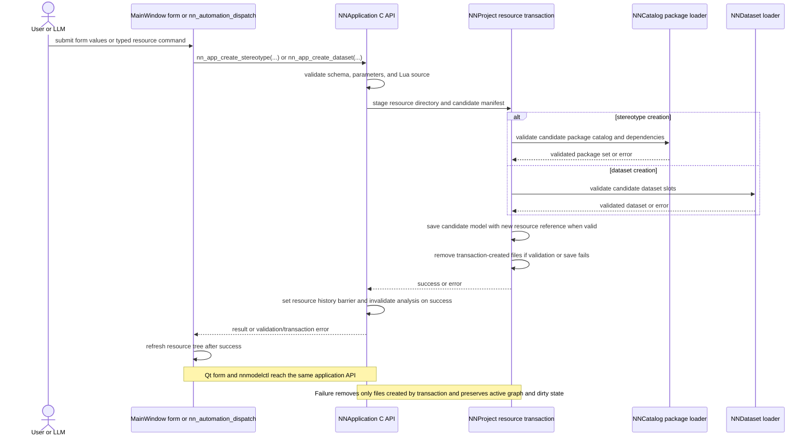

# Resource authoring sequence

## Create a stereotype or dataset

**Purpose.** Show how Qt forms and the local command service converge on the
same C resource validation and project transaction.

```mermaid
sequenceDiagram
    actor Author as User or LLM
    participant Frontend as MainWindow form or nn_automation_dispatch
    participant App as NNApplication C API
    participant Project as NNProject resource transaction
    participant Catalog as NNCatalog package loader
    participant Datasets as NNDataset loader
    Author->>Frontend: submit form values or typed resource command
    Frontend->>App: nn_app_create_stereotype(...) or nn_app_create_dataset(...)
    App->>App: validate schema, parameters, and Lua source
    App->>Project: stage resource directory and candidate manifest
    alt stereotype creation
        Project->>Catalog: validate candidate package catalog and dependencies
        Catalog-->>Project: validated package set or error
    else dataset creation
        Project->>Datasets: validate candidate dataset slots
        Datasets-->>Project: validated dataset or error
    end
    Project->>Project: save candidate model with new resource reference when valid
    Project->>Project: remove transaction-created files if validation or save fails
    Project-->>App: success or error
    App->>App: set resource history barrier and invalidate analysis on success
    App-->>Frontend: result or validation/transaction error
    Frontend->>Frontend: refresh resource tree after success
    Note over Frontend,App: Qt form and nnmodelctl reach the same application API
    Note over App,Project: Failure removes only files created by transaction and preserves active graph and dirty state
```
