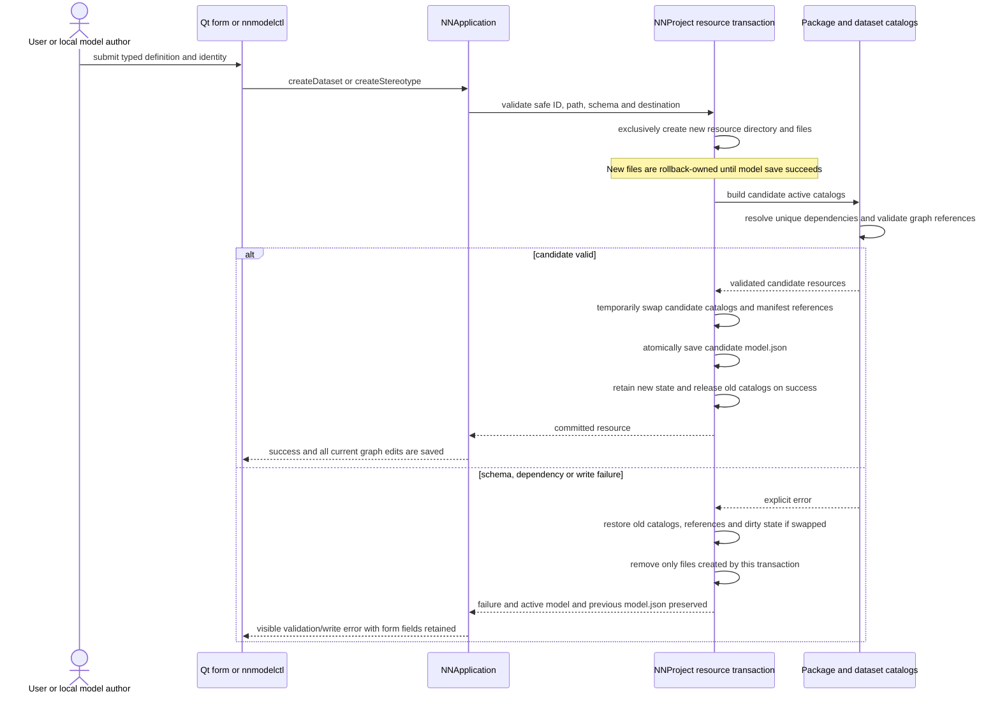
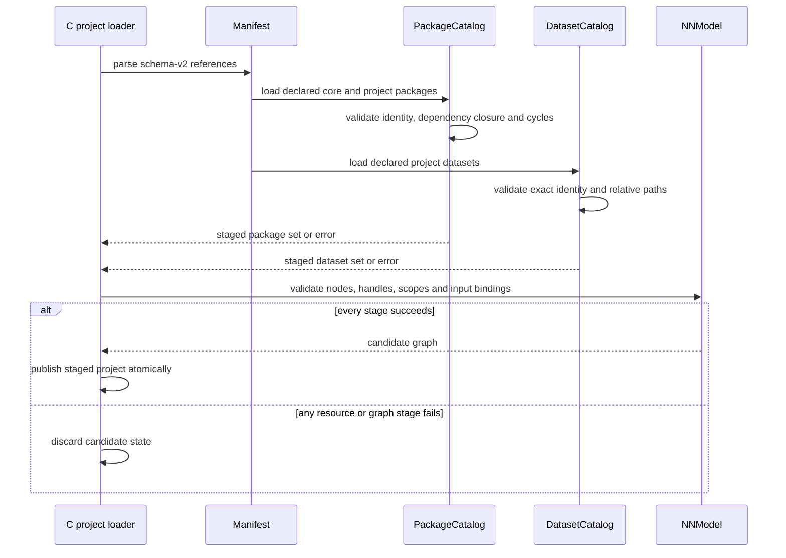
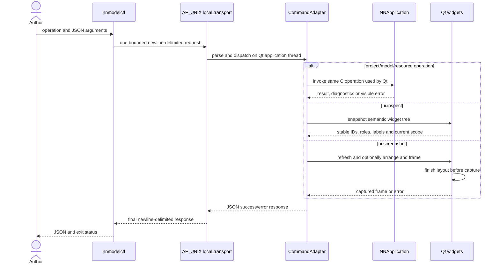

# Resource authoring and local automation

Project resources are written by C project code only. Qt forms and
`nnmodelctl` submit typed payloads to the same `NNApplication` operations.
Sources: `src/application/resources.c`, `src/project/resources.c`,
`src/catalog/`, `src/automation/`, `src/nnmodelctl/` and the Qt resource panels.

## Create a dataset or stereotype

Creation is a history barrier because the operation saves the resource files
and existing graph edits together. Python dataset and stereotype stubs declare
`nnmodelling-runtime` and raise `NotImplementedError` until implemented;
native C and the Qt client never execute those modules. Dataset selection is a
separate exact ID/version operation that updates manifest state and invalidates
the lazy analysis report.

Preflight identity/schema/destination failures return before creating files or
loading candidate catalogs. After directory creation, each write/catalog/save
failure enters rollback. `nn_project_create_dataset` and
`nn_project_create_stereotype` temporarily install candidate resource state for
`nn_project_save`, then retain it only when the atomic model save succeeds.

## Resolve a project on open

Catalog activation is limited to declared project resources and the exact
required core closure. Ambient directories are not activated. See
`contracts/model.md` and [project UML](../project.md).

## CLI request and UI introspection

The socket is private to the current user and enabled only with `--socket`.
Requests are bounded, dispatched synchronously on the existing application
thread, and cannot create a second graph owner. `ui.inspect` is read-only.
Capture waits for layout/frame completion; optional arrangement persists the
current scope's model positions before capture. Unknown or rejected operations
return errors without partial mutation.
