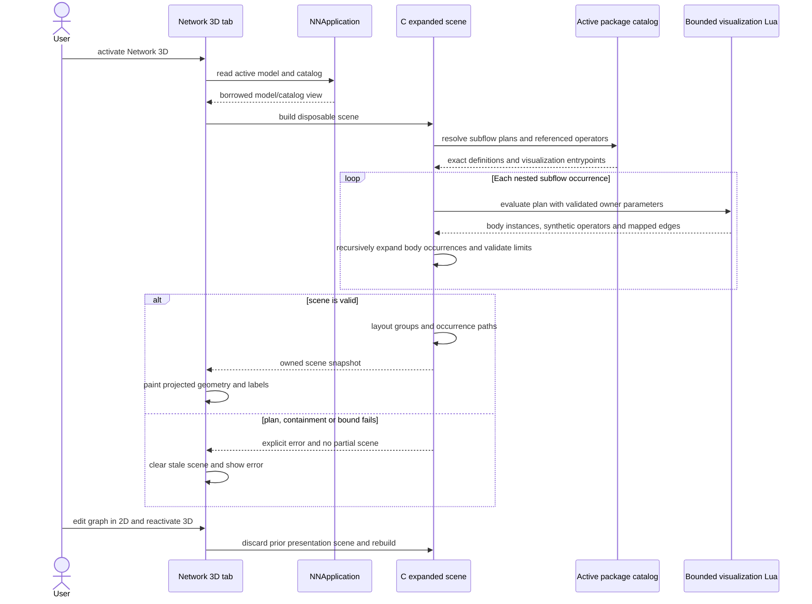
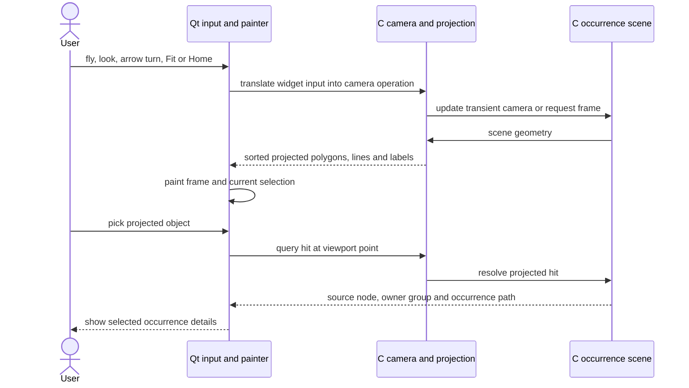

# Network 3D explorer

The C11 visualization module builds a disposable occurrence scene from the
existing model and active package catalog. Qt translates input and paints C
projections. Sources: `src/visualization/`, `src/gui/qt/Network3D*` and
`src/gui/qt/MainWindow*`.

## Activate, inspect and rebuild

Expanded bodies are occurrences of the source graph, not copied model nodes or
claims about parameter sharing. Occurrence paths combine source IDs and recipe
instance IDs. No write-back, dirty-state, history, analysis or persistence
change occurs. Missing visualization Lua uses the default single-body plan.

## Camera and picking

Only C owns camera math, projection, depth order and picking. Camera and
selection are transient. The independent 2D editor continues to own persisted
scope-local layout; switching tabs does not mutate it.
