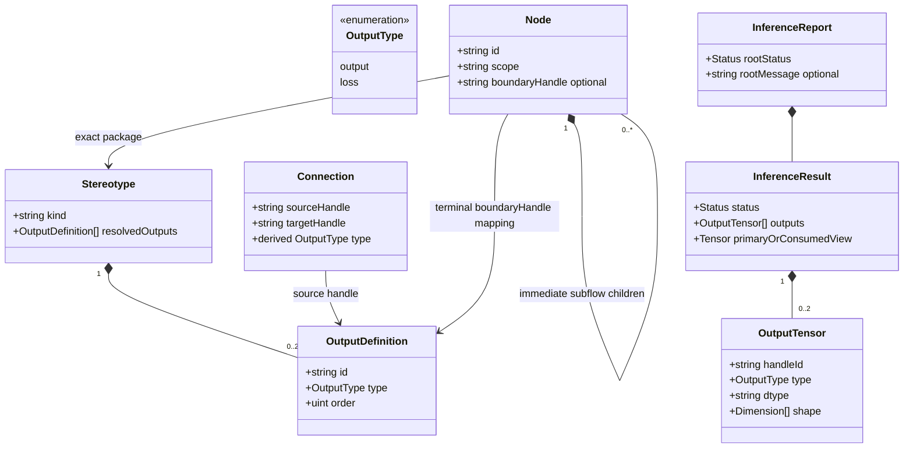
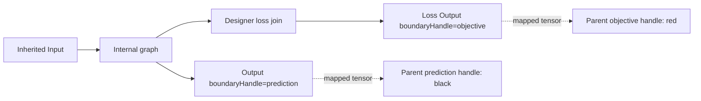

# Typed output and boundary model

Accepted 2026-10-01; [contract](../contracts/typed-outputs.md) is normative.



```mermaid
sequenceDiagram
    actor Designer
    participant UI as Qt or CLI
    participant App as C application
    participant Catalog
    participant Model
    Designer->>UI: add subflow
    UI->>App: addNode(exactPackage,scope)
    App->>Catalog: resolve outputs (defaults or explicit list)
    App->>Model: add owner and mapped terminal for each output
    alt complete transaction
        App->>App: mark dirty and invalidate analysis
        App-->>UI: success
    else failure
        App->>Model: remove transaction-created nodes only
        App-->>UI: error; prior state preserved
    end
    Designer->>UI: build children and connect appropriate joins
    UI->>App: connect(source,sourceHandle,target,in)
    App->>Catalog: resolve source type and terminal-only restriction
    App->>Model: same scope, occupancy, acyclicity, commit
```



Dotted mapping is not a cross-scope graph edge. For each declared handle exactly
one immediate terminal matches ID and type. Default has out/output only.
Root has exactly one Output and one Loss Output, no boundary mappings. All
terminal inputs have at most one producer; accumulation requires explicit join.
Intermediate nodes accept either edge type; their own outputs determine fanout
classification. Analysis reads keyed outputs per source handle without mutation.
Missing completion is Incomplete, invalid declarations/mappings are semantic
errors, invalid edge handle/type commands are rejected without mutation.
Root completion lives in report metadata so even a zero-node graph is
Incomplete; UI/CLI show a non-navigable Root problem with null node ID.
