# NNModelling client guide

This guide describes the Qt client controls and how they affect a project. Interface labels are shown in English as they appear on screen. Graph edits become part of the project with `File > Save`; resource creation and dataset metadata edits save the project when the operation completes.

## Starting the application and projects

In a normal desktop launch, the project chooser appears first. `New project` creates an empty project; `New MNIST MLP` and `New mini LLM` create editable copies of the examples; `Open project` opens a project folder; `Close` closes the chooser and leaves the main window open. The main window can therefore remain open without a project. If the application starts through the automation bridge without a project path, the initial chooser is skipped. Open it with `File > New project…`, `File > Open project…` or `Training`. Example model copies are independent of the originals.

Creation first asks for a parent folder, then `Model ID` and `Display name`. The ID determines the new folder name. The initial model fields start at `mnist-mlp` / `MNIST MLP` or `mini-llm` / `mini LLM`; for an empty project the ID starts blank and the name suggests the entered ID. The project version is not editable in this window. An existing destination folder or invalid ID produces a message and does not replace the active project.

`File` contains:

| Item | Effect |
| --- | --- |
| `New project…` (`Ctrl+N`) | Starts an empty project. |
| `New from template > MNIST MLP…` | Asks for an ID and name for a copy of the MNIST classifier example. |
| `New from template > mini LLM…` | Asks for an ID and name for a copy of the mini LLM example. |
| `Open project…` (`Ctrl+O`) | Chooses a project folder. Before replacing unsaved edits, asks whether to save, discard or cancel. |
| `Save` (`Ctrl+S`) | Saves the current project. An error leaves the project open and displays a dialog. With no project open it shows `No project is open`. |
| `Close project` (`Ctrl+F4` on Linux) | If there are edits, asks to save, discard or cancel before closing and returning to the chooser. The shortcut depends on the platform. |

Closing the main window with unsaved edits also offers `Save`, `Discard` or `Cancel`. Cancel leaves the project open. The window title shows `*` when the project has unsaved edits.

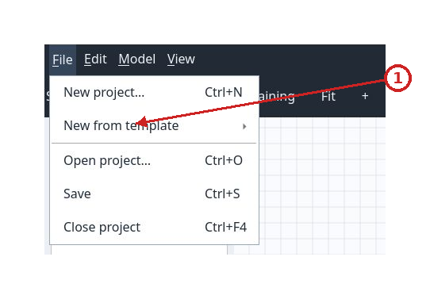

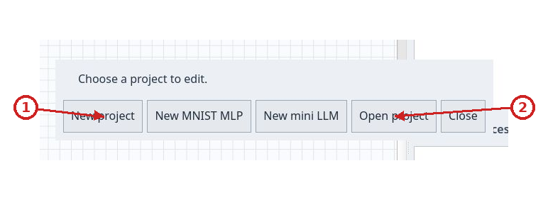

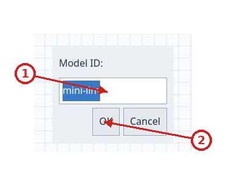

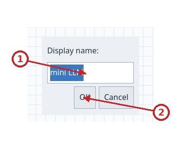

## Menus and history

`Edit` contains `Undo` (`Ctrl+Z`) and `Redo` (`Ctrl+Y` on the observed platform). Each item is enabled only when the project history has an action to undo or redo. Undo and redo refresh the canvas, selection, Inspector and problems. Saving and history are separate: the title loses its asterisk when the project returns to the saved revision.

`Model` contains `Create stereotype…`, `Create dataset…`, `Manage datasets…` and `Training backend…`. The first three require a project; without one, the client suggests opening one. `Training backend…` opens the panel even without a project, so you can check the service and inspect jobs.

`View` contains `Fit graph` (`Ctrl+0`), `Zoom in` (`Ctrl++` on the observed platform), `Zoom out` (`Ctrl+-`) and `Arrange > Vertical/Horizontal`. `Fit graph` frames the current scope and its connections without moving nodes. Wheel zoom is centered on the pointer; menu and toolbar zoom scales around the canvas center. The mouse wheel zooms in or out. The middle mouse button, or holding `Space` while dragging with the left button, pans the canvas. `Escape` cancels a pending connection or drag. Zoom shortcuts can vary by platform and keyboard layout.

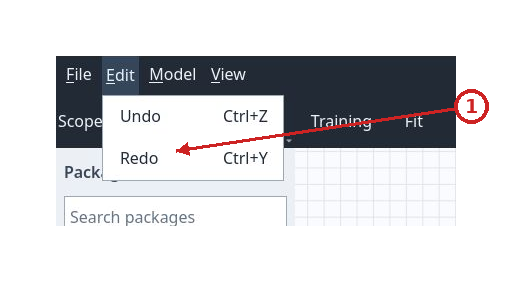

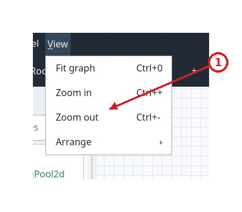

## Graph workspace

The main window has three columns: the `Packages` palette on the left, the graph in the center and the `Inspector`, `Project resources` and `Model problems` panels on the right. Drag the dividers between columns and right-side panels to change their widths.

### Palette and node creation

`Search packages` filters active packages by name, ID, version and kind; the search is case-insensitive. Results are grouped under kind headings (`input`, `layer`, `join`, `loss`, `output`, `loss-output`, `subflow` or another available category). Selecting a leaf item selects it in the palette; double-clicking it or pressing `Add to graph` adds it to the current scope, centered in the view. Selecting a group heading does not add a node. An item uses its package color. With no project open the palette is empty; an empty new project still has the core catalog and displays its packages.

Click nodes to select them; drag across empty space to select multiple items. Qt selection modifiers add to or remove from the selection. Drag a node to move it; to move several together, select them and drag one. Positions snap to the grid. Select an edge and press `Delete` or `Backspace` to remove it; those keys also remove selected nodes and their incident edges. A subflow with children cannot be deleted until its contents have been removed. Each rejected operation displays a dialog explaining why.

To connect two nodes, drag from an output handle to the desired input handle. The dashed connection is a draft; the model accepts it only when direction, handles, scope and occupancy/cycle rules are valid. A rejected connection shows `Operation rejected` and leaves the graph unchanged. Permanent edges use orthogonal routes. Color distinguishes normal output flow from loss flow. Output-handle tooltips show the ID and kind.

`Input`, `Output` and `Loss Output` nodes are terminal circles with an outside label. An `Output` collects a prediction; a `Loss Output` collects a loss result; each accepts one connection. A complete root model expects an `Output` and a `Loss Output`; an incomplete project remains editable and can be saved. A `join` node appears as a junction bar. `+` beside the bar adds a free input handle; `−` removes the highest free handle. At least two inputs and every connected handle remain visible. `−` is disabled if it would remove an occupied input; `+` is disabled at the limit of 128 displayed inputs.

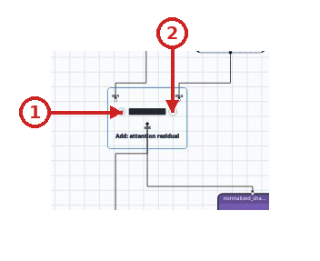

### Scopes and subflows

The `Scope` bar opens the scope tree. `Root` shows the main nodes; choose a subflow to show its immediate scope. `Orphan scopes` collects imported scopes without a reachable container; these remain selectable. Navigation shows one scope at a time and does not move or change nodes.

A subflow has a card with its child count. Click the `Subflow · N nodes ›` footer to expand a read-only preview on the canvas; `▾` closes it. You can hover over nodes in the preview but cannot select, move or connect them or change join inputs. Double-click the subflow, or choose `Enter subflow` from its right-click context menu, to enter its scope. The same menu has `Expand preview` / `Collapse preview`. Use the scope tree's navigation arrow to return to `Root` or an ancestor scope. Expansion is a temporary view; child nodes retain their coordinates in their scope.

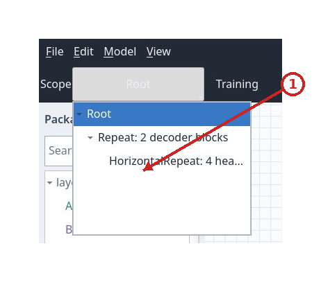

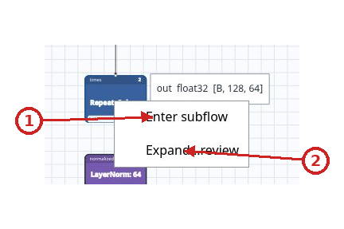

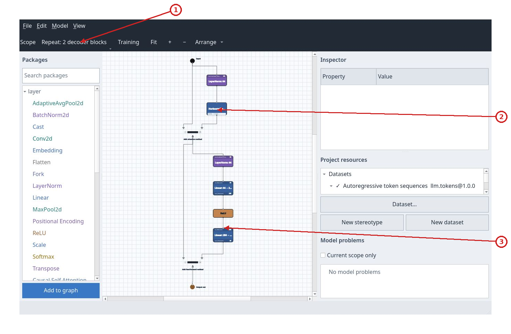

### Graph toolbar and direction

The `Workspace` toolbar provides `Scope`, `Training`, `Fit`, `+`, `−` and `Arrange`. `Training` opens the same panel as `Model > Training backend…`. `Fit` frames the content; `+` and `−` zoom in or out. `Arrange` applies the default vertical layout. Its arrow offers `Vertical` or `Horizontal`; the same choices are under `View > Arrange`. Arrangement recalculates node positions in the current scope, updates the in-memory project and marks it modified, then fits the result. Use `File > Save` to persist it to disk. Vertical flow goes from top to bottom; horizontal flow goes to the left. Changing direction is a session presentation choice; `Arrange` is the action that lays out and records positions.

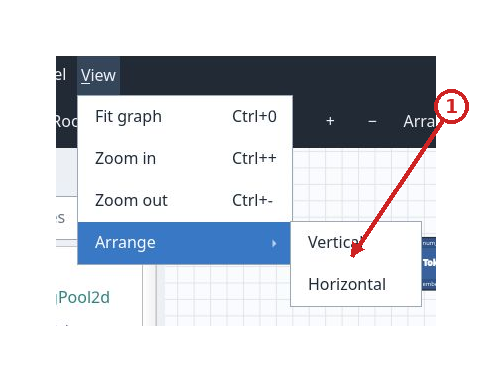

## Inspector

Selecting a canvas node fills the `Inspector` table with `Property` and `Value` columns. With no selection, the panel is empty. `Name` is editable; press Enter or leave the field to apply a new name. `Package` shows `id@version`; hover over the row to see the package description.

When analysis succeeds, `Successful outputs` lists each handle with its kind, dtype and shape. Terminals instead show `Consumed tensor` with the received tensor's dtype and shape. These values describe shape analysis; they do not mean that the model has been trained.

For an `Output` or `Loss Output` inside a subflow, `Boundary mapping` associates the terminal with an output declared by the container. The list includes only outputs of the same kind; `(unmapped)` appears when there is no association. An imported association that no longer matches appears as `Invalid mapping: …` so you can correct it.

`Parameters` contains one control for each parameter defined by the package:

- parameters with preset choices use drop-down menus;
- Boolean values use checkboxes;
- integers, numbers, strings, dtypes and JSON values use text fields, validated by the package when you confirm the field;
- parameters placed at `top` or `bottom` can also appear as synthetic rows on the node card.

For the meaning, defaults, limits and choices of every field in distributed packages, see the [parameter catalog](parameters.md).

A `stereotype` parameter consists of a package selector and fields from that package's schema. The selector shows the name and exact `id@version` identity, applies any kind filter, and uses ` (choose package)` when no package is selected. Choosing a package initializes its parameters to their defaults; an existing reference keeps its values. Inner fields use checkboxes, menus or text according to their type. The project validates the selection and every changed field. If a value is invalid, the client reports the rejection and keeps the last confirmed values. Inspector data refreshes after an edit.

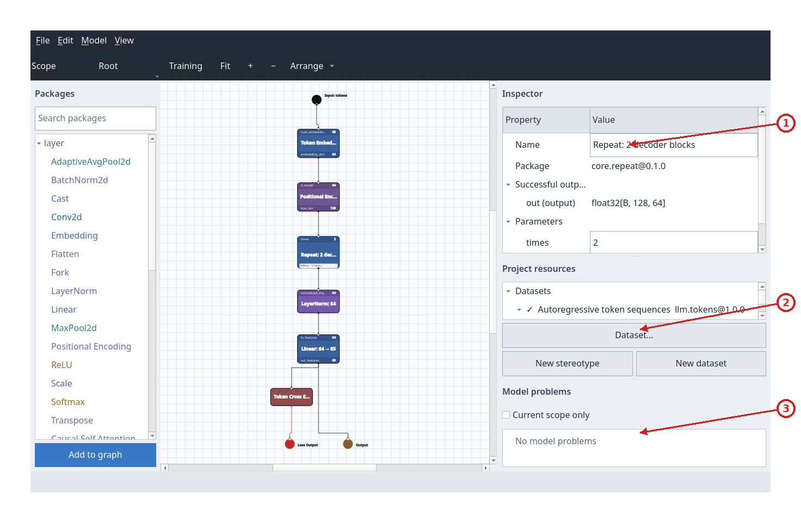

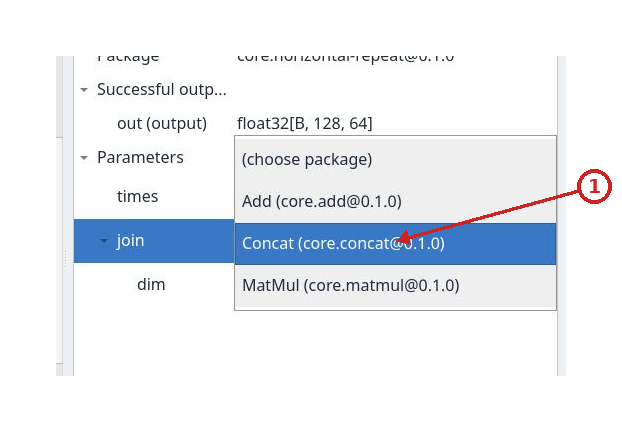

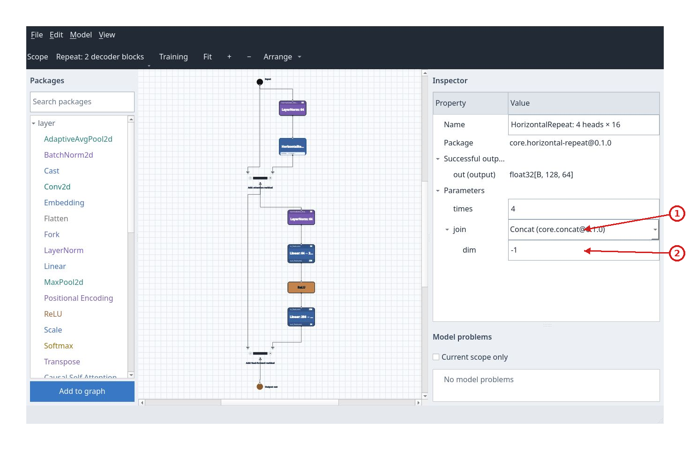

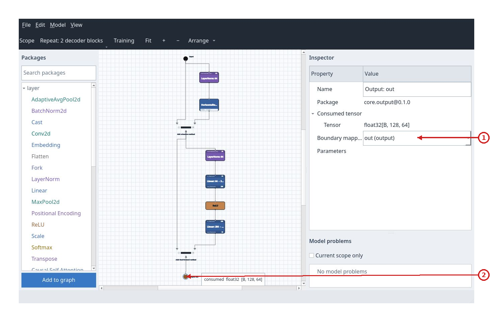

## Project resources and dataset selection

`Project resources` displays three expandable groups:

- `Datasets` lists names and `id@version`. A `✓` marks the active dataset. Child rows show `Input: name [dtype]` and `Target: name [dtype]`. Selecting a dataset row makes it active, refreshes analysis and marks the project modified. Clicking an informational child row displays the resource path in the status bar.
- `Packages` lists active packages with their exact identities. Expand a package to see dependencies in the format `Requires id version-constraint`. These rows are informational; they do not activate or deactivate resources.
- `Operations` lists public methods that will be included in the wheel, with endpoint status. Each row's tooltip shows its nodes and codecs. Invalid endpoints remain editable in the manager and prevent training submission until fixed or removed.

`New stereotype` opens the stereotype creator; `New dataset` opens the dataset creator; `Dataset…` opens the dataset manager. `Model > Manage operations…` opens the operations manager.

### Manage exported operations

`Model > Manage operations…` opens `Manage operations`, the list of methods that will appear on the Python wheel. `New…` creates a method; `Edit…` changes the selected row; `Remove` deletes it. The list shows the name, endpoint status, and input and output nodes. The `Operation` form shows the current signature from graph analysis; it is informational because the Qt client does not execute Python operators.

The `Operation` form asks for `Method name`, input and output endpoints, a codec for each side, and `Current signature`. Names must be simple Python identifiers such as `encode` or `decode`. An input can use the output of a root `Input` node, or a root node's input handle; in the second case, the supplied tensor replaces the value from the existing connection for this operation without changing the saved graph. The output selects an existing output handle. The `dataset` codec calls the active adapter's `tokenize` or `untokenize`; `tensor` accepts or returns a batched PyTorch tensor.

Operations are saved in `model.json` with the project. Graph edits can make an endpoint invalid; `Operations` marks it so you can fix or remove the method. `Save project and submit` blocks submission while invalid references remain. After training, the wheel exposes each name as a method such as `model.encode(value)` or `model.decode(tensor)`. `model.infer(value)` remains available. The [VAE tutorial](tutorial-vae.md) shows how to create both methods in the MNIST example.

### Dataset manager

`Dataset…` / `Manage datasets…` opens `Project datasets`, a single-selection list. Each row shows `id@version — name`; the active dataset is marked `✓ (active)`. `New dataset` opens a blank form. `Edit` opens the selected dataset; double-clicking a row also runs `Edit`. `Select` activates the selected dataset and is disabled if it is already active. `Edit` and `Select` are disabled when no row is selected. `Close` closes the manager without further changes.

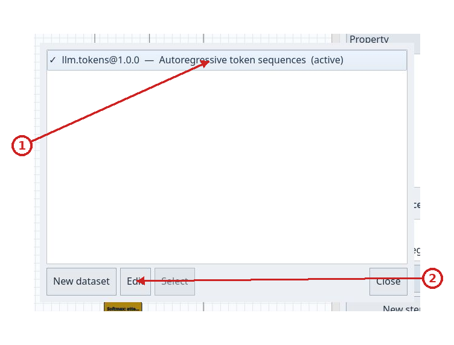

### Create or edit a dataset

`Create dataset — saves project` contains `ID`, `Version`, `Name`, `Description` and the initially checked `Select this dataset after creation` box. The edit form is titled `Edit dataset — saves project`: `ID` and `Version` are locked and the selection box is not shown.

The `Input slots` and `Target slots` tables have `Slot name`, `Dtype` and `Shape` columns. For each row, enter a unique name, a dtype from `float16`, `bfloat16`, `float32`, `float64`, `int8`, `int16`, `int32`, `int64`, `uint8`, `bool`, and comma-separated dimensions. The symbolic dimension `B` represents the batch; other dimensions must be positive integers. A shape can have 1 to 64 dimensions. Each new row starts with dtype `float32` and shape `B`. `Add row` adds a row; `Remove row` removes only the selected row. At least one input slot is required; target slots may be empty.

`Create and save project` creates the resource and saves the project; in edit mode the button is `Save changes`. `Cancel` closes without applying the fields. Errors appear in the form, which remains open so you can correct them. Editing a dataset changes only the displayed name, description and slots; it preserves the ID/version, Python adapter, data and metadata not shown in the form.

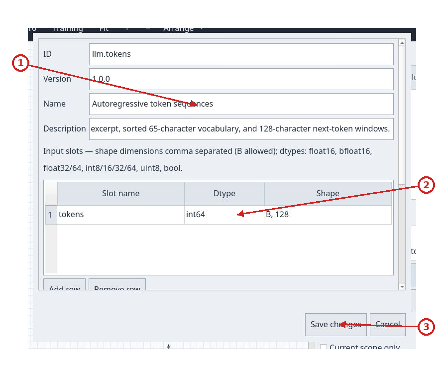

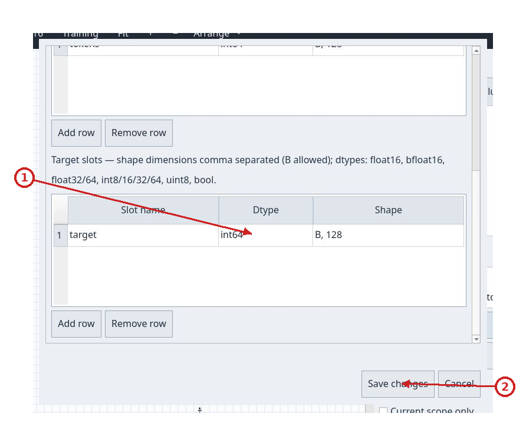

## Create a stereotype

`Create stereotype — saves project` opens from `Model > Create stereotype…` or `New stereotype`. Its initial fields are `ID`, `Version` (default `1.0.0`), `Name`, `Description`, `Kind` and `Color` (default `#6b8fc4`). `Kind` offers `input`, `layer`, `join`, `loss`, `output`, `loss-output` and `subflow`.

The metadata fields have distinct meanings in both the stereotype and dataset forms:

| Field | Description |
| --- | --- |
| `ID` | Technical resource identity. Project references use it with the version. It must follow the syntax accepted by the creator. |
| `Version` | Resource version; distinguishes definitions that share an ID. |
| `Name` | Readable name shown in catalogs and lists. |
| `Description` | Text describing the resource's purpose and use. |
| `Kind` | Node role in the graph; determines its display and connection rules. |
| `Color` | Color of the palette item and card; use a hexadecimal value such as `#6b8fc4`. |

| `Kind` choice | Use |
| --- | --- |
| `input` | Source of a scope's input tensors. |
| `layer` | Tensor transformation, such as a neural layer. |
| `join` | Combines multiple inputs; the canvas provides dynamic handles. |
| `loss` | Computes an objective exposed as a loss output. |
| `output` | Terminal that consumes a prediction. |
| `loss-output` | Terminal that consumes a loss objective. |
| `subflow` | Container for a navigable inner graph. |

`Use explicit output handles instead of defaults` enables the `Output ID` / `Type (output or loss)` table. `Add output row` creates a row (initial type `output`); `Remove output row` removes the selected row. Explicit definitions replace implicit outputs. Without an override, the caption shows the defaults: a normal `out` of kind `output`, a `loss` handle of kind `loss` for kind `loss`, and no outputs for `output` and `loss-output`. At most one output of each kind is allowed. IDs must be nonempty and unique; terminal nodes cannot declare outputs.

`Key` is the technical parameter name shown in the Inspector; `Default` is the initial value for new nodes; `Minimum` sets the lower bound for numeric values. `Minimum` is supported only for `integer` and `number`, must be finite, and cannot exceed the default. Integer values cannot have a fractional part. `Type` determines the control and validation, while `Choices` is supported only for `string` and `dtype`; when choices are supplied, the default must be one of them.

`Parameters` is a table with `Key`, `Type`, `Default`, `Minimum`, `Choices (comma separated)`, `Position` and an untitled column. Types are `boolean`, `integer`, `number`, `string`, `dtype` and JSON arrays. The default must match the type; `Minimum` must be finite. Choices are comma-separated values and produce a menu in the node Inspector. `Position` may be empty, `top` or `bottom`; the latter two show the key and value on the node card. `Add parameter row` adds a row with initial type `number` and value `0`; `Remove selected row` removes the selected row. The untitled final column is ignored. Use the horizontal scrollbar to reach it; it is not an additional setting.

`Dependencies` contains `Package ID` and `Version constraint`. The package ID identifies the required resource; the constraint selects compatible versions, for example `0.1.0` or `^0.1.0`. `Add dependency` adds a row with initial constraint `0.1.0`; `Remove dependency` removes the selected row. IDs and constraints must be nonempty, and IDs must be unique. The project must be able to resolve every dependency.

`Optional Lua inference` contains the source editor. Its initial text is an explicit pass-through rule: it returns the first input and reports when one is missing. Replace it with a valid Lua rule; the client shows errors beside the editor and highlights a line when available. `Create and save project` validates and saves the stereotype and project; `Cancel` cancels the form. A field or Lua error leaves the entered values open for correction.

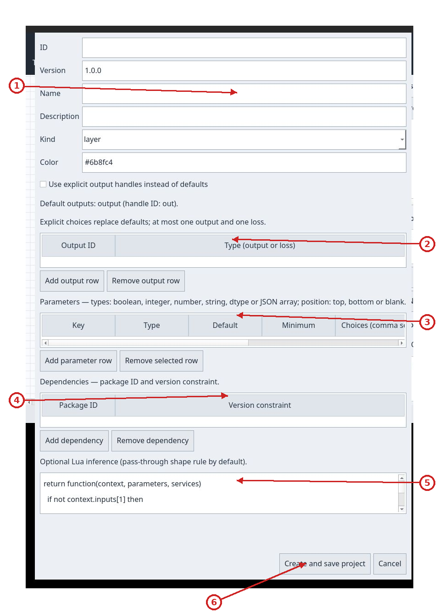

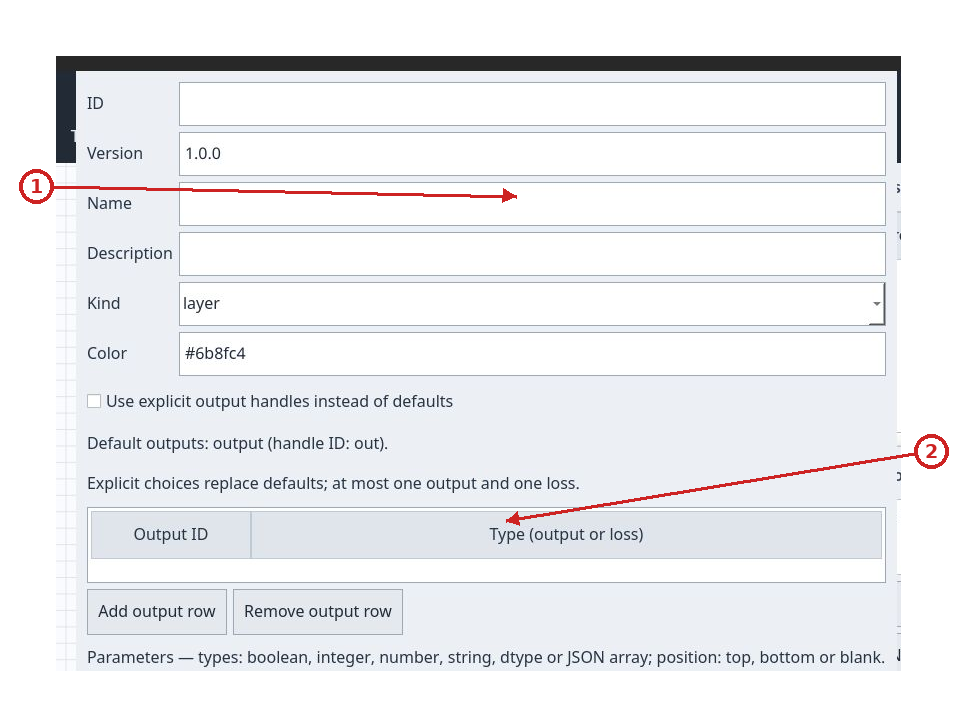

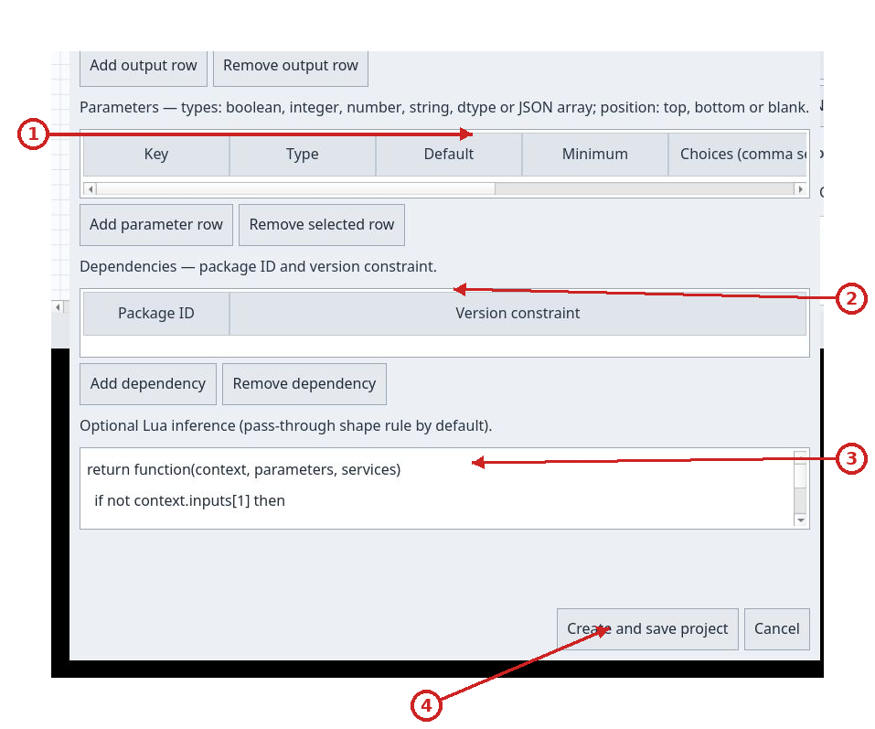

## Model problems

`Model problems` lists shape-analysis problems; it does not list successful rows. Each row shows category, node name, scope and reason. Categories distinguish `Lua compilation error`, `Model error`, `Incomplete` and `Analysis unavailable` by icon, text and color. Primary causes are grouped; blocked descendants appear as expandable child rows. When available, `Technical details` opens stable codes, source file/line or technical details.

`Current scope only` filters the list to the displayed scope and keeps an outside cause visible as context when needed. Clicking a navigable problem selects and centers its node, switching to its scope. The `Root` problem reports missing or invalid root terminals and does not navigate to a node. If analysis failed, `Analysis unavailable` remains visible with expandable technical details; the model is not presented as problem-free. Nodes with problems also show a small canvas marker.

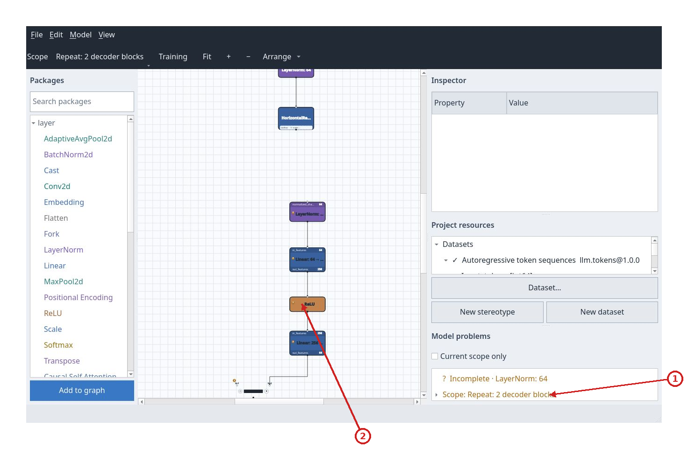

## Training backend

`Training` on the toolbar and `Model > Training backend…` open `Training backend`. You can connect and inspect jobs without a project; submitting a job requires a valid project, which is saved before submission.

### Configure and start the local backend

Press `Configure backend…` in the Training dashboard. The separate `Local backend service configuration` window opens; the dashboard with its connection, controls, history and curves stays usable. Choose `Docker-compatible runtime` or `SSH / Slurm`. Slurm needs a configured SSH alias, a writable remote directory and a prepared Singularity `.sif` image. `Partition`, `CPUs`, `Memory` and `Time limit` start with the backend defaults. The app does not collect SSH passwords or build images and dependencies.

Press `Save settings and start local backend`. The UI starts FastAPI on loopback as a separate local process; with `SSH / Slurm`, only workers are sent to the cluster. `uv` and the repository workspace must be available, and the worker image must be prepared first. The configuration window shows startup and runtime availability errors; the dashboard then checks the service with `Connect / check health`. Non-secret settings are saved for the current user; `Bearer token` stays in memory for the session. When connected to a manually started service or remote endpoint, the UI does not manage it. See the illustrated [Slurm backend guide](server.md#run-jobs-on-the-sapienza-cluster-from-the-ui).

When the managed service is already running, the button changes to `Restart local backend safely`. The UI refuses to restart while job history contains `queued` or `running` jobs, avoiding training interruption. Closing the Training panel leaves the service running. Closing the app while its managed service is active shows a warning: confirming stops the backend and interrupts any Slurm jobs; canceling keeps the app open.

At the top, `Endpoint` starts at `http://127.0.0.1:8765` for a manually started service. The app-managed backend reserves an available loopback port and fills this field automatically. `Bearer token` is optional, hidden as you type and kept in memory for the session. `Connect / check health` checks the service and runtime; `Refresh jobs` updates history. The status line reports the result in readable form.

Submission fields are `Epochs` (10), `Batch` (32), `Learning rate` (0.001), `Seed` (0) and `Publish every N steps` (10). Epochs: 1–10000; batch: 1–4096; learning rate: greater than zero and at most 1; seed: −2147483648 to 4294967295; publish interval: 1–100000. The interval controls metric publication and validation. `Save project and submit` saves the current state first, then submits an immutable snapshot; a save or submission error appears in the status line.

`Job history` shows abbreviated date/time, ID suffix and status; its tooltip shows the full ID and date. Selecting a job loads its details and curves. The list refreshes every 2.5 seconds. `Learning curves` displays `Training loss` and `Validation loss`, both enabled initially, on the same loss axis. `Scale` chooses `Linear` or `Log`. The horizontal axis is `Optimizer step` for new published points and `Epoch` for historical metrics that have no step points. `Final test loss` remains `pending` until the job finishes with a valid value.

`Training and worker log` reports status, any error, metrics and final test loss. The bottom controls are `Download weights`, `Download wheel`, `Restore snapshot…`, `Cancel job` and `Close`. Downloads require a completed job and save the selected file through the system dialog. `Restore snapshot…` recreates a copy in a new folder chosen by the user, opens it as a project and does not overwrite an existing folder. `Cancel job` requests cancellation of the selected job. `Close` closes the panel.

New wheels use distribution `nnm_<normalized-project-id>`; for example, project
ID `llm` produces `nnm_llm-0.1.0-py3-none-any.whl`. The Python module inside the
wheel remains job-specific (`nnmodel_<normalized-job-id>`): read the module name
from the wheel for the import instead of deriving it from the filename. Jobs
from projects with the same normalized ID share a distribution name and
version; install their wheels in separate Python environments. Previously
stored wheels keep their original names and contents.

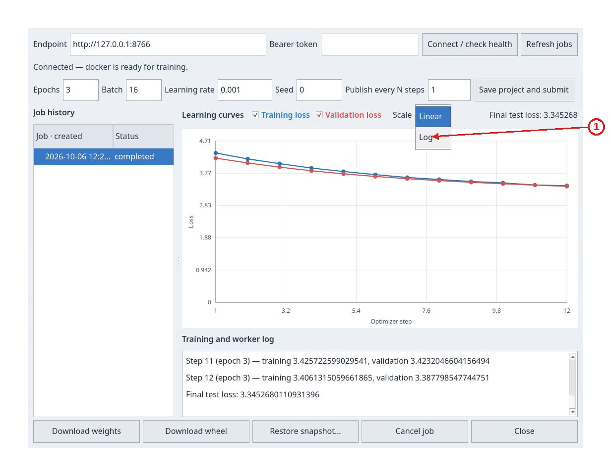

## Features not exposed in the current interface

The project describes a `Network 3D` explorer, but the current Qt window has no 3D tab, menu or command. Therefore its flight, display, occurrence selection, `Fit` and 3D `Home` controls are unavailable in this version. The 2D canvas is the only graph editor exposed.
