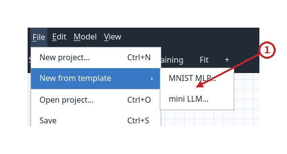
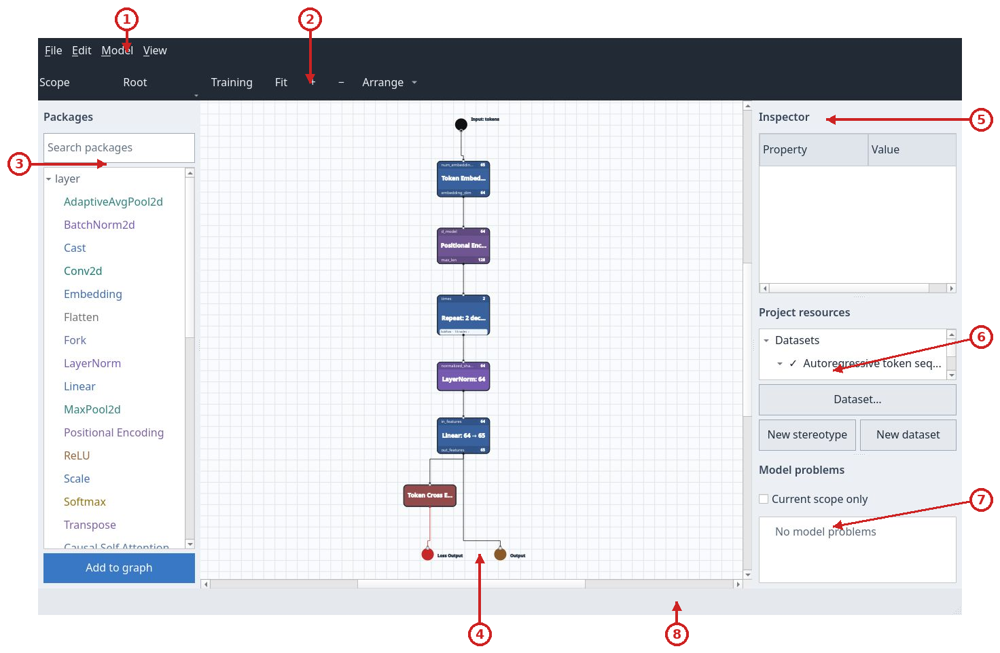
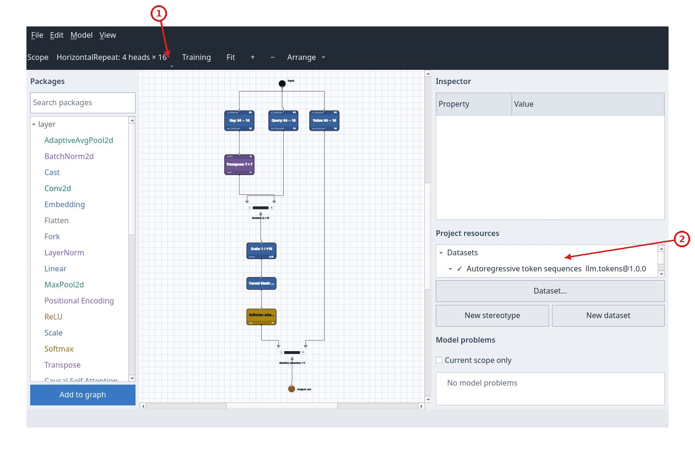
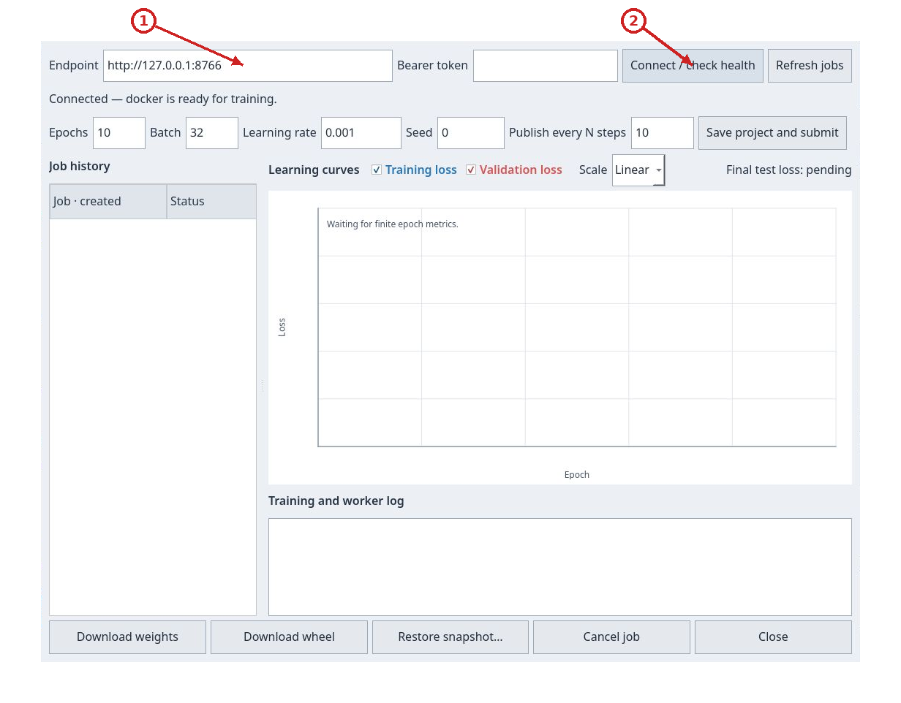
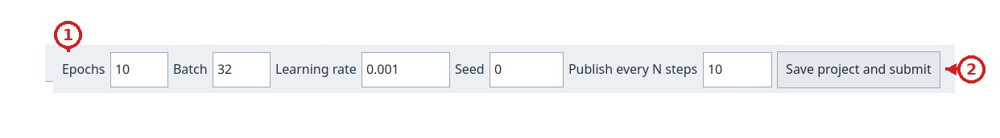
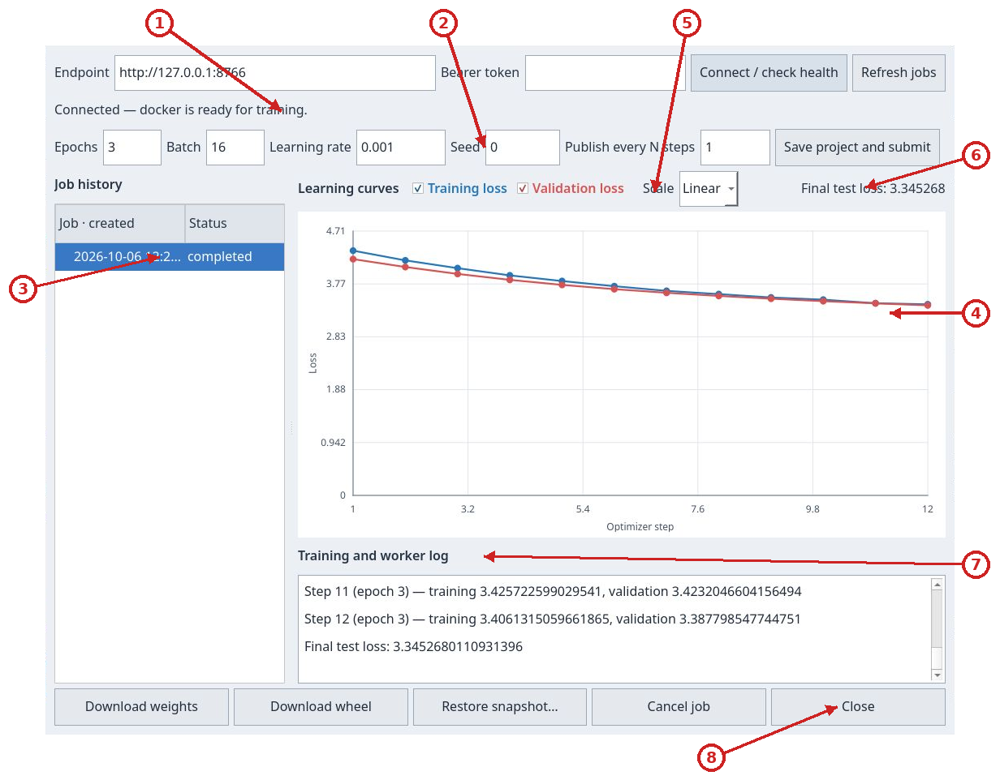
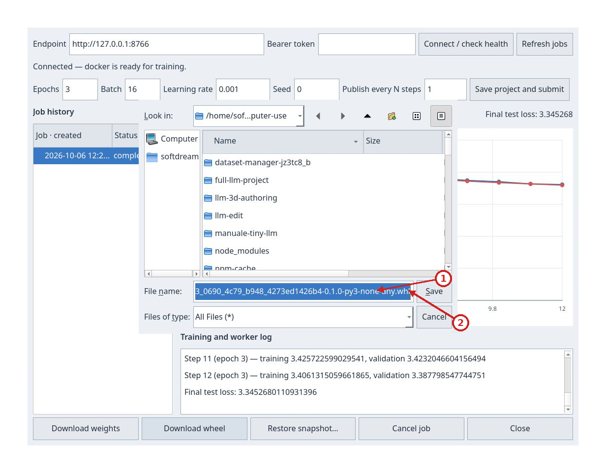

# Tutorial: train a tiny LLM

This walkthrough starts from the model shipped in `examples/models/tiny-decoder-llm`, available in the client as **mini LLM**. Create a copy, check the dataset and graph, run a short training job and download a model that Python can use. The first experiment teaches the complete workflow; a full-corpus path is included at the end.

## 1. Prepare the client and backend

From the repository root, with compilers, CMake, Qt 6, `just`, `uv` and a Docker-compatible runtime available:

```sh
just build
just backend-sync
just backend-image
just backend-run
```

Leave the server terminal open. In a second terminal, start the client:

```sh
./build/qt/nnmodelling-ui
```

The default backend listens at `http://127.0.0.1:8765`. The screenshots in this tutorial show **8766**, chosen to isolate the walkthrough from a port that was already occupied. To reproduce that address, start the server with:

```sh
NNMODELLING_BACKEND_PORT=8766 just backend-run
```

Use the port of the server you started in the client. If you chose a token, enter it in the Training panel as described in the [backend configuration](server.md).

## 2. Create a model copy

In the initial chooser, select `New mini LLM`, or use `File > New from template > mini LLM…`. Choose a parent folder, enter an unused ID such as `manuale-tiny-llm`, and confirm the display name. The program creates and opens the new subfolder; an existing destination is rejected.



The original project remains available for other experiments. To make a manual copy instead, copy all of `examples/models/tiny-decoder-llm` to a working folder and open **that folder**, not only its `model.json` file, with `Open project`.

## 3. Read the graph before submitting

The model uses a **65-character** vocabulary, context length **128**, width **64**, **two** decoder blocks, **four** attention heads of width **16**, and a feed-forward layer of width **256**. The root Input receives `tokens`; Embedding and Positional Encoding prepare the representations; Repeat applies the decoder blocks; LayerNorm and Linear produce logits; Token Cross Entropy feeds `Loss Output`. `Output` collects the prediction.



Check `Project resources`: `llm.tokens@1.0.0` must be active. `Dataset… > Edit` lets you inspect the slots without changing them:

| Slot | Dtype | Shape | Meaning |
| --- | --- | --- | --- |
| Input `tokens` | `int64` | `[B, 128]` | Sequences of character indices. |
| Target `target` | `int64` | `[B, 128]` | The same sequence shifted by one character: the next symbol to predict. |

Choose `Cancel` if you are only inspecting. The included dataset contains **64** training, **16** validation and **16** test windows, taken from a Tiny Shakespeare excerpt. It is ready to use; the first training run does not need a corpus download.

Select Repeat: the Inspector shows `times = 2` and output `float32[B, 128, 64]`. Open `Scope` and choose the decoder block; in its scope select HorizontalRepeat: `times = 4`, `join = Concat`, `dim = -1`. Enter the attention-head scope to see `Q × Kᵀ`, scale `0.25 = 1/√16`, causal mask, Softmax and multiplication by V. The join concatenates four width-16 results into a width-64 tensor.



Return to `Root` in the Scope tree. The logits output should have shape `float32[B, 128, 65]`, while loss is scalar. `No model problems` means shape analysis is complete. Correct shapes and available Python resources are both required: the client shows the first, and the backend checks the second while running the project.

## 4. Connect and choose a short experiment

Press `Training`. Set the right endpoint, leave `Bearer token` blank if the server does not require one, and press `Connect / check health`. The status line should say that the runtime is ready for training.



To reproduce the illustrated run, use:

| Field | Value | Reason |
| --- | --- | --- |
| `Epochs` | `3` | Three passes over the small dataset. |
| `Batch` | `16` | Four updates per epoch for 64 training windows. |
| `Learning rate` | `0.001` | Adam optimizer step size. Use a decimal point. |
| `Seed` | `0` | Fixes initialization and the job's random sources. |
| `Publish every N steps` | `1` | Publishes and validates at every update, useful for seeing curves quickly in this small run. |



Press **Save project and submit** once. The client saves edits before submission, collects resources and data, and creates the job. Wait for it to appear in `Job history`, then select it; this loads curves, status and metrics. If an old submission message remains visible, `Connect / check health` refreshes the connection line; the job row status and metrics describe the experiment.

## 5. Read the curves and identify completion

The blue series is training loss and the red series is validation loss. A lower value means a smaller mean error for this objective. Training measures the data used to update the model; validation measures separate data without updating the weights. If training keeps improving while validation gets worse, the model may be overfitting the training data.



`Optimizer step` counts global updates. This experiment has **12**: four in each of the three epochs. Checkboxes hide or show the series; `Scale > Log` changes how loss is displayed and does not modify the job. Test loss is calculated at the end on a third, separate set.

In the run made for this guide, job `86caba53-0690-4c79-b948-4273ed1426b4` reached `completed`, with final-epoch mean training loss **3.462321**, validation loss **3.387799** and test loss **3.345268**. These are observed results, not a target threshold: dependency versions, runtime and machine can affect the values. The small excerpt and three epochs demonstrate the workflow; they are not enough to promise high-quality text.

If the job is `failed`, read `Error` in the panel and the server's `worker.log`. To stop a queued or running job, select it and press `Cancel job`. Closing the panel with `Close` leaves the job with the server. Client edits made after submission do not change the snapshot already being trained.

## 6. Download and use the model

With the `completed` job selected, press `Download weights` to get `weights.safetensors` and `Download wheel` for the Python package. Keep **the full wheel filename proposed by the dialog**, including its version and `-py3-none-any.whl` tag; a generic name such as `model.whl` is not a valid installable wheel filename.



In a new folder, create an isolated environment and install the downloaded wheel. Replace the path with the actual location; `pip` also installs declared dependencies, which must be available from a network connection or local cache:

```sh
python3 -m venv .venv
.venv/bin/python -m pip install /path/nnmodel_job_86caba53_0690_4c79_b948_4273ed1426b4-0.1.0-py3-none-any.whl
```

The module name varies with the job ID. For the illustrated run, save this as `infer.py`:

```python
import torch
from nnmodel_job_86caba53_0690_4c79_b948_4273ed1426b4 import Model

torch.set_num_threads(2)
model = Model()  # Loads the weights included in the wheel.
text = "ROMEO:\n"
for _ in range(40):
    prediction = model.inference(text[-128:])
    if not prediction:
        raise RuntimeError("The model returned an empty prediction")
    text += prediction[-1]
print(text)
```

Run `.venv/bin/python infer.py`. Text passed to the adapter must contain characters from the vocabulary and a nonempty context of at most 128 characters. `infer` is an alias for `inference`. The function returns one prediction per sequence position; the loop uses the final predicted character to build a greedy continuation. To use compatible alternative weights, construct `Model(weights_path="/path/weights.safetensors")`.

For another job, read the module name from the wheel without importing its code:

```sh
python3 - /path/to/the-wheel.whl <<'PY'
import sys
import zipfile
with zipfile.ZipFile(sys.argv[1]) as wheel:
    for name in wheel.namelist():
        if name.startswith("nnmodel_") and name.count("/") == 1 and name.endswith("/__init__.py"):
            print("Module to import:", name.split("/")[0])
PY
```

Replace that name in `infer.py`'s import. The wheel contains the private runtime needed to use the model: the original repository, training dataset and server are not required. `examples/implementation/llm` is a consumer already configured for a specific historical 20-epoch job; use the newly downloaded wheel and its module name for a new experiment.

## 7. Move to the full corpus

Once the short run works, prepare **another** folder for the full corpus. From the repository root:

```sh
uv run --group examples python tools/prepare_full_llm.py \
  --output-project .computer-use/manuale-full-llm
```

The destination must not exist. The command verifies the Tiny Shakespeare corpus and its checksum, copies the model, and prepares contiguous 80/10/10 splits before extracting windows: **6,971** training, **871** validation and **871** test windows. Each window uses 128 input characters and the following character as target. If the source is not cached already, preparation needs network access; the training container remains offline.

Open `.computer-use/manuale-full-llm` with `File > Open project…`. In the Training panel, enter the values from `training.json` manually:

| Field | Full-corpus value |
| --- | --- |
| `Epochs` | `20` |
| `Batch` | `64` |
| `Learning rate` | `0.001` |
| `Seed` | `0` |
| `Publish every N steps` | `100` |

The panel does **not** load `training.json` automatically. This setup has 109 steps per epoch and 2,180 in total; final partial epoch batches are also published when they do not fall on a multiple of 100. It takes longer than the short tutorial. Submit, select the new job and download its artifacts when it reaches `completed`.

## 8. Find the experiment and shut down

History belongs to the backend's job directory. Restarting the same service with the same `NNMODELLING_JOB_ROOT` restores its experiments. `Restore snapshot…` asks for a parent folder and a new directory name, recreates the project used for that job and opens it. This restores the project; it does not continue training. A new submission initializes a new job. The panel does not offer resume or fine-tuning from downloaded weights.

Save the project with `File > Save`, close the client, and stop the backend with **Ctrl-C** in its terminal after jobs finish. Keep the wheel and weights with your experiment results.
