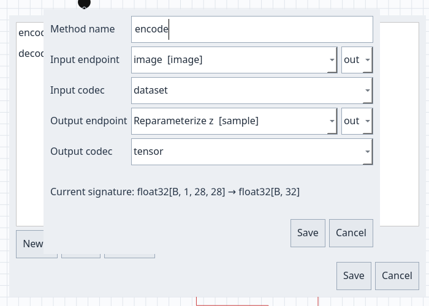
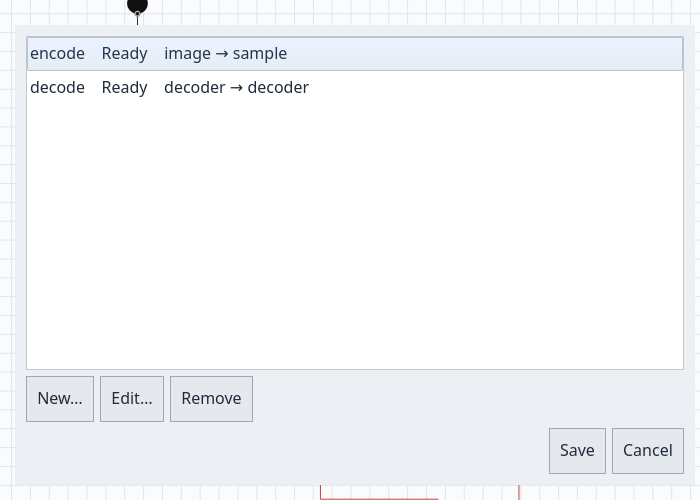

# Tutorial: creare operazioni per un VAE

Il tutorial tiny LLM mostra come addestrare un modello linguistico e usare `infer`. Qui partiamo dal VAE MNIST distribuito e aggiungiamo due metodi alla wheel Python: `encode` trasforma un'immagine nella rappresentazione latente; `decode` trasforma un tensore latente in un'immagine ricostruita. Le operazioni si configurano dalla UI, senza modificare il grafo o scrivere codice Python nel progetto.

## 1. Preparare client e backend

Dalla root del repository, con CMake, Qt 6, `just`, `uv` e un runtime compatibile con Docker disponibili:

```sh
just build
just backend-sync
just backend-image
just backend-run
```

Lascia il terminale del backend aperto. In un secondo terminale avvia `./build/qt/nnmodelling-ui`. Il backend predefinito usa `http://127.0.0.1:8765`; per token e altre opzioni consulta la [guida al server](server.md).

## 2. Aprire una copia del VAE

Dalla root del repository copia l'intero progetto, incluso dataset e pacchetti Python:

```sh
cp -a examples/models/mnist-vae my-vae
```

Apri `my-vae` con `File > Open project…`. Usa una copia perché questo tutorial rimuove e ricrea le operazioni già incluse nell'esempio. Il grafo radice porta l'immagine MNIST a `sample`, il vettore latente da 32 valori, poi al decoder che produce 784 pixel. L'adapter del dataset converte immagini in tensori normalizzati e le ricostruzioni in array NumPy `[28,28]`.

## 3. Aprire il gestore e creare `encode`

Scegli `Model > Manage operations…`. L'esempio elenca già `encode` e `decode`; nella copia seleziona ciascuna riga e premi `Remove`, poi premi `Save` per ripartire da una lista vuota.



Premi `New…`. Nella scheda `Operation` imposta:

| Campo | Valore |
| --- | --- |
| `Method name` | `encode` |
| `Input endpoint` | nodo `image`, handle `out` |
| `Input codec` | `dataset` |
| `Output endpoint` | nodo `sample`, handle `out` |
| `Output codec` | `tensor` |

Premi `Save` nella scheda. Il codec `dataset` passa il valore dato a `model.encode(...)` all'adapter `tokenize`, che accetta percorso PNG, immagine PIL o array NumPy. Il grafo produce il tensore latente `[B,32]`. In modalità valutazione il VAE restituisce la media della distribuzione posteriore, quindi `encode` è deterministico.

## 4. Creare `decode` e salvare le operazioni

Nel gestore premi di nuovo `New…` e configura:

| Campo | Valore |
| --- | --- |
| `Method name` | `decode` |
| `Input endpoint` | nodo `decoder`, handle `in` |
| `Input codec` | `tensor` |
| `Output endpoint` | nodo `decoder`, handle `out` |
| `Output codec` | `dataset` |

L'ingresso `decoder.in` riceve il tensore fornito al metodo. Per questa operazione il runtime sostituisce il valore del collegamento in ingresso; il grafo del modello resta intatto. Il codec `dataset` passa l'uscita `[B,784]` all'adapter `untokenize`, che restituisce una singola immagine NumPy `[28,28]` con pixel normalizzati fra 0 e 1.

Nella lista controlla che entrambi gli stati siano `Ready`, poi premi `Save`. Se vedi `Stale endpoint`, modifica l'operazione per selezionare un nodo e un handle attuali, oppure rimuovila. Salva anche il progetto con `File > Save`.

## 5. Addestrare e scaricare la wheel

Apri `Training` e premi `Connect / check health`. Per il piccolo dataset incluso usa:

| Campo | Valore |
| --- | --- |
| `Epochs` | `1` |
| `Batch` | `32` |
| `Learning rate` | `0.001` |
| `Seed` | `0` |
| `Publish every N steps` | `10` |

Premi `Save project and submit`. Quando il job arriva a `completed`, selezionalo nella cronologia e scarica `Download wheel`. Le operazioni fanno parte del manifesto del progetto e la wheel esporta `Model.encode` e `Model.decode` insieme a `Model.infer`.



## 6. Codificare, ricostruire e campionare

Installa la wheel in un ambiente Python isolato. Sostituisci il percorso con il file scaricato:

```sh
python3 -m venv .venv
.venv/bin/python -m pip install /percorso/nnm_mnist_vae-0.1.0-py3-none-any.whl
```

Il modulo Python contiene l'ID del job. Stampane il nome dalla wheel, senza importare il codice:

```sh
python3 - /percorso/nnm_mnist_vae-0.1.0-py3-none-any.whl <<'PY'
import sys
import zipfile
with zipfile.ZipFile(sys.argv[1]) as wheel:
    for name in wheel.namelist():
        if name.startswith("nnmodel_") and name.count("/") == 1 and name.endswith("/__init__.py"):
            print("Modulo da importare:", name.split("/")[0])
PY
```

Nel frammento seguente sostituisci `nnmodel_your_job_id` con il modulo stampato. `encode` accetta direttamente il percorso dell'immagine; `decode` restituisce un array NumPy. Un campione `torch.randn(1,32)` esplora il prior standard normale:

```python
import numpy as np
import torch
from PIL import Image
from nnmodel_your_job_id import Model  # Sostituisci con il modulo della wheel.

model = Model()
z = model.encode("digit.png")             # torch.Tensor [1, 32]
reconstruction = model.decode(z)           # np.ndarray [28, 28], valori [0, 1]
pixels = (np.clip(reconstruction, 0, 1) * 255).astype(np.uint8)
Image.fromarray(pixels).save("reconstruction.png")

sample = model.decode(torch.randn(1, 32))   # Una nuova immagine dal prior.
```

Usa `model.decode(z)` per ricostruire l'immagine codificata; `model.decode(torch.randn(1,32))` parte invece da un punto casuale nello spazio latente. Entrambi usano i pesi addestrati nella wheel. Il metodo originale `model.infer(...)` resta disponibile.
