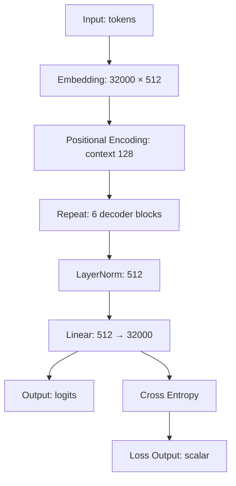
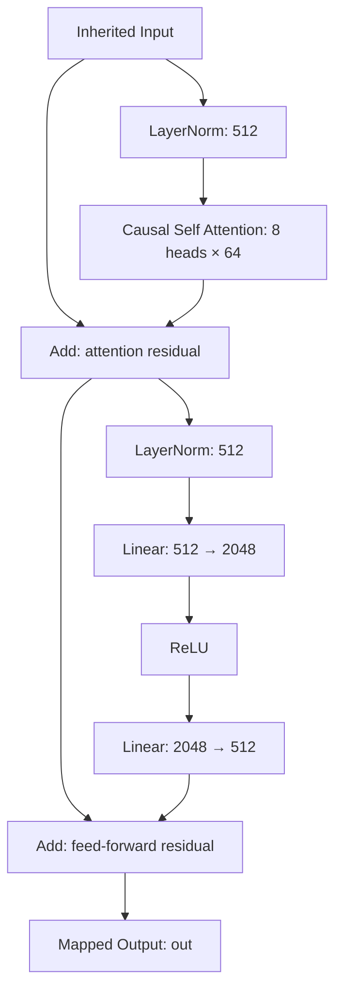

# Tiny Decoder LLM

Created from a blank project through the native Qt GUI using Codex computer
use, including the project-owned dataset and causal-attention stereotype.

The dataset describes token IDs and next-token targets, both `int64[B,128]`.
Vocabulary size is 32000; model width is 512. The root graph is:

Enter Repeat to inspect the pre-normalized decoder block:

Expected tensors: embedding, attention, residuals, normalization and block
output `float32[B,128,512]`; expanded FFN `float32[B,128,2048]`; logits
`float32[B,128,32000]`; loss `float32[]`.

This is an editable architecture and shape-analysis example. The custom
attention rule checks its expected rank, dtype and width and retains shape;
its definition describes causal masking, Q/K/V projections and eight heads.
It does not execute attention. Dataset files contain metadata, not token samples.
There are no trained weights or numerical backend. The preserved Cross Entropy
rule checks floating logits/rank but does not fully validate target compatibility.

The computer-use findings and fixes are recorded in
`docs/knowledge/testing/ui-llm-authoring-2026-10-03.md`.
